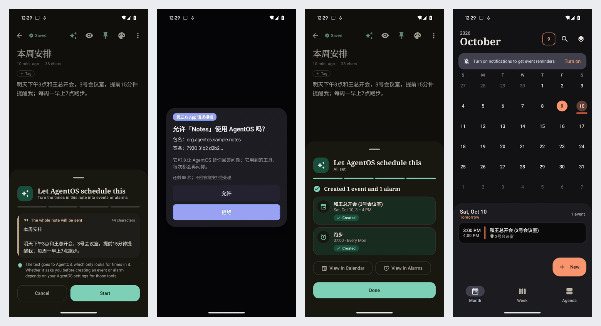
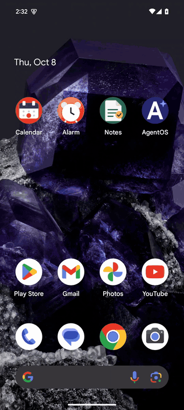
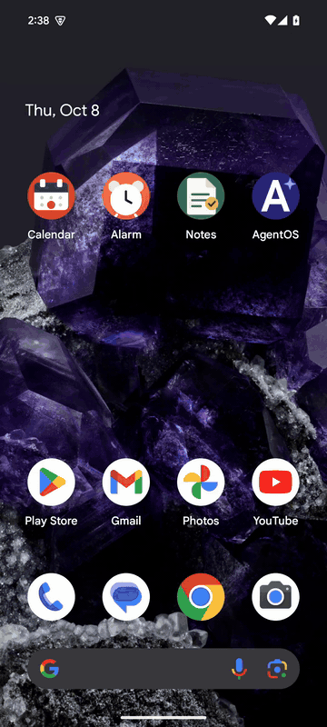
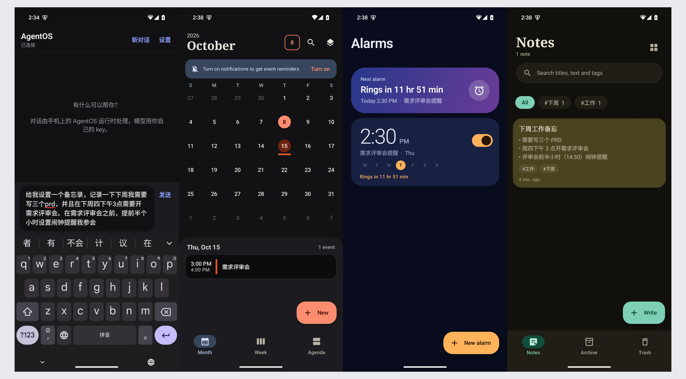
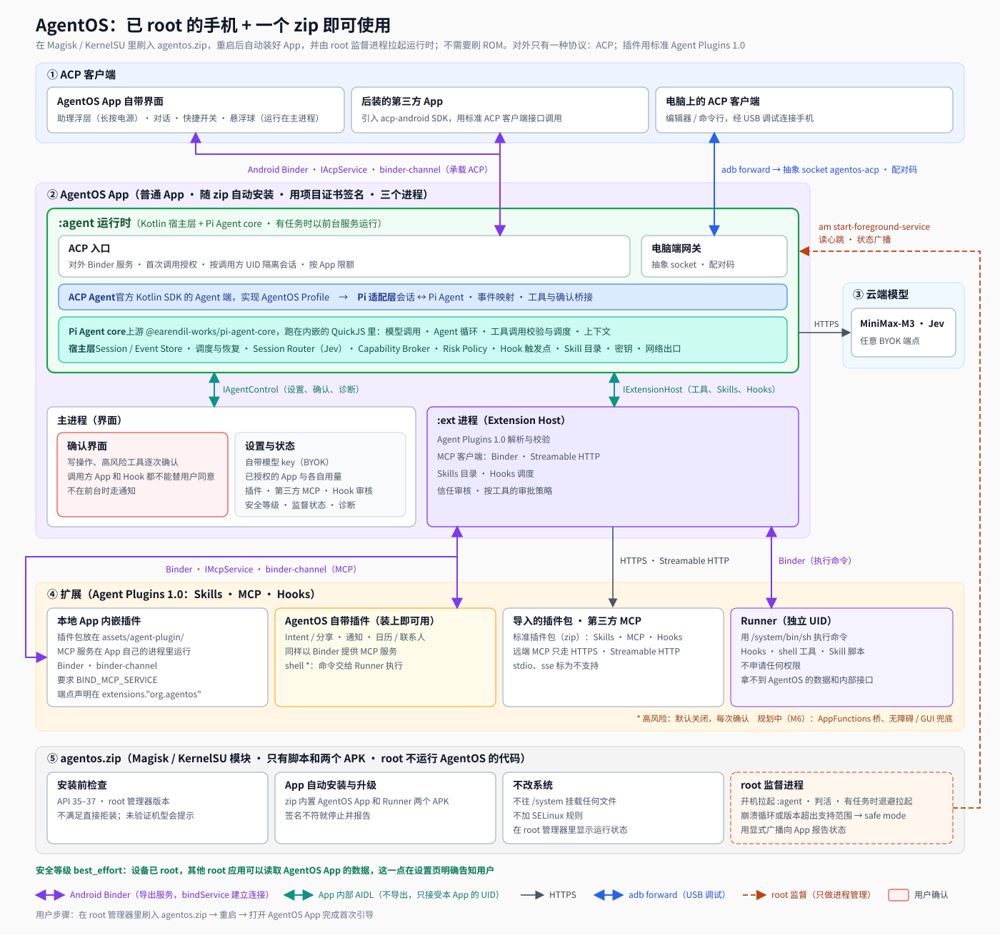
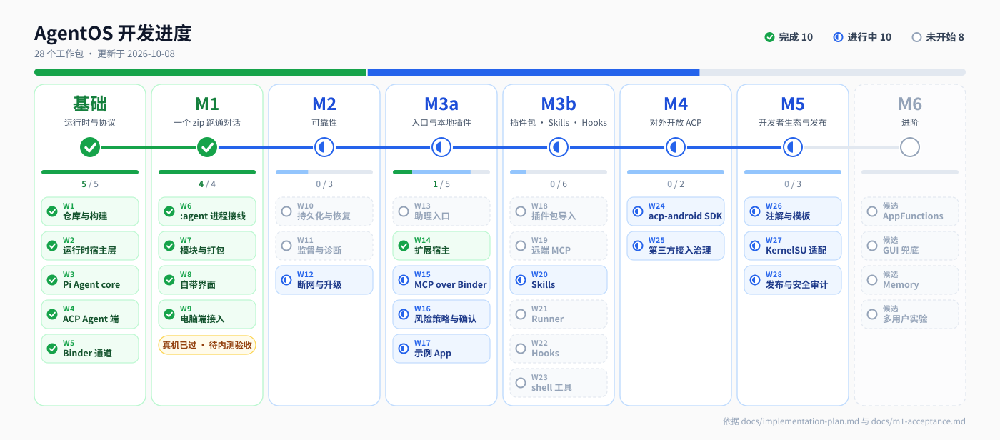

# AgentOS for Android

**让 App 既能调用 Agent，也能为 Agent 提供能力。**

AgentOS 是一个 Android Agent 服务原型，探索如何让多个 App 共用同一套 Agent 运行时，而不必各自内置完整的 Agent。

我们想验证两种接入关系：

- **App 调用 Agent**：App 发起任务，由 Agent 处理，进度和结果回到发起任务的 App。
- **App 为 Agent 提供能力**：App 通过插件暴露工具，由 Agent 在任务中调用。

同一个 App 可以同时扮演这两种角色。用户在原来的 App 里就能发起任务，不必先进入一个统一的聊天入口。

当前原型以 Magisk / KernelSU 模块的形式部署在已 root 的 Android 手机上，不需要更换 ROM。root 是现阶段的部署和进程监督手段，不是项目的核心主张。

> 两条接入路径都已有真机演示：后装的示例备忘录经 ACP 发起任务，结果回到备忘录；Agent 经 MCP 调用三个示例 App。这些都是原型级验证：示例 App 由本项目提供，第三方 App 的权限管控也还很粗，详见[当前状态与边界](#当前状态与边界)。

## 演示

两段真机演示，分别对应开头说的两种接入关系。

### App 调用 Agent

备忘录是一个后装的 App。里面有一条备忘，点一下按钮，把文字交给 AgentOS，Agent 读出时间，建出日程和闹钟。备忘录自己没有日历、闹钟的任何权限，也没有模型 key。

[](docs/assets/demo3.mp4)

关键帧，从左到右：点 AgentOS 按钮后，确认要发送的文字；**第一次使用，AgentOS 弹出“允许「Notes」使用 AgentOS 吗？”**（显示包名和签名摘要，默认焦点在“拒绝”）；回到备忘录，面板显示已建 1 个日程、1 个闹钟；日历里周六 15:00 的「和王总开会（3号会议室）」。

点击图片观看完整录屏（真机，原速，没有加速，44 秒）：[demo3.mp4](docs/assets/demo3.mp4)。流程是：打开备忘「本周安排」→ 点 AgentOS 按钮 → 确认文字 → 首次授权，点允许 → 回到备忘录看结果 → 分别跳到日历和闹钟（每周一 07:00 的「跑步」）确认。

**这段演示验证的是：一个 App 不必内置 Agent，也能通过公共运行时获得跨 App 的任务处理能力；任务是从原来的 App 里发起的，进度和结果也回到这个 App。**

几点需要说明：

- 备忘录同时扮演了两种角色：它通过 `acp-android` SDK 调用 Agent，又通过内嵌插件把自己的笔记工具提供给 Agent。它是本项目的示例 App，不是外部第三方。
- 授权只问这一次，之后可以在 AgentOS 设置里撤销，撤销后这个 App 进行中的任务立即取消。
- 备忘录只向 Agent 申请了 `event_create` 和 `alarm_create` 两个工具。这是它自己选择的最小范围，用来防备忘文字里的提示注入；AgentOS 并不强制第三方这样做（见[当前状态与边界](#当前状态与边界)）。
- 录制时日历、闹钟两个创建工具设成了“始终允许”，所以没有逐次确认框；没设的话，每次创建仍会弹出确认。

设计和验收见 [docs/third-party-acp.md](docs/third-party-acp.md)。

### App 为 Agent 提供能力

这一段看另一个方向。在 AgentOS 自己的界面里输入一条指令：

> 给我设置一个备忘录，记录一下下周我需要写三个 prd，并且在下周四下午 3 点需要开需求评审会。在需求评审会之前，提前半个小时设置闹钟提醒我参会

Agent 通过三个示例 App 提供的 MCP 工具，分别创建备忘录、日历日程和闹钟。需要确认的调用会先弹确认框，列出工具名、来源插件和参数，用户确认后才执行。

| 在 AgentOS 里说一句话 | 三个 App 里的结果 |
|:---:|:---:|
|  |  |

执行结果：

- 备忘录：创建「下周工作备忘」。
- 日历：创建周四 15:00 的「需求评审会」。
- 闹钟：创建 14:30 的「需求评审会提醒」。

**这段演示验证的是：App 可以通过明确声明的工具向 Agent 提供能力；Agent 把自然语言任务拆成工具调用，结果保存在各自的 App 里。** 跨 App 的操作走的是 MCP，不是模拟点击界面。

> 三个 App 都是本项目提供的示例应用，已接入插件与 MCP。这段演示不代表 AgentOS 能直接操作任意未经适配的 Android App。

录屏后半段是设置页（模型与 key、安全等级）和插件管理（已发现的插件）。动图里打字部分加速了 4 倍，其余 2 倍，点发送前后是原速；没加速的完整录屏（720p）：[demo.mp4](docs/assets/demo.mp4)、[demo2.mp4](docs/assets/demo2.mp4)。

关键帧，从左到右：点发送前输完的指令；日历里周四 15:00 的「需求评审会」；14:30 的闹钟；备忘录「下周工作备忘」。



## 为什么这样设计

### 让入口、能力与运行时分别演进

我们希望把三件事分开：

**任务入口**负责接收用户意图，可以是备忘录、日历、独立助手或其他客户端。

**能力提供方**负责具体操作，由各个 App 或服务暴露工具，并维护自己的业务逻辑与数据。

**Agent 运行时**负责模型调用、任务执行与会话管理，并在工具调用过程中执行授权、确认和审计规则。

这样划分，是为了让 App 不必为了用上 Agent 而各自维护一套完整的运行时，也让新增一种能力不必总是伴随 Agent 主程序的修改。AgentOS 可以有自己的聊天界面，但它不应成为使用 Agent 的唯一入口。

### ACP、MCP、Plugin 和 Skill 各自解决不同的问题

| 组成 | 职责 |
|---|---|
| ACP | 连接任务发起方与 Agent，承载会话、输入和执行过程 |
| MCP | 连接 Agent 与能力提供方，承载工具调用和结果 |
| Plugin | 组织和分发工具配置、Skills、Hooks 等扩展内容 |
| Skill | 写给模型看的操作指南，描述如何用已有的工具完成一类任务，本身不授予任何权限 |

App 可以通过 ACP 请求 Agent 服务，也可以通过插件向 Agent 提供 MCP 工具。这是两个独立的接入方向，不要求每个 App 同时实现两者。

**工具和 Skill 分开，接口与用法才能各自演进。** 工具要稳定、可校验、可授权，所以每个工具都有 schema、风险等级和确认流程，每次调用都有记录；操作经验写成 Skill，改一句话不用发版。反过来，把能力藏进 Skill 的脚本里，或把流程塞进工具描述里，权限边界会变模糊。AgentOS 也是这样处理的：同一个插件里，MCP 和 Skills 走两条路。工具调用经 Extension Host，过风险策略和用户确认；Skill 通过 `read_skill` 读成文字，按不可信输入交给模型，它附带的脚本要执行，还得过 shell 工具、Runner 和确认。细节见 [docs/extensions.md](docs/extensions.md)。

**ACP 在手机上更像系统服务的调用协议。** 编辑器和终端里的 ACP，通常是 Agent 外壳的接线层，Agent 是客户端拉起的子进程。当 Agent 在手机上常驻、有身份、有状态、能跨 App 办事时，App 不再“集成一个 Agent”，而是向系统“请求 Agent 的服务”：调用方身份由内核给出（Binder 的调用方 UID），能不能调用由用户决定，用量看得见，随时能撤。所以 AgentOS 里 ACP 走 Binder，只有电脑端调试才走 `adb forward` 的 stdio 语义。

### 共用运行时，不等于共用所有上下文与权限

多个 App 使用同一个 Agent 服务，不意味着它们可以读取彼此的会话。

我们的设计目标是：由运行时识别调用方、隔离会话边界，由用户的授权与确认决定工具能否使用。模型可以提出行动，但不能仅凭生成的文本获得额外权限。

目前已经做到调用方识别、会话隔离、首次授权与撤销、限额和写操作确认。**按 App 和插件细分权限还在设计中**：现在获得授权的第三方 App，默认可以使用所有已启用插件的工具。这个取舍和它带来的风险，见[当前状态与边界](#当前状态与边界)。

## 实现与关键取舍

AgentOS 的运行时是 AgentOS App 里的一个独立进程 `:agent`，而不是放进 Android 的 `system_server`。外层是 Kotlin 宿主层，负责 ACP 接入、身份、存储、调度和恢复；Agent 循环复用上游的 **Pi Agent core**（`@earendil-works/pi-agent-core`），跑在进程内嵌的 QuickJS 里。

| 选择 | 原因与代价 |
|---|---|
| 用 root 模块，而不是定制 ROM | 原型把 Agent 做进了系统镜像，用户得自己编译、刷机。改成模块后，在现有设备上刷一个 zip 就能跑，部署和迭代成本低得多。代价：仍需要已 root 的设备，未 root 的手机没有同等能力 |
| 复用 Pi Agent core，而不是自己写 Agent 循环 | 把精力放在 Android 宿主、跨 App 接入和任务治理上。代价：Pi 还在 0.x，API 变化快，所以固定版本，升级要单独评估 |
| 在 QuickJS 里运行 Agent 核心 | APK 自带 JS 运行环境，手机上不需要装 Node。代价：官方 SDK 里依赖 Node 的部分要在打包时替换；模型请求的网络、key、重试留在 Kotlin 宿主层，key 因此不会进入 QuickJS |
| 用 Binder 传输 ACP 与 MCP | 调用方 UID 由内核给出，ACP 和 MCP 共用同一种消息通道。协议语义与 Android 传输分开，电脑端调试仍可走 `adb forward` |
| 工具调用由 AgentOS 自己的界面确认 | 调用方 App 只能追加拒绝，不能替用户同意；否则恶意 App 可以借 Agent 操作其他 App 或用户数据 |
| root 只管安装、守护和拉起 | AgentOS 的代码、模型和插件都不以 root 运行。代价：设备已经 root，其他 root 应用仍可能读取 AgentOS 的数据，所以安全等级固定为 `best_effort`，并在设置页如实告知 |

本仓库接续早期的 [agenroid 原型](https://github.com/HanZijie/agenroid)。从系统镜像迁到 root 模块，是为了先在现有设备上验证产品关系，不代表已经完成真正的系统级集成。



完整的组件关系、协议与决策记录见 [架构文档](docs/architecture.md)。

## 当前状态与边界

AgentOS 目前是用于验证产品形态与技术路径的原型。



| 状态 | 内容 |
|---|---|
| 已有真机演示 | 后装的示例备忘录经 ACP 发起任务，首次使用时授权，日程和闹钟的结果回到备忘录；在 AgentOS 中发起任务，经 MCP 操作备忘录、日历、闹钟三个示例 App |
| 已通过真机验收（Pixel 8，Magisk 30.7，Android 15） | 模块安装、重启、禁用、启用、卸载的完整生命周期；电脑端 ACP 一致性测试（38 项，33 过、0 败、5 跳）；第三方 ACP 流程的自动化验收（34 项检查，连续两轮全过，含授权、拒绝、撤销、提示注入） |
| 尚未验证 | KernelSU；Android 16 / 17 真机；灭屏与 24 小时驻留；非本项目示例的第三方 App；第三方通道的一致性测试；“刷入后 10 分钟内完成第一次对话”（需要内测用户计时） |
| 尚未实现 | 按（App，插件，动作）细分的第三方权限；`acp-android` 发布到 Maven |

详细验证记录见 [验收清单](docs/m1-acceptance.md)，完整计划见 [实现计划](docs/implementation-plan.md)。

### 如何理解这个原型

**“本地 Agent”指运行时在手机上，不代表模型推理完全在手机上。** 当前通过用户自己配置的模型 API 获取推理结果。

**“App 可以接入”不等于“任意 App 都能被直接操作”。** 调用方需要接入 ACP；能力提供方需要暴露相应的插件或工具接口。

**“系统服务形态”是探索方向，不是当前权限等级。** 当前运行时位于普通 App 的进程中，没有注册进 `system_server`，也不具备完整的系统级信任边界。

**root 设备上的安全等级是 `best_effort`。** AgentOS 不以 root 身份运行 Agent，但无法阻止设备上的其他 root 应用读取它的数据。

**第三方 App 的权限目前是“授权后默认放开”，不是最小权限。** 已有的约束是：第一次使用要用户在 AgentOS 里允许，可随时撤销，撤销会取消它进行中的任务；会话按调用方隔离；每个 App 同时只能有一个进行中的任务，每小时最多 30 次，单次文字不超过 16,000 字符；写操作按和 AgentOS 自己一样的规则确认。但获准之后，它默认可以让 Agent 使用所有已启用插件的所有工具：读类工具不弹确认，用户设为“始终允许”的写工具也不再询问。这意味着一个获得授权的 App，可能借 Agent 读到自己本来无权读取的其他 App 的数据。调用方可以自己用 `toolScope` 缩小范围（示例备忘录就这么做），AgentOS 目前不强制。按（App，插件，动作）授权的方案和需要拍板的问题，见 [第三方接入设计第 9 节](docs/third-party-acp.md#9-权限管控机制设计讨论不实现)，目前只讨论、未实现。

## 用户怎么用

1. 手机已解锁并装好 Magisk 或 KernelSU，系统是 Android 15–17。
2. 在 root 管理器里刷入 `agentos-<ver>.zip`，然后重启。模块会自动安装 AgentOS App 和 Runner，并拉起 Agent 运行时。
3. 打开 AgentOS App 完成首次引导：选择模型厂商并填写 key（MiniMax 等预设，或自定义兼容端点）、允许通知、选择默认助理、允许忽略电池优化、查看已发现的插件。

之后可以长按电源键唤起助手，也可以在其他 App 里通过 ACP 调用它。

真机验证过的组合是 Pixel 8（Magisk 30.7，Android 15）；模拟器上跑过 Android 15 / 16 / 17。KernelSU 和 Android 16 / 17 真机还没验证过。

## 开发者怎么接入

两个方向相互独立，一个 App 可以只做其中一个，也可以两个都做。

**调用 Agent**（真机已验证，Android 15）：在 App 里引入 `acp-android` SDK，建会话、发 prompt、接收流式事件。首次调用时，由用户在 AgentOS 里授权。SDK 目前以本仓库的 Gradle 模块 `:sdk:acp-android` 提供，还没有发布到 Maven；它基于官方 ACP Kotlin SDK（固定 0.30.1），加上 Binder 传输。

```kotlin
// 在协程里调用；失败会抛 AgentOsException（未安装、被拒绝、没配模型、限额等）
if (AgentOs.isInstalled(context)) {
    val connection = AgentOs.connect(context) { waiting -> /* 正在等用户在 AgentOS 里授权 */ }
    val session = connection.newSession(
        toolScope = listOf(ToolRef("calendar", "event_create"), ToolRef("alarm", "alarm_create")), // 可选：自己缩小范围
    )
    session.prompt("明天下午 3 点和王总开会").collect { event ->
        when (event) {
            is AgentOsEvent.Text -> { /* Agent 的文字 */ }
            is AgentOsEvent.ToolCall -> { /* 工具状态：等待确认 / 执行中 / 已完成 / 被拒绝 / 失败 */ }
            is AgentOsEvent.Done -> { /* 结束 */ }
        }
    }
}
```

完整示例见 [`plugins/samples/notes`](plugins/samples/notes)，接口约定见 [docs/third-party-acp.md](docs/third-party-acp.md) 第 4.7 节。

**把能力提供给 Agent**（模拟器和真机已验证，三个示例 App 全部走这条路径）：在 App 里内嵌一个标准的 Agent Plugins 1.0 插件，放在 `assets/agent-plugin/`（`plugin.json`、`skills/`、`mcp.json`、Hooks）。MCP 服务用 `plugin-sdk` 在你自己的 App 进程里实现，在 `plugin.json` 的 `extensions."org.agentos"` 里声明，AgentOS 通过 Binder 连接，不需要任何解释器。

**分发插件包**：标准插件包（zip）可以直接导入 AgentOS。其中的 MCP 只支持远端 Streamable HTTP（`https://`）；Hooks 只支持命令型，用手机自带的 `sh` 执行。

**在电脑上调试**：通过 `adb forward` 用任意 ACP 客户端连接手机上的 Agent。

## 阅读顺序

| 文档 | 内容 |
|---|---|
| [docs/architecture.md](docs/architecture.md) | 范围与决策记录、设计原则、组件、协议（ACP、Binder 消息通道、App 内部接口、扩展）、13 个功能的实现过程 |
| [docs/extensions.md](docs/extensions.md) | 扩展模块（Extension Host）：插件格式、插件来源、MCP over Binder、远端 Streamable HTTP、Skills、Hooks、Runner |
| [docs/third-party-acp.md](docs/third-party-acp.md) | 第三方 App 接入 ACP：授权、身份、限额、`acp-android` SDK、示例备忘录的功能规格，以及权限管控的风险讨论（第 9 节） |
| [docs/implementation-plan.md](docs/implementation-plan.md) | 文件级目录、构建与产物（含依赖版本锁定）、8 项验证、依赖顺序图、28 个工作包与 M1–M6 出口条件、从 agenroid 迁移、风险 |
| [docs/m1-acceptance.md](docs/m1-acceptance.md) | 验收清单：真机与模拟器的验证记录、发现并修好的缺陷、没验证的部分 |
| [docs/sample-apps.md](docs/sample-apps.md) | 闹钟、日历、备忘录三个示例 App：工具清单、数据、构建 |
| [docs/spikes/](docs/spikes/) | 各项验证的结论：S1（模块安装 APK）、S2（保活与 root 监督）、S3（ACP over Binder）、S8（Pi Agent core 在 QuickJS 里）；实验工程在 `spikes/`，不参与主构建 |
| [docs/assets/request-flow.svg](docs/assets/request-flow.svg) | 核心链路时序图：后装的 App 通过 ACP 调用 Agent，工具由另一个 App 内嵌的插件经 Binder 提供（含可选的 Hook 步骤） |
| [docs/assets/dependency-graph.svg](docs/assets/dependency-graph.svg) | 实现依赖顺序图：工作包和验证项的前后关系 |

对外协议以 [core/protocol/acp-profile-v1.md](core/protocol/acp-profile-v1.md) 为准。

## 顶层目录

```text
agentos-android/
├── core/      # contracts · protocol（ACP Profile、Binder 消息通道、Hooks、Agent Plugins schema）· runtime（Kotlin 宿主层与 Pi 适配层）· pi-runtime（打包进 APK 的 Pi Agent core）· extensions
├── app/       # AgentOS App：主进程（界面、确认、设置）· :agent（运行时、ACP 入口）· :ext（Extension Host）
├── runner/    # Runner：独立 UID，用 sh 执行 Hooks、shell 工具、Skill 脚本
├── sdk/       # binder-channel · acp-android（给后装 App）· plugin-sdk（在 App 里内嵌插件）
├── module/    # agentos.zip 的脚本：安装前检查、root 监督进程、safe mode
├── plugins/   # samples（内嵌插件的示例 App）
├── tools/  reference/  tests/  docs/  .github/
```

## 开发

### 环境

| 工具 | 版本 | 说明 |
|---|---|---|
| JDK | 21 | 运行 Gradle 和编译都用它，根 `build.gradle.kts` 会检查。Android Studio 里把 Gradle JDK 设为 21（它自带的 JBR 版本更高，Gradle 8.14 跑不了） |
| Android SDK | platform 36，build-tools 35 及以上 | 用 `ANDROID_HOME` 或 `local.properties` 的 `sdk.dir` 指定；`local.properties` 不进仓库 |
| Gradle | 仓库自带 wrapper（8.14.5） | 不需要单独安装 |
| Node | 22.19 及以上 | 只在构建机上用：打包 `core/pi-runtime`、跑 ACP 一致性测试。手机上不需要 Node |

所有依赖版本都锁定在 `gradle/libs.versions.toml`，与 [implementation-plan.md 第 2 节](docs/implementation-plan.md#2-构建与产物)一致，不要擅自升级。

### 常用命令

```bash
./gradlew test lint -Pagentos.skipPiBundle=true        # 电脑上能跑的单元测试和 Lint，与 CI 的 portable-tests 相同
./gradlew :core:runtime:test                            # 只测运行时宿主层
./gradlew :app:assembleDebug :runner:assembleDebug      # 调试包，用 Android 默认的 debug 证书
./gradlew :app:assembleRelease :runner:assembleRelease  # 发布包，需要下面的项目发布证书
```

`:app` 构建前会调用 `core/pi-runtime/build.mjs`，生成 `app/src/main/assets/pi-agent.js` 和 `model-catalog.json`（W3 起；第一次先在 `core/pi-runtime` 里执行 `npm ci`）。这两个文件是生成物，不手改，不进仓库。只跑单元测试时加 `-Pagentos.skipPiBundle=true` 跳过。

### 模块与源码位置

| Gradle 模块 | 类型 | 包名 |
|---|---|---|
| `:core:runtime` | Kotlin/JVM | `org.agentos.runtime` |
| `:core:extensions` | Kotlin/JVM | `org.agentos.extensions` |
| `:sdk:binder-channel` | Android 库 | `org.agentos.channel` |
| `:sdk:acp-android` | Android 库 | `org.agentos.acp` |
| `:sdk:plugin-sdk` | Android 库 | `org.agentos.plugin` |
| `:app` | Android App | `org.agentos.app` |
| `:runner` | Android App | `org.agentos.runner` |
| `:plugins:samples:<name>` | Android App | `plugins/samples/<name>/` 下有 `build.gradle.kts` 就自动加入构建 |

源码用 Gradle 的标准布局。implementation-plan.md 里的简写路径按包名展开，例如 `core/runtime/ports/AgentCore.kt` 就是 `core/runtime/src/main/kotlin/org/agentos/runtime/ports/AgentCore.kt`。SDK 级别（`compileSdk` / `targetSdk` 36，`minSdk` 35）、字节码版本和 release 签名由根 `build.gradle.kts` 统一配置，各模块只写 `namespace` 和依赖。

### 示例 App

`plugins/samples/` 下有闹钟、日历、备忘录三个示例 App，各自带一个 MCP 服务（Binder，不开 HTTP 端口），用来演示和验收“AgentOS 通过 MCP 完整操作一个 App”。备忘录还引入了 `:sdk:acp-android`，带一个“让 AgentOS 安排”按钮，是“App 调用 Agent”的参考实现。工具清单、数据与构建见 [docs/sample-apps.md](docs/sample-apps.md) 和各 App 目录下的 README。

```bash
./gradlew :plugins:samples:alarm:assembleDebug :plugins:samples:calendar:assembleDebug :plugins:samples:notes:assembleDebug
./gradlew :plugins:samples:calendar:testDebugUnitTest
python3 tests/device/acp-channel/sample_apps_e2e.py --serial <序列号>          # 脚本模式；--live 用真实模型
```

写操作的确认走真实界面：前台是 AgentOS 里的对话框，后台是通知；release 和 debug 用同一套。debug 构建额外带自动应答的调试接收器，供上面的脚本无人值守地跑，release 包里没有。验收结果见 [docs/m1-acceptance.md](docs/m1-acceptance.md) 三之三、三之四。

### 项目发布证书

AgentOS App 和 Runner 用同一张项目发布证书签名。模块的 `service.sh` 升级 App 时要求签名一致，所以证书发布后就不能更换；私钥丢了，已安装的用户就无法再升级。**私钥只放在仓库外**，不进仓库，不进 CI 日志。

生成（只做一次，由项目维护者执行）。密码由 `keytool` 交互式输入，不要写在命令行里：

```bash
mkdir -p ~/.agentos/signing && chmod 700 ~/.agentos/signing
keytool -genkeypair \
  -keystore ~/.agentos/signing/agentos-release.p12 -storetype PKCS12 \
  -alias agentos-release -keyalg RSA -keysize 4096 -sigalg SHA256withRSA \
  -validity 10000 \
  -dname "CN=AgentOS Release, O=AgentOS"
chmod 600 ~/.agentos/signing/agentos-release.p12
```

查看证书的 SHA-256 指纹（发布说明和签名核对时用）：

```bash
keytool -list -v -keystore ~/.agentos/signing/agentos-release.p12 -alias agentos-release | grep SHA256
```

构建发布包时用环境变量传入，构建脚本只从环境变量读取：

```bash
export AGENTOS_SIGNING_STORE_FILE=~/.agentos/signing/agentos-release.p12
export AGENTOS_SIGNING_KEY_ALIAS=agentos-release
read -rs AGENTOS_SIGNING_STORE_PASSWORD && export AGENTOS_SIGNING_STORE_PASSWORD
./gradlew :app:assembleRelease :runner:assembleRelease
"$ANDROID_HOME"/build-tools/36.0.0/apksigner verify --print-certs app/build/outputs/apk/release/app-release.apk
```

- 三个变量都不设时，release 构建不签名（产出 `*-unsigned.apk`）；只设了一部分会直接报错。
- keystore 放在仓库目录里会直接报错。`.gitignore` 也排除了 `*.jks`、`*.keystore`、`*.p12` 等文件。
- `AGENTOS_SIGNING_KEY_PASSWORD` 可选；PKCS12 的 key 密码默认与 store 密码相同。
- keystore 和密码要离线备份。CI 发布（W28）时通过 GitHub Secrets 注入，不写进仓库和日志。

## 里程碑

工作包按依赖开工，不等上一个里程碑验收；里程碑是验收检查点，顺序为 M1 → M2 → M3a → M3b ∥ M4 → M5。依赖关系见 [依赖顺序图](docs/implementation-plan.md#4-依赖顺序)。

| 里程碑 | 目标 |
|---|---|
| 基础 | 仓库与构建、运行时宿主层、Pi Agent core 接入、ACP Agent 端、Binder 通道（原 M0 已拆散，验证项按需插在各自解锁的工作之前） |
| M1 一个 zip 跑通对话 | 刷 zip 后 10 分钟内完成第一次对话；电脑端 ACP 客户端能对话和取消 |
| M2 可靠性 | 持久化提交与恢复、监督强化与 safe mode、断网与升级 |
| M3a 入口与本地插件 | 助理入口、Extension Host、App 内嵌插件（MCP over Binder）、AgentOS 自带插件、工具确认 |
| M3b 插件包、Skills、Hooks、远端 MCP | 导入标准插件包、远端 Streamable HTTP MCP、Skills、命令型 Hooks、Runner、shell 工具 |
| M4 对外开放 ACP | 后装 App 通过 SDK 调用；授权、限额、会话隔离 |
| M5 开发者生态与发布 | plugin-sdk 注解与模板、KernelSU、设备矩阵、正式发布 |
| M6 进阶 | AppFunctions、GUI 兜底、Memory、多用户实验 |

## 不在范围内

刷 ROM、AOSP 集成、system_server 服务、平台签名、未 root 的设备。

## 许可证

MIT License，与 agenroid 保持一致，见 [LICENSE](LICENSE)。
