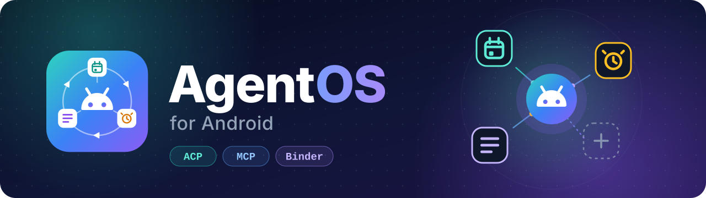
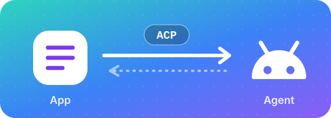
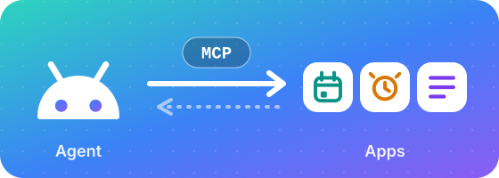
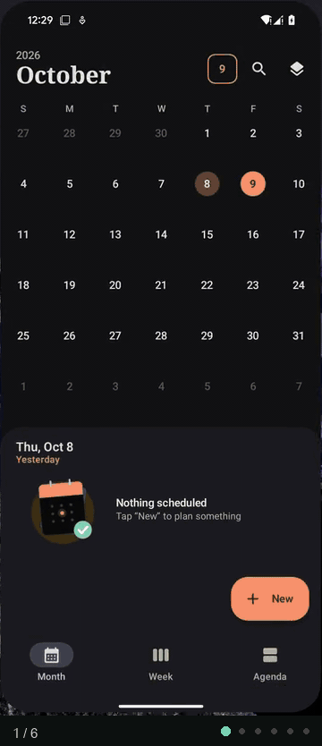
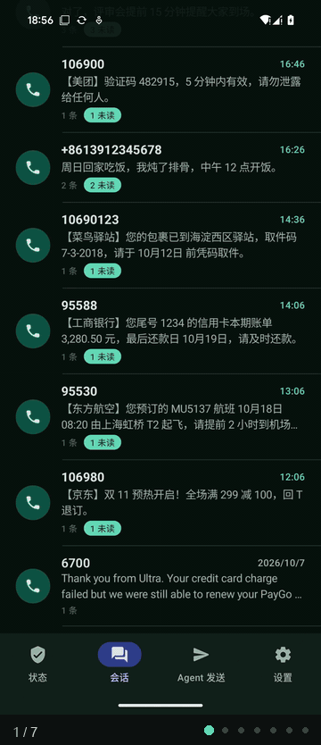

<div align="center">



<p>
  <b>简体中文</b> &nbsp;|&nbsp; <a href="README.en.md">English</a>
</p>

<h3>让 App 既能调用 Agent，也能为 Agent 提供能力。</h3>

<p>Agent 可以是一种入口，也可以是一种基础的系统服务。<br>
多个 App 共用同一套 Agent 运行时，不必各自内置完整的 Agent。</p>

<p>
  <a href="#当前状态与边界"></a>
  <a href="#快速开始"></a>
  <a href="#架构与设计"></a>
  <a href="#快速开始"></a>
  <a href="LICENSE"></a>
</p>

<p>
  <a href="#演示">演示</a> &nbsp;·&nbsp;
  <a href="#快速开始">快速开始</a> &nbsp;·&nbsp;
  <a href="#开发者接入">开发者接入</a> &nbsp;·&nbsp;
  <a href="#架构与设计">架构与设计</a> &nbsp;·&nbsp;
  <a href="#当前状态与边界">当前状态与边界</a> &nbsp;·&nbsp;
  <a href="#文档导航">文档</a> &nbsp;·&nbsp;
  <a href="#贡献与反馈">贡献</a>
</p>

</div>

---

## 核心能力

<table>
<tr>
<td width="50%" valign="top">
<a href="#demo-app-to-agent"></a>
<p><b>App 调用 Agent</b></p>
<p>App 通过 ACP 发起任务，由 Agent 处理，进度和结果回到发起任务的 App。App 不必内置 Agent，也不需要日历、闹钟等权限和模型 key。</p>
<p><sub>接入：<code>acp-android</code> SDK · Binder · 首次使用由用户授权，可随时撤销</sub></p>
</td>
<td width="50%" valign="top">
<a href="#demo-agent-to-app"></a>
<p><b>App 为 Agent 提供能力</b></p>
<p>App 通过插件把能力暴露成 MCP 工具，由 Agent 在任务中调用。写操作先弹确认框，列出工具、来源和参数。跨 App 走 MCP，不是模拟点击界面。</p>
<p><sub>接入：<code>plugin-sdk</code> 内嵌插件 · Binder · 不需要解释器</sub></p>
</td>
</tr>
</table>

同一个 App 可以同时扮演这两种角色。用户在原来的 App 里就能发起任务，不必先进入一个统一的聊天入口。

> [!NOTE]
> 当前是**原型**，以 Magisk / KernelSU 模块的形式部署在已 root 的 Android 手机上，不需要更换 ROM。root 是现阶段的部署和进程监督手段，不是项目的核心主张。两条接入路径都已有真机演示，但示例 App 由本项目提供，第三方 App 的权限管控也还很粗，详见[当前状态与边界](#当前状态与边界)。

---

## 演示

三段真机演示。前两段是 App 调用 Agent：备忘录和短信两个后装的示例 App，各在自己的界面里用上 AgentOS；第三段反过来，Agent 调用 App 提供的工具。

<a id="demo-app-to-agent"></a>

### 主演示：App → Agent

两个 App 自己都没有日历、闹钟的权限，也没有模型 key。它们只做一件事：把一段文字交给 AgentOS，由 Agent 读出时间和事项，建出日程、闹钟或待办，进度和结果回到发起任务的 App。用户不必离开原来的 App，去一个统一的聊天入口里重新描述一遍。

下面两张动图是从真机录屏里截出来的，丢掉了中间等待、切换 App 的帧，右边的数字和动图下方的圆点一一对应。

#### 备忘录：一条备忘变成日程和闹钟

<table>
<tr>
<td valign="top" width="320"></td>
<td valign="top">
<ol>
<li><b>先看现状。</b>日历里没有日程，闹钟里没有闹钟。</li>
<li><b>在备忘录里发起。</b>打开备忘「本周安排」：“明天下午3点和王总开会，3号会议室，提前15分钟提醒我；每周一早上7点跑步。”点 AgentOS 按钮（备忘录这段录屏是英文界面，按钮写着 <i>Let AgentOS schedule this</i>）。面板先列出<b>要发送的全文</b>，点开始才发。</li>
<li><b>第一次使用，要用户点头。</b>AgentOS 弹出“允许「Notes」使用 AgentOS 吗？”，显示包名和签名摘要，默认焦点在“拒绝”。点允许。</li>
<li><b>Agent 办事，结果回到备忘录。</b>面板里先看到 Agent 的思路，再显示“已创建 1 个日程、1 个闹钟”。</li>
<li><b>日历里确认。</b>周六 15:00–16:00「和王总开会（3号会议室）」，提前 15 分钟提醒。</li>
<li><b>闹钟里确认。</b>每周一 07:00「跑步」。</li>
</ol>
</td>
</tr>
</table>

完整录屏（真机，原速，44 秒）：[demo3.mp4](docs/assets/demo3.mp4)。动图没有加速，只是截取。

#### 短信：一个会话里的新短信变成日程和待办

<table>
<tr>
<td valign="top" width="320"></td>
<td valign="top">
<ol>
<li><b>打开会话。</b>短信 App 的会话列表，进入同事发来的会话：3 条短信：“明天上午 10 点产品评审会，3 号会议室，记得带原型。”“另外 Q3 数据报告周五之前发一下。”“对了，评审会提前 15 分钟提醒大家到场。”底部的“让 AgentOS 安排”按钮上，标签写着“3 条未处理”。</li>
<li><b>先预览，再发送。</b>面板列出<b>将发送的 3 条短信</b>（带收到的时间）和“提示词”（默认的任务说明，可以展开编辑），点开始才发。</li>
<li><b>第一次使用，要用户点头。</b>AgentOS 弹出“允许「短信」使用 AgentOS 吗？”，同样显示包名和签名摘要，默认焦点在“拒绝”。点允许。</li>
<li><b>Agent 读短信，建东西。</b>Agent 读短信的那几秒加速了 2 倍。Agent 按<b>短信收到的日期</b>换算“明天”和“周五”，建出周六 10:00 的「产品评审会」和今天到期的待办「发送 Q3 数据报告」；第三条“提前 15 分钟提醒”并进了日程的提醒，没有另外建闹钟。面板显示“已创建 1 个日程、1 个待办”。</li>
<li><b>待办 App 里确认。</b>「发送 Q3 数据报告」，今天到期，来源“同事短信”。</li>
<li><b>日历里确认。</b>10 月 10 日周六 10:00–11:00「产品评审会」，3 号会议室。</li>
<li><b>回到短信。</b>3 条短信的气泡标上“已由 AgentOS 处理”，下次不会再发，免得同一条短信反复建出重复的待办。</li>
</ol>
</td>
</tr>
</table>

动图是 51 秒录屏里截出的 16 秒：丢掉了点允许后停在 AgentOS 设置页、在最近任务里切换 App 的几段；只有第 4 步里 Agent 读短信的那几秒加速了 2 倍，其余原速。完整录屏（真机，原速，51 秒，720p）：[demo4.mp4](docs/assets/demo4.mp4)。

> **这两段演示验证的是：** 一个 App 不必内置 Agent，也能通过公共运行时获得跨 App 的任务处理能力；任务是从原来的 App 里发起的，进度和结果也回到这个 App。两个 App 用的是同一个 SDK、同一套授权，只是任务来源不同：一条备忘，一个会话里的短信。

需要说明的几点：

- 备忘录同时扮演了两种角色：它通过 `acp-android` SDK 调用 Agent，又通过内嵌插件把自己的笔记工具提供给 Agent。两个 App 都是本项目的示例，不是外部第三方。
- 授权只问这一次，之后可以在 AgentOS 设置里撤销，撤销后这个 App 进行中的任务立即取消。
- 两个 App 都只向 Agent 申请了“创建”类工具：备忘录是 `event_create`、`alarm_create`，短信是日程、待办、闹钟三个创建工具，不带读短信、发短信的工具。这是它们自己选择的最小范围，用来防文字里的提示注入；AgentOS 并不强制第三方这样做（见[当前状态与边界](#当前状态与边界)）。
- 每次创建是否先弹确认框，取决于你在 AgentOS 里对这些工具的设置。备忘录那段录制时，日历、闹钟两个创建工具设成了“始终允许”，所以没有逐次确认框。
- **短信原文会交给 AgentOS，再发给你在 AgentOS 里配置的模型端点**；短信 App 自己不联网。验证码按设置遮蔽。
- 短信演示里的 10 条短信是用 root 写进系统短信库的演示数据（脚本见 [`tests/device/acp-channel/sms_demo_seed.py`](tests/device/acp-channel/sms_demo_seed.py)），不是真实短信；短信 App 不是默认短信应用，真实 SIM 的短信没有验证过。待办类的事要装好待办示例 App 并启用它的插件才会建。
- 同一句话，模型每次的判断不完全一致：可能建成闹钟，也可能建成每周重复的日程。录屏是其中一次的结果。

备忘录一段的设计和验收见 [docs/third-party-acp.md](docs/third-party-acp.md)，短信一段见其中第 5b 节和 [0.2.0 发布说明](docs/release-notes/0.2.0.md)。

<a id="demo-agent-to-app"></a>

### 第二段演示：Agent → App

这一段看另一个方向。在 AgentOS 自己的界面里输入一条指令：

> 给我设置一个备忘录，记录一下下周我需要写三个 prd，并且在下周四下午 3 点需要开需求评审会。在需求评审会之前，提前半个小时设置闹钟提醒我参会

Agent 通过三个示例 App 提供的 MCP 工具，分别创建备忘录、日历日程和闹钟。需要确认的调用会先弹确认框，列出工具名、来源插件和参数，用户确认后才执行。

<table>
<tr>
<th align="center">在 AgentOS 里说一句话</th>
<th align="center">三个 App 里的结果</th>
</tr>
<tr>
<td align="center"></td>
<td align="center"></td>
</tr>
</table>

执行结果：

- 备忘录：创建「下周工作备忘」。
- 日历：创建周四 15:00 的「需求评审会」。
- 闹钟：创建 14:30 的「需求评审会提醒」。

> **这段演示验证的是：** App 可以通过明确声明的工具向 Agent 提供能力；Agent 把自然语言任务拆成工具调用，结果保存在各自的 App 里。跨 App 的操作走的是 MCP，不是模拟点击界面。

> [!NOTE]
> 三个 App 都是本项目提供的示例应用，已接入插件与 MCP。这段演示不代表 AgentOS 能直接操作任意未经适配的 Android App。

<details>
<summary>录屏说明与关键帧</summary>

<br>

录屏后半段是设置页（模型与 key、安全等级）和插件管理（已发现的插件）。动图里打字部分加速了 4 倍，其余 2 倍，点发送前后是原速；没加速的完整录屏（720p）：[demo.mp4](docs/assets/demo.mp4)、[demo2.mp4](docs/assets/demo2.mp4)。

关键帧，从左到右：点发送前输完的指令；日历里周四 15:00 的「需求评审会」；14:30 的闹钟；备忘录「下周工作备忘」。


</details>

---

## 快速开始

> [!IMPORTANT]
> 需要一台**已 root** 的 Android 15–17 手机，装好 Magisk 或 KernelSU。真机验证过的组合是 Pixel 8（Magisk 30.7，Android 15）；模拟器上跑过 Android 15 / 16 / 17；KernelSU 和 Android 16 / 17 真机还没验证过。

**最短路径：** 从 [Releases](https://github.com/HanZijie/agentos-android/releases) 下载**所有文件**到同一个文件夹，运行 `sh install.sh`。它会校验文件、刷入模块、重启、装好 AgentOS 和示例 App。**脚本做不了的部分**（解锁 / root、USB 调试、授予 root、模型 key、启用插件、短信权限）和**出问题怎么办**，逐条写在 [docs/install.md](docs/install.md)。下面是从源码自己打包的方式：

**1. 构建模块 zip。** 从源码打包（JDK 21、Android SDK、Node 22.19+，详见[开发指南](docs/development.md)）：

```bash
python3 tools/package-module.py --variant debug   # 产物在 build/module/agentos-<ver>.zip
```

**2. 刷入并重启。** 在 root 管理器里刷入 `agentos-<ver>.zip`，然后重启。模块会自动安装 AgentOS App 和 Runner，并拉起 Agent 运行时。

**3. 完成首次引导。** 打开 AgentOS App：选择模型厂商并填写 key（MiniMax 等预设，或自定义兼容端点）、允许通知、选择默认助理、允许忽略电池优化、查看已发现的插件。

之后可以长按电源键唤起助手，也可以在其他 App 里通过 ACP 调用它。

---

## 开发者接入

两个方向相互独立，一个 App 可以只做其中一个，也可以两个都做。

### 调用 Agent

真机已验证（Android 15）。在 App 里引入 `acp-android` SDK，建会话、发 prompt、接收流式事件。首次调用时，由用户在 AgentOS 里授权。SDK 目前以本仓库的 Gradle 模块 `:sdk:acp-android` 提供，还没有发布到 Maven；它基于官方 ACP Kotlin SDK（固定 0.30.1），加上 Binder 传输。

```kotlin
// 在协程里调用；失败会抛 AgentOsException（未安装、被拒绝、没配模型、限额等）
if (AgentOs.isInstalled(context)) {
    val connection = AgentOs.connect(context) { waiting -> /* 正在等用户在 AgentOS 里授权 */ }
    val session = connection.newSession(
        toolScope = listOf(ToolRef("calendar", "event_create"), ToolRef("alarm", "alarm_create")), // 可选：自己缩小范围
    )
    session.prompt("明天下午 3 点和王总开会").collect { event ->
        when (event) {
            is AgentOsEvent.Text -> { /* Agent 的文字 */ }
            is AgentOsEvent.ToolCall -> { /* 工具状态：等待确认 / 执行中 / 已完成 / 被拒绝 / 失败 */ }
            is AgentOsEvent.Done -> { /* 结束 */ }
        }
    }
}
```

完整示例见 [`plugins/samples/notes`](plugins/samples/notes)，接口约定见 [docs/third-party-acp.md](docs/third-party-acp.md) 第 4.7 节。

### 把能力提供给 Agent

模拟器和真机已验证，三个示例 App 全部走这条路径。在 App 里内嵌一个标准的 Agent Plugins 1.0 插件，放在 `assets/agent-plugin/`（`plugin.json`、`skills/`、`mcp.json`、Hooks）。MCP 服务用 `plugin-sdk` 在你自己的 App 进程里实现，在 `plugin.json` 的 `extensions."org.agentos"` 里声明，AgentOS 通过 Binder 连接，不需要任何解释器。

- **分发插件包**：标准插件包（zip）可以直接导入 AgentOS。其中的 MCP 只支持远端 Streamable HTTP（`https://`）；Hooks 只支持命令型，用手机自带的 `sh` 执行。
- **在电脑上调试**：通过 `adb forward` 用任意 ACP 客户端连接手机上的 Agent。
- **示例 App**：`plugins/samples/` 下有闹钟、日历、备忘录三个示例，工具清单与构建见 [docs/sample-apps.md](docs/sample-apps.md)。

构建、测试、打包和发布证书，见 [开发指南](docs/development.md)。

---

## 架构与设计


### 让入口、能力与运行时分别演进

| 角色 | 负责 |
|---|---|
| **任务入口** | 接收用户意图，可以是备忘录、日历、独立助手或其他客户端 |
| **能力提供方** | 负责具体操作，由各个 App 或服务暴露工具，并维护自己的业务逻辑与数据 |
| **Agent 运行时** | 负责模型调用、任务执行与会话管理，并在工具调用过程中执行授权、确认和审计规则 |

这样划分，是为了让 App 不必为了用上 Agent 而各自维护一套完整的运行时，也让新增一种能力不必总是伴随 Agent 主程序的修改。AgentOS 可以有自己的聊天界面，但它不应成为使用 Agent 的唯一入口。

### ACP、MCP、Plugin 和 Skill 各自解决不同的问题

| 组成 | 职责 |
|---|---|
| ACP | 连接任务发起方与 Agent，承载会话、输入和执行过程 |
| MCP | 连接 Agent 与能力提供方，承载工具调用和结果 |
| Plugin | 组织和分发工具配置、Skills、Hooks 等扩展内容 |
| Skill | 写给模型看的操作指南，描述如何用已有的工具完成一类任务，本身不授予任何权限 |

App 可以通过 ACP 请求 Agent 服务，也可以通过插件向 Agent 提供 MCP 工具。这是两个独立的接入方向，不要求每个 App 同时实现两者。

<details>
<summary><b>为什么工具和 Skill 要分开？为什么 ACP 走 Binder？</b></summary>

<br>

**工具和 Skill 分开，接口与用法才能各自演进。** 工具要稳定、可校验、可授权，所以每个工具都有 schema、风险等级和确认流程，每次调用都有记录；操作经验写成 Skill，改一句话不用发版。反过来，把能力藏进 Skill 的脚本里，或把流程塞进工具描述里，权限边界会变模糊。AgentOS 也是这样处理的：同一个插件里，MCP 和 Skills 走两条路。工具调用经 Extension Host，过风险策略和用户确认；Skill 通过 `read_skill` 读成文字，按不可信输入交给模型，它附带的脚本要执行，还得过 shell 工具、Runner 和确认。细节见 [docs/extensions.md](docs/extensions.md)。

**ACP 在手机上更像系统服务的调用协议。** 编辑器和终端里的 ACP，通常是 Agent 外壳的接线层，Agent 是客户端拉起的子进程。当 Agent 在手机上常驻、有身份、有状态、能跨 App 办事时，App 不再“集成一个 Agent”，而是向系统“请求 Agent 的服务”：调用方身份由内核给出（Binder 的调用方 UID），能不能调用由用户决定，用量看得见，随时能撤。所以 AgentOS 里 ACP 走 Binder，只有电脑端调试才走 `adb forward` 的 stdio 语义。

</details>

### 共用运行时，不等于共用所有上下文与权限

多个 App 使用同一个 Agent 服务，不意味着它们可以读取彼此的会话。

我们的设计目标是：由运行时识别调用方、隔离会话边界，由用户的授权与确认决定工具能否使用。模型可以提出行动，但不能仅凭生成的文本获得额外权限。

目前已经做到调用方识别、会话隔离、首次授权与撤销、限额和写操作确认。**按 App 和插件细分权限还在设计中**：现在获得授权的第三方 App，默认可以使用所有已启用插件的工具。这个取舍和它带来的风险，见[当前状态与边界](#当前状态与边界)。

### 实现与关键取舍

AgentOS 的运行时是 AgentOS App 里的一个独立进程 `:agent`，而不是放进 Android 的 `system_server`。外层是 Kotlin 宿主层，负责 ACP 接入、身份、存储、调度和恢复；Agent 循环复用上游的 **Pi Agent core**（`@earendil-works/pi-agent-core`），跑在进程内嵌的 QuickJS 里。

| 选择 | 原因与代价 |
|---|---|
| 用 root 模块，而不是定制 ROM | 原型把 Agent 做进了系统镜像，用户得自己编译、刷机。改成模块后，在现有设备上刷一个 zip 就能跑，部署和迭代成本低得多。代价：仍需要已 root 的设备，未 root 的手机没有同等能力 |
| 复用 Pi Agent core，而不是自己写 Agent 循环 | 把精力放在 Android 宿主、跨 App 接入和任务治理上。代价：Pi 还在 0.x，API 变化快，所以固定版本，升级要单独评估 |
| 在 QuickJS 里运行 Agent 核心 | APK 自带 JS 运行环境，手机上不需要装 Node。代价：官方 SDK 里依赖 Node 的部分要在打包时替换；模型请求的网络、key、重试留在 Kotlin 宿主层，key 因此不会进入 QuickJS |
| 用 Binder 传输 ACP 与 MCP | 调用方 UID 由内核给出，ACP 和 MCP 共用同一种消息通道。协议语义与 Android 传输分开，电脑端调试仍可走 `adb forward` |
| 工具调用由 AgentOS 自己的界面确认 | 调用方 App 只能追加拒绝，不能替用户同意；否则恶意 App 可以借 Agent 操作其他 App 或用户数据 |
| root 只管安装、守护和拉起 | AgentOS 的代码、模型和插件都不以 root 运行。代价：设备已经 root，其他 root 应用仍可能读取 AgentOS 的数据，所以安全等级固定为 `best_effort`，并在设置页如实告知 |

本仓库接续早期的 [agenroid 原型](https://github.com/HanZijie/agenroid)。从系统镜像迁到 root 模块，是为了先在现有设备上验证产品关系，不代表已经完成真正的系统级集成。完整的组件关系、协议与决策记录见 [架构文档](docs/architecture.md)。

<details>
<summary><b>仓库结构</b></summary>

```text
agentos-android/
├── core/      # contracts · protocol（ACP Profile、Binder 消息通道、Hooks、Agent Plugins schema）· runtime（Kotlin 宿主层与 Pi 适配层）· pi-runtime（打包进 APK 的 Pi Agent core）· extensions
├── app/       # AgentOS App：主进程（界面、确认、设置）· :agent（运行时、ACP 入口）· :ext（Extension Host）
├── runner/    # Runner：独立 UID，用 sh 执行 Hooks、shell 工具、Skill 脚本
├── sdk/       # binder-channel · acp-android（给后装 App）· plugin-sdk（在 App 里内嵌插件）
├── module/    # agentos.zip 的脚本：安装前检查、root 监督进程、safe mode
├── plugins/   # samples（内嵌插件的示例 App）
├── tools/  reference/  tests/  docs/  .github/
```

模块与包名对照见 [开发指南](docs/development.md#模块与源码位置)。

</details>

---

## 当前状态与边界

AgentOS 目前是用于验证产品形态与技术路径的原型。


| 状态 | 内容 |
|---|---|
| 已有真机演示 | 后装的示例备忘录、短信经 ACP 发起任务，首次使用时授权，建出的日程、闹钟、待办的进度和结果回到发起任务的 App；在 AgentOS 中发起任务，经 MCP 操作备忘录、日历、闹钟三个示例 App |
| 已通过真机验收（Pixel 8，Magisk 30.7，Android 15） | 模块安装、重启、禁用、启用、卸载的完整生命周期；电脑端 ACP 一致性测试（38 项，33 过、0 败、5 跳）；第三方 ACP 流程的自动化验收（34 项检查，连续两轮全过，含授权、拒绝、撤销、提示注入） |
| 尚未验证 | KernelSU；Android 16 / 17 真机；灭屏与 24 小时驻留；非本项目示例的第三方 App；第三方通道的一致性测试；“刷入后 10 分钟内完成第一次对话”（需要内测用户计时） |
| 尚未实现 | 按（App，插件，动作）细分的第三方权限；`acp-android` 发布到 Maven |

详细验证记录见 [验收清单](docs/m1-acceptance.md)，完整计划见 [实现计划](docs/implementation-plan.md)。

### 如何理解这个原型

**“本地 Agent”指运行时在手机上，不代表模型推理完全在手机上。** 当前通过用户自己配置的模型 API 获取推理结果。

**“App 可以接入”不等于“任意 App 都能被直接操作”。** 调用方需要接入 ACP；能力提供方需要暴露相应的插件或工具接口。

**“系统服务形态”是探索方向，不是当前权限等级。** 当前运行时位于普通 App 的进程中，没有注册进 `system_server`，也不具备完整的系统级信任边界。

**root 设备上的安全等级是 `best_effort`。** AgentOS 不以 root 身份运行 Agent，但无法阻止设备上的其他 root 应用读取它的数据。

**第三方 App 的权限目前是“授权后默认放开”，不是最小权限。** 已有的约束是：第一次使用要用户在 AgentOS 里允许，可随时撤销，撤销会取消它进行中的任务；会话按调用方隔离；每个 App 同时只能有一个进行中的任务，每小时最多 30 次，单次文字不超过 16,000 字符；写操作按和 AgentOS 自己一样的规则确认。但获准之后，它默认可以让 Agent 使用所有已启用插件的所有工具：读类工具不弹确认，用户设为“始终允许”的写工具也不再询问。这意味着一个获得授权的 App，可能借 Agent 读到自己本来无权读取的其他 App 的数据。调用方可以自己用 `toolScope` 缩小范围（示例备忘录就这么做），AgentOS 目前不强制。按（App，插件，动作）授权的方案和需要拍板的问题，见 [第三方接入设计第 9 节](docs/third-party-acp.md#9-权限管控机制设计讨论不实现)，目前只讨论、未实现。

**不在范围内：** 刷 ROM、AOSP 集成、system_server 服务、平台签名、未 root 的设备。

<details>
<summary><b>里程碑</b></summary>

<br>

工作包按依赖开工，不等上一个里程碑验收；里程碑是验收检查点，顺序为 M1 → M2 → M3a → M3b ∥ M4 → M5。依赖关系见 [依赖顺序图](docs/implementation-plan.md#4-依赖顺序)。

| 里程碑 | 目标 |
|---|---|
| 基础 | 仓库与构建、运行时宿主层、Pi Agent core 接入、ACP Agent 端、Binder 通道（原 M0 已拆散，验证项按需插在各自解锁的工作之前） |
| M1 一个 zip 跑通对话 | 刷 zip 后 10 分钟内完成第一次对话；电脑端 ACP 客户端能对话和取消 |
| M2 可靠性 | 持久化提交与恢复、监督强化与 safe mode、断网与升级 |
| M3a 入口与本地插件 | 助理入口、Extension Host、App 内嵌插件（MCP over Binder）、AgentOS 自带插件、工具确认 |
| M3b 插件包、Skills、Hooks、远端 MCP | 导入标准插件包、远端 Streamable HTTP MCP、Skills、命令型 Hooks、Runner、shell 工具 |
| M4 对外开放 ACP | 后装 App 通过 SDK 调用；授权、限额、会话隔离 |
| M5 开发者生态与发布 | plugin-sdk 注解与模板、KernelSU、设备矩阵、正式发布 |
| M6 进阶 | AppFunctions、GUI 兜底、Memory、多用户实验 |

</details>

---

## 文档导航

| 文档 | 内容 |
|---|---|
| [docs/architecture.md](docs/architecture.md) | 范围与决策记录、设计原则、组件、协议（ACP、Binder 消息通道、App 内部接口、扩展）、13 个功能的实现过程 |
| [docs/extensions.md](docs/extensions.md) | 扩展模块（Extension Host）：插件格式、插件来源、MCP over Binder、远端 Streamable HTTP、Skills、Hooks、Runner |
| [docs/third-party-acp.md](docs/third-party-acp.md) | 第三方 App 接入 ACP：授权、身份、限额、`acp-android` SDK、示例备忘录的功能规格，以及权限管控的风险讨论（第 9 节） |
| [docs/development.md](docs/development.md) | 开发指南：环境、常用命令、打包模块 zip、模块与源码位置、示例 App、项目发布证书 |
| [docs/implementation-plan.md](docs/implementation-plan.md) | 文件级目录、构建与产物（含依赖版本锁定）、8 项验证、依赖顺序图、28 个工作包与 M1–M6 出口条件、从 agenroid 迁移、风险 |
| [docs/m1-acceptance.md](docs/m1-acceptance.md) | 验收清单：真机与模拟器的验证记录、发现并修好的缺陷、没验证的部分 |
| [docs/install.md](docs/install.md) | 安装指南：脚本解决不了的部分（root、USB 调试、授权、key、插件、短信权限）、升级、故障排查 |
| [docs/sample-apps.md](docs/sample-apps.md) | 闹钟、日历、备忘录三个示例 App：工具清单、数据、构建 |
| [docs/spikes/](docs/spikes/) | 各项验证的结论：S1（模块安装 APK）、S2（保活与 root 监督）、S3（ACP over Binder）、S8（Pi Agent core 在 QuickJS 里）；实验工程在 `spikes/`，不参与主构建 |
| [core/protocol/acp-profile-v1.md](core/protocol/acp-profile-v1.md) | 对外协议，以此为准 |
| [请求链路时序图](docs/assets/request-flow.svg) | 核心链路：后装的 App 通过 ACP 调用 Agent，工具由另一个 App 内嵌的插件经 Binder 提供（含可选的 Hook 步骤） |
| [依赖顺序图](docs/assets/dependency-graph.svg) | 工作包和验证项的前后关系 |

---

## 贡献与反馈

**反馈。** Bug、想法、接入中遇到的问题，欢迎提 [Issue](https://github.com/HanZijie/agentos-android/issues)。请尽量附上设备型号、Android 版本、root 方案和版本（如 Magisk 30.7）、复现步骤；涉及 ACP / MCP 的问题，附上调用方 App 和插件的包名。

**贡献。** 欢迎提 PR：

1. Fork 本仓库，从 `main` 拉出分支。
2. 提交前在本地跑和 CI 一致的检查：

   ```bash
   ./gradlew test lint -Pagentos.skipPiBundle=true
   python3 tools/check-i18n.py
   ```

3. 几条约定：依赖版本锁定在 `gradle/libs.versions.toml`，不要擅自升级；界面文案中文放 `values/`、英文放 `values-en/`，`src/main` 的字符串字面量里不写中文（`check-i18n.py` 会拦）；私钥和密钥不进仓库。
4. 提 PR 到 `main`，说明改动和验证方式；真机验证请写明设备和系统版本。提交信息沿用历史里的 `docs:`、`tools:`、`feat(…)` 这类前缀。

**适合参与的方向**（都来自[当前状态与边界](#当前状态与边界)里“尚未验证 / 尚未实现”的部分）：

- KernelSU 和 Android 16 / 17 真机验证，灭屏与 24 小时驻留测试；
- 按（App，插件，动作）细分的第三方权限，设计讨论见 [第三方接入设计第 9 节](docs/third-party-acp.md#9-权限管控机制设计讨论不实现)；
- 用非示例的第三方 App 跑通接入，并补上第三方通道的一致性测试。

---

## Star History

<a href="https://star-history.com/#HanZijie/agentos-android&Date">
  <picture>
    <source media="(prefers-color-scheme: dark)" srcset="https://api.star-history.com/svg?repos=HanZijie/agentos-android&type=Date&theme=dark" />
    <source media="(prefers-color-scheme: light)" srcset="https://api.star-history.com/svg?repos=HanZijie/agentos-android&type=Date" />
    
  </picture>
</a>

---

## 许可证

[MIT License](LICENSE)，与 [agenroid](https://github.com/HanZijie/agenroid) 保持一致。

<sub>Android 是 Google LLC 的商标。本项目与 Google 没有隶属或背书关系。</sub>
