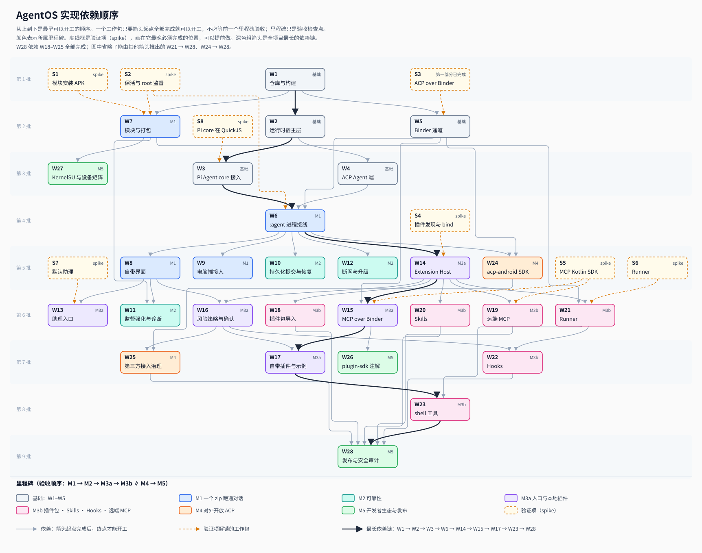

# AgentOS 项目计划

架构、协议和功能流程见 [architecture.md](architecture.md)，扩展模块见 [extensions.md](extensions.md)。本文回答四个问题：代码放在哪里、先验证什么、按什么依赖顺序做、每一步怎么算完成。

**交付形态只有一种：已 root 的手机 + 一个 `agentos.zip`。** 不刷 ROM，不做 AOSP 集成。运行时是 AgentOS App 里的 `:agent` 进程：Kotlin 宿主层，加上跑在 QuickJS 里的 Pi Agent core；root 只运行模块脚本。

标记说明：
- `[W1]`–`[W28]`：所属工作包（第 5 节）；`[M6]`：进阶阶段的占位；
- `S1`–`S8`：开工前的验证项（第 3 节）；
- `← 迁移`：从原型 [agenriod](https://github.com/HanZijie/agenroid)（本地 workspace 中的 `../agenriod/`）迁入或改写；
- `新写`：原型里没有对应的实现。

---

## 1. 项目文件夹

下面的 Kotlin 路径是简写：源码按 Gradle 标准布局，按包名展开，例如 `core/runtime/ports/AgentCore.kt` 就是 `core/runtime/src/main/kotlin/org/agentos/runtime/ports/AgentCore.kt`。各模块的包名见 README「开发」一节。

```text
agentos-android/
├── README.md · LICENSE · .gitignore
├── settings.gradle.kts · build.gradle.kts           [W1]
├── gradle/libs.versions.toml                        [W1] 所有依赖版本集中锁定在这里（第 2 节）
│
├── core/                                            # 纯 Kotlin/JVM，不依赖 Android，在电脑上编译和测试
│   ├── contracts/                                   # 对调用方可见的行为契约
│   │   ├── session-scheduling.md                    [W2] ← contracts/session-scheduling-v1.md，改用 ACP 术语
│   │   ├── session-selection.md                     [W2] ← contracts/session-selection-v1.md
│   │   ├── events.md                                [W2] ← contracts/output-stream-v1.md 中的事件信封与 sequence 语义
│   │   └── errors.md                                [W2] 新写：错误码，以及可重试与不可重试的分类
│   ├── protocol/
│   │   ├── acp-profile-v1.md                        [W4] ← workspace 根目录的 agentos-acp-profile-v1.md，对外协议的权威文档
│   │   ├── acp-mapping.md                           [W4] 新写：ACP 方法启用范围、内部事件到 session/update 的映射
│   │   ├── acp-extensions.schema.json               [W4] 新写：自动选会话；[W10] 持久化提交、增量恢复
│   │   ├── binder-channel-v1.md                     [W5] ACP 与 MCP 共用的 Binder 消息通道，附 AIDL；S3 定参的草案已在，W5 在真机结果补齐后冻结
│   │   ├── hooks-v1.md                              [W22] 新写：首批支持的 Hook 事件、输入字段和输出格式
│   │   └── agent-plugins-1.0/                       [W14] 固定副本：plugin.schema.json、mcp.schema.json（来自 agent-plugins.org）
│   ├── runtime/                                     # 运行时的 Kotlin 宿主层与 Pi 适配层（Kotlin/JVM 库，由 :agent 进程加载）
│   │   ├── acp/{AgentSide,UpdateMapper,ProfileExtensions}.kt      [W4] 新写：官方 SDK 的 Agent 端接上宿主层
│   │   ├── {AgentRuntime,RuntimeEngine,Ids}.kt · errors/ · events/   [W2] 运行时入口 AgentRuntimes.create、错误码、内部事件
│   │   ├── store/{Store,Db,Schema,Records,EventLog,SessionStore,TaskStore}.kt   [W2] ← sideagentd/main.cpp 的行为：追加写、sequence、恢复围栏；另存各会话的 Pi messages
│   │   ├── store/Migrations.kt                                    [W12]
│   │   ├── scheduler/{Scheduler,Recovery,TaskRunner,CoreSessions,SchedulerConfig,PromptContent}.kt   [W2] ← runtime_worker.cpp、main.cpp 的调度与恢复行为
│   │   ├── router/{SessionRouter,JevProvider}.kt                  [W2] ← session_selector.cpp 的行为
│   │   ├── pi/{PiAdapter,PiEventMapper,JsEngine,PiRuntime,ModelCatalog}.kt   [W3] 新写：Pi 适配层；JsEngine 是 QuickJS 的抽象，Android 和电脑上各一个实现；PiRuntime 是常驻泵
│   │   ├── net/HostFetch.kt                                       [W3] 新写：给 Pi 用的 fetch（OkHttp），按 endpoint 注入 key，错误分为可重试和不可重试
│   │   ├── broker/CapabilityBroker.kt                             [W2] 按目录校验工具名；[W16] 接 Extension Host，处理超时和取消
│   │   ├── broker/RiskPolicy.kt                                   [W16] 新写
│   │   ├── hooks/HookPoints.kt                                    [W22] 新写：在会话、prompt、工具调用（Pi 的 beforeToolCall / afterToolCall）、停止等节点发出 Hook 事件，按决定执行
│   │   ├── skills/SkillPrompt.kt                                  [W20] 新写：把 Skill 目录写进系统提示；内置 read_skill 工具
│   │   ├── ports/{HostPort,AgentCore}.kt                          [W2] 新写：HostPort 是宿主层对 Android 的全部依赖（工具、Skill、Hook、确认、存储、密钥、时钟）；AgentCore 是宿主层对 Agent 循环的依赖，由 Pi 适配层实现，测试时用假实现
│   │   ├── memory/MemoryProvider.kt                               [M6] 接口占位
│   │   ├── src/testFixtures/                                      [W2] FakeAgentCore、FakeHostPort、TestRuntime、AcpStdioAgent（电脑端 Agent 进程）；[W3] QuickJsJvmEngine、FakeModelServer（`FakeModelServerMain` 可单独运行，A6）、`RevocableSecrets`（带撤销信号的 SecretPort 测试替身，B5）
│   │   └── src/test/                                              [W2] JUnit，在电脑上运行；[W3] 含可以编排 tool_use 的假模型端点
│   ├── pi-runtime/                                  # 打包进 APK 的 Pi Agent core（JavaScript）
│   │   ├── package.json · package-lock.json         [W3] 固定 @earendil-works/pi-agent-core、pi-ai 0.86.1；只引入 anthropic-messages、openai-completions 两个协议族
│   │   ├── src/entry.js                             [W3] ← agenriod runtime/src/agent-runtime.js：给宿主调用的入口（start / prompt / abort / restore / history）
│   │   ├── src/host-bridge.js                       [W3] 调用 Kotlin 宿主层：fetch、工具、Hook 决定、事件
│   │   ├── src/polyfills.js                         [W3] ← agenriod runtime/build.mjs 里的 polyfill，补上真实定时器和流式 fetch
│   │   ├── src/node-stubs/                          [W3] 新写：替换官方 SDK 和 pi-ai 中引用 node:fs、node:child_process 等的文件
│   │   ├── build.mjs                                [W3] ← agenriod runtime/build.mjs：esbuild 打成单文件，输出到 app/src/main/assets/pi-agent.js；同时从 pi-ai 的模型目录导出 model-catalog.json，供设置页的厂商预设使用
│   │   └── test/                                    [W3] 用假宿主对打包结果做契约测试，Node 和 QuickJS 各跑一遍
│   └── extensions/                                  # 扩展的纯逻辑（Kotlin/JVM）
│       ├── ManifestReader.kt                        [W14] plugin.json、mcp.json、extensions."org.agentos"
│       ├── ToolNaming.kt                            [W14]
│       ├── PackageValidator.kt                      [W18]
│       ├── hooks/{HookMatcher,DecisionMerger}.kt    [W22]
│       └── src/test/
│
├── app/                                             # AgentOS App（普通 App，项目证书签名）：主进程 · :agent · :ext
│   ├── src/main/AndroidManifest.xml                 # 定义 BIND_MCP_SERVICE、RUN_COMMANDS（signature）；导出 ACP 服务（:agent）；<queries> 声明插件发现 action；声明 :agent、:ext 进程
│   ├── src/main/aidl/org/agentos/internal/          [W6] IAgentControl；[W14] IExtensionHost、IExtensionCallback（都不导出）
│   ├── src/main/assets/pi-agent.js                  [W3] 由 core/pi-runtime/build.mjs 生成，不手改，不进仓库；同目录的 model-catalog.json 同样是生成物
│   ├── src/main/res/xml/network_security_config.xml   [W6，B4] 只对 127.0.0.1、localhost、::1 放行明文 HTTP（debug 与 release 相同，F9），与 HostFetch.LOOPBACK_HOSTS 一致
│   ├── src/androidTest/                         [W6] 设备测试，跑在 :agent 进程（QuickJsEngine、PiAdapter 契约、冷启动、可选的真实端点）
│   ├── src/debug/                               [W9] 只进 debug 包：DesktopGatewayDebugReceiver（电脑端接入的测试入口，要求 DUMP）。回环明文放行在 main（B4）；设备用例的测试入口由 BuildConfig.TEST_HOOKS 控制（debug、releaseTest 打开）
│   ├── src/main/assets/agent-plugin/                [W17] AgentOS 自带插件（标准 Agent Plugin：plugin.json、skills/）
│   └── src/main/java/org/agentos/app/
│       ├── agent/                                   # 运行时进程 :agent
│       │   ├── AgentService.kt                      [W6] 有任务时前台服务（specialUse）；写心跳文件
│       │   ├── AgentProcess.kt · RuntimeLifecycle.kt · Heartbeat.kt   [W6] :agent 进程入口；前台 / 空闲判断（纯 Kotlin，恢复期间不判空闲）；心跳（DE 存储，监督契约 b）
│       │   ├── AcpService.kt                        [W6] 导出的 IAcpService：每条通道绑定调用方 UID，交给 SDK 的 Agent 端；M1 只接受本 App；[W25] 放开第三方
│       │   ├── AndroidStore.kt                      [W6] SQLite 实现
│       │   ├── QuickJsEngine.kt                     [W6，B lane] ← agenriod PiRuntime.kt、NativeAgentBridge.kt 的 QuickJS 接线：JsEngine 的 Android 实现，加载 pi-agent.js
│       │   ├── PiAgentCores.kt                      [W6，B lane] :agent 的 AgentCoreFactory：PiAdapter.factory + QuickJsEngine + hostPort.secrets
│       │   ├── KeystoreSecrets.kt                   [W6] BYOK，Keystore 加密
│       │   ├── ModelSources.kt                      [W6] 模型来源（厂商预设 / 自定义兼容端点）的校验、保存（files/byok/model-source.json）与热加载；清除 = key 立即作废
│       │   ├── HostPortImpl.kt                      [W6]；[W16] 工具与确认；[W20] Skill；[W22] Hook
│       │   ├── AgentControl.kt                      [W6] IAgentControl 的实现
│       │   ├── ConsentCoordinator.kt                [W16] 前台时弹确认界面，后台时发通知；60 秒无响应视为拒绝
│       │   ├── DesktopGateway.kt                    [W9] 抽象 socket agentos-acp，开发者开关，一次性配对码
│       │   ├── {CallerRegistry,QuotaPolicy}.kt      [W25] 第三方 App 授权名单与限额，支持撤销，防止反复弹窗
│       │   └── supervisor/{SupervisorStatusReceiver,SupervisorStatus,SupervisorStatusStore}.kt   [W7] 接收 root 监督进程的状态广播（signature 权限保护），状态文件 key=value 与 toJson()；[W11] safe mode
│       ├── ext/                                     # Extension Host，:ext 进程（设计见 docs/extensions.md）
│       │   ├── ExtensionHostService.kt              [W14] IExtensionHost 的实现
│       │   ├── registry/AppPluginScanner.kt         [W14] ← AgentManagerService.java 的发现与签名校验
│       │   ├── registry/{PackageImporter,PluginStore}.kt   [W18]
│       │   ├── registry/UserMcpConfig.kt            [W19]
│       │   ├── policy/ApprovalPolicy.kt             [W14] 按插件、服务器、工具的启用与审批设置
│       │   ├── policy/TrustStore.kt                 [W22] Hook 信任审核（按内容哈希）
│       │   ├── mcp/{McpClientManager,ToolCatalog}.kt   [W15] 连接管理、工具目录
│       │   ├── mcp/HttpMcpClient.kt                 [W19] 远端 Streamable HTTP，凭据用 Keystore 加密保存
│       │   ├── skills/SkillCatalog.kt               [W20]
│       │   ├── hooks/HookEngine.kt                  [W22] Hook 调度，调用 core/extensions 的匹配与合并
│       │   └── runner/RunnerClient.kt               [W21] 调用 Runner 执行命令、同步插件副本
│       ├── builtin/                                 # AgentOS 自带插件的 MCP 服务（Binder）
│       │   ├── BuiltinMcpService.kt                 [W17]
│       │   ├── tools/{intent,notifications,providers}/   [W17] Intent / 分享、通知、日历与联系人
│       │   ├── tools/shell/                         [W23] 高风险，默认关闭；命令交给 Runner 执行
│       │   └── tools/{appfunctions,accessibility}/  [M6]
│       ├── consent/                                 [W16] 确认界面，写明发起请求的 App
│       ├── ui/{AssistantSurface,ConversationScreen,LocalAcpClient}.kt   [W8] ← frontends/agenriod；LocalAcpClient 用官方 SDK + BinderAcpTransport
│       ├── voice/ · tile/ · bubble/                 [W13] ← frontends/agenriod/voice：默认助理入口、快捷开关、悬浮球
│       ├── settings/                                [W8] BYOK（厂商预设 + 自定义兼容端点）、安全等级、运行与监督状态；[W14] 插件管理；[W18][W19][W22] 插件导入、第三方 MCP、Hook 审核；[W25] 已授权 App 与用量
│       ├── diagnostics/                             [W11] 版本、健康状态、上次错误、监督状态
│       └── onboarding/                              [W8] 首次引导
│
├── runner/                                          # Runner APK（org.agentos.runner），独立 UID
│   ├── src/main/AndroidManifest.xml                 [W21] 不申请任何权限；Service 要求 RUN_COMMANDS
│   └── src/main/java/org/agentos/runner/
│       ├── RunnerService.kt                         [W21] 校验调用方 UID；syncPlugin / removePlugin / run
│       ├── CommandExecutor.kt                       [W21] /system/bin/sh -c；stdin、环境变量、超时（杀进程组）、输出上限
│       └── PluginMirror.kt                          [W21] 插件副本（PLUGIN_ROOT）和各插件的 PLUGIN_DATA
│
├── sdk/
│   ├── binder-channel/                              [W5] IChannel AIDL（src/main/aidl/org/agentos/channel/）；BinderChannel：顺序、背压、linkToDeath、UID 校验；FlowWindow（流控账本，纯 Kotlin，可在电脑上单测）
│   ├── acp-android/                                 # 给后装 App 用
│   │   ├── aidl/IAcpService.aidl                    [W5]
│   │   ├── BinderAcpTransport.kt                    [W5] 实现 ACP SDK 0.30.x 的 Transport；客户端、Agent 端、自带界面共用
│   │   ├── JsonRpcCodec.kt                          [W5] 按具体类型编码 JSON-RPC（不带 SDK 的 "type" 字段）；电脑端网关（W9）也用它
│   │   ├── AcpAndroid.kt                            [W5] ensureInitialized()：SDK 记日志前打开 kotlin-logging 的 Android 原生输出
│   │   ├── AgentOs.kt                               [W24] 检测是否安装、bind、打开通道、授权引导
│   │   └── sample/                                  [W24] 最小示例 App
│   └── plugin-sdk/                                  # 给 App 开发者：在 App 里内嵌标准 Agent Plugin
│       ├── aidl/IMcpService.aidl                    [W15]
│       ├── McpBinderTransport.kt                    [W15] 实现 MCP SDK 的 Transport；Extension Host 与插件 App 共用
│       ├── McpBinderService.kt                      [W15] 服务端基类，开发者只注册工具
│       ├── packaging/                               [W15] 按 Agent Plugins 1.0 校验并打包 assets/agent-plugin/
│       └── annotations/ · ksp/ · template/          [W26] 用注解生成 MCP 工具定义；内嵌插件的 App 模板工程
│
├── module/                                          # agentos.zip 的脚本，不含任何原生二进制
│   ├── module.prop.template                         [W7]
│   ├── customize.sh                                 [W7] 安装前检查
│   ├── common.sh · apks.sh · META-INF/              [W7] 公共函数、APK 安装与升级（按 S1 规则）、刷入入口
│   ├── test/{unit,service-sim}.sh                   [W7] 主机侧测试：安装逻辑与支持矩阵；监督状态机（假 procfs、虚拟时钟）
│   ├── service.sh                                   [W7] 监督进程：安装或升级 App（[W21] 起含 Runner）、开机拉起运行时、判活与退避拉起、状态广播；[W11] 崩溃循环、safe mode
│   ├── action.sh                                    [W11] 在 root 管理器里手动切换 safe mode
│   ├── uninstall.sh                                 [W7] 停止监督进程，删除监督状态
│   ├── kernelsu/                                    [W27] KernelSU 特有的差异
│   └── support-matrix.yaml                          [W7] 支持的 API、root 管理器版本、已验证的 fingerprint
│
├── plugins/
│   └── samples/{notes,alarm,calendar,meeting-records}/   [W17] ← plugins/notes、demo-apps/*：改写为内嵌插件的示例 App
│
├── tools/
│   ├── package-module.py                            [W7] 把 APK（[W21] 起加上 Runner）、脚本、支持矩阵打成 agentos.zip
│   ├── check-device.sh · smoke-test.sh              [W7]
│   ├── acp-bridge/                                  [W9] 电脑端 stdio ↔ adb forward 桥接命令
│   └── release.py                                   [W28]
├── spikes/                                          # 验证项的一次性实验工程，每项一个独立目录（spikes/S<n>/），不参与主构建；结论写进 docs/spikes/S<n>.md
├── reference/                                       [W2] ← sideagentd（C++）、system/agent/daemon（Node）、../pi-acp-adapter：只作行为参考和契约测试
├── tests/
│   ├── acp-conformance/                             [W4] 官方 TypeScript 客户端经 stdio 测电脑上的运行时；[W9] 经 adb forward 测真机
│   └── device/                                      [W6] 起：adb 驱动的真机测试，ACP 通道、MCP Binder、Runner、监督的用例分开；也可以在 root 过的模拟器上跑
│       └── acp-channel/{common,agent,client,inapp}/ · run.py   [W5] SDK 回归（--suite sdk）；[W6] :agent 用例（--suite app，inapp 执行器以 debugImplementation / releaseTestImplementation 注入 debug 和 releaseTest 包，release 包里没有；测试 key 只经 stdin 投递（`adb shell content write` 到 inapp 的 KeyDropProvider），不进 adb 命令行（API 37 的 adbd 会把命令行写进 logcat））
├── docs/
│   ├── architecture.md · extensions.md · implementation-plan.md · assets/
│   ├── spikes/                                      # 验证项的结论：S1、S2、S3、S8（真机部分待测）
│   └── runbooks/                                    [W28] 安装、卸载、恢复、设备兼容性操作手册
└── .github/workflows/
    ├── portable-tests.yml                           [W1]
    ├── module-package.yml                           [W7]
    └── release.yml                                  [W28]
```

---

## 2. 构建与产物

**用户只拿到一个文件：`agentos-<ver>.zip`。**

| zip 里的内容 | 构建方式 |
|---|---|
| `app/AgentOS-<ver>.apk` | Gradle，用项目发布证书签名；开机后由 `service.sh` 安装或升级 |
| `app/AgentOS-Runner-<ver>.apk` | Gradle，用项目发布证书签名；随 AgentOS App 一起安装或升级（W21 起） |
| 脚本、`support-matrix.yaml` | 原样打包 |

zip 里没有独立的原生二进制，不按 API 或 ABI 分别构建。Pi Agent core 以 `pi-agent.js` 的形式打进 AgentOS App 的 APK，QuickJS 的原生库随 `quickjs-kt` 一起进 APK，由 App 自己加载。构建机上需要 Node 来跑 esbuild，手机上不需要 Node。

另外发布给开发者的产物：
- `acp-android` SDK（Maven 包）；
- `plugin-sdk`（Maven 包，给要内嵌插件的 App 用）；
- 电脑端 `acp-bridge` 命令；
- 内嵌插件的示例 App 的 APK。

**AgentOS App 和 Runner 使用项目发布证书；内嵌插件的第三方 App 不要求同证书。** 两个 signature 级权限都由 AgentOS App 定义，只有 AgentOS App 持有：
- `BIND_MCP_SERVICE`：第三方 App 的 MCP 服务要求这个权限，所以只有 AgentOS 能 bind；
- `RUN_COMMANDS`：Runner 的 Service 要求这个权限，Runner 再校验调用方 UID。

证书在 W1 生成，私钥不进仓库。

### 依赖与版本锁定

| 项目 | 决定 | 依据 |
|---|---|---|
| ACP Kotlin SDK | 固定为 `com.agentclientprotocol:acp:0.30.1`，Gradle 会解析到 JVM 变体 `acp-jvm`；客户端和 Agent 端都用它。R8 需要 `-dontwarn org.slf4j.**`（`acp-android` 的 consumer 规则带入）；运行时在 SDK 第一次记日志前设置 `kotlin-logging-to-android-native=true`，电脑上的测试设置 `kotlin-logging-to-jul=true` | 已在 Android 上完成编译、D8、R8 验证，S3 第二部分已在 API 35 / 36 / 37 模拟器上跑通 Binder 往返，见 [spikes/S3.md](spikes/S3.md)。SDK 没有声明 Android target，属于 JVM 兼容性落地。注意：正式包里的版本常量是 `0.30.1-dev-67`，不能拿它判断版本（`AcpSdkVersionLockTest` 检查的是 jar 名和 Transport 签名） |
| ACP SDK 的 master 分支 | 不使用 | master 的 Transport API 已经改成 `TransportFrame` / `onFrame`，与 0.30.x 的 `JsonRpcMessage` / `onMessage` 不兼容。升级 SDK 要单独评估，改 `BinderAcpTransport` 并在真机上重跑 S3 |
| MCP Kotlin SDK | 官方 `io.modelcontextprotocol:kotlin-sdk-client` / `kotlin-sdk-server`，版本在 S5 固定；同时固定它所支持的 MCP 协议修订版 | 撰写时查到的最新版 0.15.0 用 Kotlin 2.4、Ktor 3.5 构建。Kotlin 编译器只能读取比自己高一个小版本的库元数据，所以 S5 要一并决定整个工程的 Kotlin 版本 |
| Pi Agent core | `@earendil-works/pi-agent-core` 和 `@earendil-works/pi-ai` 固定 0.86.1；`pi-ai` 只打包 `anthropic-messages`、`openai-completions` 两个协议族，连同它们的官方 SDK（S8 时为 `@anthropic-ai/sdk` 0.124.0、`openai` 6.40.0、`typebox` 1.3.27）按 `package-lock.json` 锁定。S8 实测 `pi-agent.js` 压缩后 573 KB（gzip 147 KB），`model-catalog.json` 419 KB（APK 内约 26 KB） | 与 Profile 核对过的 Pi 主线版本一致；原型 agenriod 用 0.85.1 在 QuickJS 里跑通了上游 `Agent` 循环。2026-09 在电脑上用 0.85.1 试打包：只含 Agent 核心约 587 KB，加上 MiniMax、Anthropic、OpenAI、DeepSeek 四个预设约 1.9 MB，其中两个官方 SDK 占约 1.2 MB。Pi 还在 0.x，升级要单独评估，并重跑 S8 和契约测试 |
| JS 引擎 | QuickJS，Kotlin 绑定 `io.github.dokar3:quickjs-kt` 固定 **1.0.15**（S8）；App 只打 `arm64-v8a` 的原生库（真机与本机 arm64 模拟器够用，需要 x86_64 模拟器时再加）；电脑上用同一个绑定的 JVM 变体 `quickjs-kt-jvm`，另可用 Node 的裸 `vm` 上下文跑快速契约测试 | 体积小，不需要 Node。1.0.15 用 Kotlin 2.4.10 构建，要求 Kotlin 编译器 ≥ 2.3；最后一个能配 Kotlin 2.2 的 1.0.5 遇到中文 + emoji 会挂住，不可用。`quickjs-kt-jvm` 只在 macOS arm64 上验证过，Linux x64 待 CI 跑一次 |
| JS 打包 | esbuild；Node 只在构建机上使用 | 原型的 `build.mjs` 已经能把 Pi 打成 QuickJS 可以执行的单文件 |
| Android 工具链 | AGP 8.10.1、**Kotlin 2.3.20**、JDK 21、Gradle wrapper 8.14.5；字节码目标 17；`compileSdk` / `targetSdk` 36，`minSdk` 35 | Kotlin 于 2026-09-29 整合时由 2.2.20 升到 2.3.20，因为 quickjs-kt 1.0.15 需要 ≥ 2.3（S8 结论 d）；升级后主工程全量构建通过，并在 Pixel_8a 模拟器上重跑了 S3 的 debug 和 R8 release 场景（S3.md）。最终版本随 S5 定：MCP SDK 用 Kotlin 2.4 构建，升到 2.4 时一并评估 AGP（AGP 8.10.1 的 R8 读 2.4 元数据有警告）。Android Studio 自带的 JBR 是 25，Gradle 8.14 跑不了，Gradle JDK 必须设成 21；AGP 8.10.1 会触发 Gradle 的 “null attribute key” 弃用警告，Gradle 10 会变成错误 |
| 其他 Kotlin / Java 库 | kotlinx-coroutines **1.11.0**、kotlinx-serialization-json 1.7.3；OkHttp 4.12.0；JUnit 4.13.2；androidx.test runner 1.5.2 / ext-junit 1.1.5（设备测试） | coroutines 于 2026-09-29 由 1.9.0（acp-jvm-0.30.1.pom 的版本）升到 1.11.0：quickjs-kt 1.0.15 需要 ≥ 1.11.0，不显式升级时测试类路径会被悄悄解析成 1.11.0、主代码仍是 1.9.0；acp 0.30.1 在 1.11.0 上已用 tests/device/acp-channel 回归验证。有 quickjs-kt 的类路径上 kotlin-stdlib 解析为 2.4.10（编译器仍是 2.3.20） |
| 支持的系统 | Android 15–17（API 35–37） | Android 17 已正式发布；真机验证覆盖这三个版本 |
| 传输 | Android 上的 ACP 和 MCP 都走 `binder-channel-v1`；SDK 的 `StdioTransport` 只用于电脑上的测试 | 两种协议都是 JSON-RPC 消息流，共用一套通道 |
| HTTP | 宿主层的网络出口（给 Pi 用的 `fetch`）用 OkHttp；MCP 远端客户端用 Ktor 加 OkHttp 引擎，不用 Ktor 的 Android 引擎 | 共用一套连接池和证书配置；HTTP 引擎版本在 S5 与 MCP SDK 一起固定 |
| 存储 | SQLite（WAL），驱动 `androidx.sqlite` 2.7.1（W2 选定）：`core/runtime` 只依赖 `SQLiteDriver` 接口，电脑测试与 `:agent` 都用 `BundledSQLiteDriver`，共用同一套 schema | 运行时的事实都在 Store 里，测试必须覆盖真实的 SQL |
| Agent Plugins schema | 固定 1.0.0 的副本，放在 `core/protocol/agent-plugins-1.0/` | 校验插件时不联网；升级到新版规范要单独评估 |

### CI

| Workflow | 触发 | 内容 |
|---|---|---|
| `portable-tests.yml` | 每次提交 | 在电脑上跑 `core/runtime`、`core/extensions` 的测试，`core/pi-runtime` 的打包与契约测试，官方 TypeScript 客户端经 stdio 的 ACP 一致性测试，Gradle 单元测试和 Lint |
| `module-package.yml` | 每次提交 | 打包 `pi-agent.js`，构建 APK，打包 zip，做离线检查（脚本语法、`module.prop`、支持矩阵） |
| `release.yml` | 打 tag | zip、SDK、SHA-256、变更日志、支持矩阵、可复现构建报告 |

---

## 3. 验证项（spike）

每一项都是一个一次性的小实验，只回答一个问题，结论写入 `docs/spikes/S<n>.md`。spike 不集中在开头做完：每一项只需要在它解锁的工作包开工前完成（见第 4 节的依赖图），当然也可以提前做。

| # | 怎么做 | 通过标准 | 不通过时 | 解锁 |
|---|---|---|---|---|
| S1 | **模块安装 APK**：在 `service.sh` 里用 `pm install` 安装和升级 zip 里的 AgentOS App 和 Runner；Magisk 和 KernelSU 各跑一遍 | 开机后能安装、能覆盖升级；不被 Play Protect 拦截；签名不符时能正确停止，并在 root 管理器里显示原因 | 改为在 `customize.sh` 刷入阶段安装；仍然不行就让用户手动安装 APK，模块只负责检查版本 | W7 |
| S2 | **运行时保活与 root 监督**：`service.sh` 以 root 用 `am start-foreground-service` 拉起 `:agent` 的前台服务（`specialUse`）；运行时写心跳文件，监督进程判活；分别在有任务时杀掉 `:agent`、锁屏灭屏 30 分钟后由测试 App bind ACP 服务、连续运行 24 小时；监督进程向 App 发显式广播，再用另一个 App 尝试发同样的广播。Android 15 / 16 / 17 和 Magisk / KernelSU 都要覆盖 | root 拉起前台服务不被后台启动限制拦截；有任务时进程被杀，能在退避时间内被拉起并执行恢复流程；灭屏 30 分钟后从 bind 到首个响应不超过 3 秒；24 小时内没有因 Android 17 的内存上限被回收，并记下内存占用；App 能收到监督进程的广播，其他 App 发不进来；判活方式（`pidof`、心跳文件）选定 | 前台服务启动被拦：依赖首次引导里请求的电池优化豁免；频繁被回收：经用户同意后由监督进程设置 standby bucket 和 deviceidle 白名单，并在设置页提示检查厂商的后台限制 | W6、W7 |
| S3 | **ACP over Binder**。第一部分（**已完成**，见 [spikes/S3.md](spikes/S3.md)）：临时 Android 工程引入 `acp:0.30.1`，`compileSdk` / `targetSdk` 35 与 36、`minSdk` 35，编译、D8、R8 release 全部通过。第二部分（**模拟器已完成，真机待做**；参数已定：单条 65,536 字符，在途 32 条且 32,768 字符，接收方累计 `ack`，见 `core/protocol/binder-channel-v1.md`）：两个测试 App，客户端用 SDK + `BinderAcpTransport`，服务端把 SDK 的 Agent 端放在独立进程里并导出 `IAcpService`，通道按 `binder-channel-v1` 实现；在 API 35 / 36 / 37 真机上跑 `initialize` → `session/new` → `session/prompt` 流式输出 → `cancel` → close / 重新 bind；debug 和 R8 release 构建各跑一次，中途分别杀一次客户端和服务端进程；在流式高峰下测 Binder 异步缓冲；最后让服务端开一个抽象 socket，经 `adb forward` 用官方 TypeScript 客户端完成一轮对话 | 流式输出不阻塞主线程，没有明显的延迟堆积；cancel 后本轮返回 `cancelled`；close 后重新 bind 能继续；任何一端进程死亡，另一端经 `linkToDeath` 关闭协程和通道，没有泄漏；R8 release 与 debug 行为一致；确定单条消息上限和背压参数；电脑端经 `adb forward` 能完成对话 | 先修 `BinderAcpTransport`；如果是 SDK 在设备上的运行时问题，改为只用 SDK 的数据类型、自己写 JSON-RPC 层；官方 Java SDK 作为最后备选 | W5 |
| S4 | **插件 App 的发现与 Binder 连接**：测试 App 定义 `BIND_MCP_SERVICE`（signature）；另装一个插件 App，在 `assets/agent-plugin/` 放插件包，导出要求该权限的 `IMcpService`。测试 App 用 `<queries>` 发现它、通过 `createPackageContext` 读出插件包，再在界面前台和只有前台服务在跑两种情况下分别 `bindService()`，经通道收发消息；最后杀掉插件 App 的进程，并用一个没有该权限的 App 尝试 bind | 能发现、能读到对方的 assets、能 bind，后台 bind 不被系统拦截；消息到达时 `Binder.getCallingUid()` 等于插件 App 的 UID；插件 App 进程被杀后经 `linkToDeath` 感知，进行中的调用被正确清理；没有权限的 App bind 失败 | 后台 bind 不可靠，就只在运行时有任务（前台服务运行）时 bind；读不到 assets，就让插件 App 通过 Binder 接口返回插件包 | W14 |
| S5 | **MCP Kotlin SDK 在 Android 上**：做法同 S3 第一部分，引入官方 MCP Kotlin SDK，完成编译、D8、R8，并确认它与 ACP SDK 0.30.1 能否共用同一套 Kotlin / Ktor 版本；实现 `McpBinderTransport`，在两个测试 App 之间跑通初始化、`tools/list`、`tools/call`、取消、`tools/list_changed`；再用 SDK 的 `StreamableHttpClientTransport`（Ktor + OkHttp 引擎）连一个真实的远端 Streamable HTTP MCP 服务，完成一次 `tools/call` 并测试断线重连 | 编译打包通过；Binder 往返和通知正常；远端能完成一次 `tools/call`；确定 SDK 版本、它支持的 MCP 协议修订版、Kotlin / Ktor / OkHttp 版本，写进依赖锁定表；如果需要升级 Kotlin，重跑 S3 第一部分 | 只用 SDK 的数据类型、自己写 JSON-RPC 层；远端客户端改用 OkHttp 自己实现 Streamable HTTP | W15、W19 |
| S6 | **Runner**：Runner APK（不申请任何权限）通过 Binder 接收命令，用 `/system/bin/sh -c` 执行：传入 stdin JSON 和环境变量，测试超时（杀进程组）和输出上限；在 Runner 里尝试读取 AgentOS App 的数据、绑定 AgentOS App 的内部服务；测试在 PATH 里放一个转发到 `/system/bin/sh` 的 `bash`；测量一次 Hook 往返（`:agent` → `:ext` → Runner → 返回）的耗时 | 命令正确执行，超时后清理干净，输出被截断；读取 AgentOS 数据、绑定内部服务都失败；记下 `bash` 转发是否可行；Runner 已在运行时，一次 Hook 往返 p95 不超过 200 ms，冷启动耗时单独记录 | 超时清理不可靠，就改为每条命令在单独的进程里执行；延迟超标，就在有任务期间让 Runner 常驻，并在设置页提示 `PreToolUse` Hook 会拖慢每次工具调用 | W21 |
| S7 | **默认助理**：用户在系统设置里选择默认助理，测试长按电源键 | 首批设备上能稳定唤起浮层 | 首版只提供快捷开关和悬浮球入口 | W13 |
| S8 | **Pi Agent core 在 QuickJS 里（混合方案）**：用 esbuild 把 `pi-agent-core` 和 `pi-ai` 0.86.1 打成单文件，`pi-ai` 只含 `anthropic-messages`、`openai-completions` 两个协议族，官方 SDK 和 `pi-ai` 里引用 Node 内置模块的文件替换成空实现；放进测试 App，用 `quickjs-kt` 执行。Kotlin 提供真实定时器、流式 `fetch`（OkHttp）、UTF-8 编解码、`AbortController`；调用 `pi-ai` 时传入这个 `fetch`、占位 key 和 `maxRetries: 0`，真 key 由 Kotlin 在 `fetch` 里注入。在 API 35 / 36 / 37 真机上：用 `minimax` / `minimax-cn` 预设和一个 OpenAI 兼容端点，各完成一次流式对话和一次工具调用；中途 `abort`；多个会话的 `Agent` 实例并发；用保存的 messages 重建 `Agent` 后继续对话；测量 bundle 体积、加载 bundle 的冷启动耗时、每个会话的内存增量、每轮的额外延迟；导出 `model-catalog.json`；最后在电脑上用同一个 bundle 跑契约测试 | 流式输出逐段到达 Kotlin，工具调用和结果往返正确；`abort` 后本轮以 aborted 结束，没有残留的 HTTP 请求；`pi-ai` 和 SDK 不自己重试；重建后上下文一致；并发会话不串话；JS 里拿不到 key；冷启动目标不超过 1 秒，bundle 体积、内存和延迟记下数值；确定“一个 QuickJS 运行时承载多个会话”还是“每个会话一个运行时”；确定电脑上跑 bundle 的方式 | 官方 SDK 在 QuickJS 里跑不通：由宿主层实现这两个协议族，经自定义 `streamFn` 推给 Pi，Agent 循环仍然用 Pi，模型目录仍读 `pi-ai` 的数据文件；QuickJS 的性能或兼容性不够：换 V8 类引擎（如 Javet）再评估 | W3 |

**当前状态（2026-09-29 整合）**：

| # | 状态 | 结论 | 还差什么 |
|---|---|---|---|
| S1 | 不需要设备的部分完成；root 模拟器（adb root，API 35 / 37）上 M1–M7 通过 | 安装规则写进 [spikes/S1.md](spikes/S1.md)：比较版本、核对 SHA-256、不降级、签名不符就停止；先等 `pm path android` 可用再装，不必等解锁；`pm install` 的输入方式按 tmp → pipe → path → stdin → session 依次回退（模拟器上 path 被 SELinux 拒） | Magisk / KernelSU 真机（M1–M8，含 Play Protect） |
| S2 | 监督契约 v0.1；root 模拟器（adb root，API 35 / 37）上 B0、K1、K2、K4、K5、T1、P1、B1（缩短为 10 分钟）通过 | [spikes/S2.md](spikes/S2.md)：判活看进程，心跳记录任务状态并用来发现短命进程（`boot` 字段必须等于 `Settings.Global.BOOT_COUNT`）；退避 1 → 60 s，10 分钟内 5 次异常退出进入 safe mode；等用户解锁后再拉起，包处于 stopped 时不拉起。**root 拉起前台服务按 `SYSTEM_UID` 豁免后台启动限制**，App 自己在后台被拒时由监督进程 1.9 s 内代为提升 | Magisk / KernelSU 真机（SELinux 上下文与 adb root 不同）；灭屏 30 分钟、24 小时驻留与内存；K3、K5b |
| S3 | 第二部分模拟器完成（API 35 / 36 / 37，另在 Pixel_8a 上用 Kotlin 2.3.20 复跑） | 可用；通道参数已定 | API 35 / 36 / 37 真机 |
| S8 | 电脑与模拟器全部通过（Node vm、QuickJS/JVM、API 36 debug / R8 release、Pixel_8a R8 release 均 20/20）；MiniMax 国内真实端点（`api.minimaxi.com` 与 `api.minimax.cn`）在电脑和 Pixel_8a 上跑通对话、工具调用、abort | 官方 SDK 能在 QuickJS 里跑通，不需要退路；一个运行时承载全部会话，由常驻泵驱动；quickjs-kt 1.0.15，Kotlin ≥ 2.3 | 真机；MiniMax 国际预设（需要国际 key）；OpenAI 兼容端点 |
| S4–S7 | 未开始 | — | — |

**S2、S3、S4、S6 验证的是四段不同的连接，不能互相替代：**
- S2：root 监督进程 → AgentOS App，进程管理与状态广播；
- S3：第三方 App → AgentOS 的 `:agent`，Binder 承载 ACP；
- S4（加上 S5 的传输部分）：Extension Host → 插件 App 的 MCP 服务，Binder 承载 MCP；
- S6：Extension Host → Runner，Binder 加命令执行。

一段通过，不代表其他几段没有问题。

---

## 4. 依赖顺序

### 4.1 依赖图



读法：
- 从上到下是**最早可以开工的顺序**。一个工作包只要指向它的前置项都完成，就可以开工，不必等前一个里程碑验收。
- 颜色表示工作包所属的里程碑。里程碑是**验收检查点**，按 M1 → M2 → M3a → M3b ∥ M4 → M5 的顺序验收。
- 虚线框是 spike，画在它**最晚必须完成**的位置，可以提前做。

### 4.2 依赖表

依赖图以这张表为准，改依赖时两处一起改。

| 工作包 | 目标 | 依赖 | 里程碑 |
|---|---|---|---|
| W1 | 仓库与构建 | — | 基础 |
| W2 | 运行时宿主层 | W1 | 基础 |
| W3 | Pi Agent core 接入 | W2、S8 | 基础 |
| W4 | ACP Agent 端 | W2 | 基础 |
| W5 | Binder 通道 | W1、S3 | 基础 |
| W6 | `:agent` 进程接线 | W3、W4、W5、S2 | M1 |
| W7 | 模块与打包 | W1、S1、S2 | M1 |
| W8 | 自带界面 | W6 | M1 |
| W9 | 电脑端接入 | W6 | M1 |
| W10 | 持久化提交与恢复 | W6 | M2 |
| W11 | 监督强化与诊断 | W7、W8 | M2 |
| W12 | 断网与升级 | W6 | M2 |
| W13 | 助理入口 | W8、S7 | M3a |
| W14 | Extension Host 与插件发现 | W6、S4 | M3a |
| W15 | MCP over Binder | W5、W14、S5 | M3a |
| W16 | 风险策略与确认 | W8、W14 | M3a |
| W17 | 自带插件与示例 App | W15、W16 | M3a |
| W18 | 插件包导入 | W14 | M3b |
| W19 | 远端 MCP（Streamable HTTP） | W14、S5 | M3b |
| W20 | Skills | W14 | M3b |
| W21 | Runner | W7、W14、S6 | M3b |
| W22 | Hooks | W16、W21 | M3b |
| W23 | shell 工具 | W17、W21 | M3b |
| W24 | `acp-android` SDK | W5、W6 | M4 |
| W25 | 第三方接入治理 | W16、W24 | M4 |
| W26 | `plugin-sdk` 注解与模板 | W15 | M5 |
| W27 | KernelSU 与设备矩阵 | W7 | M5 |
| W28 | 发布与安全审计 | W18–W25 | M5 |

### 4.3 起步顺序与关键路径

**第一批可以同时开工**：W1、S1、S2、S3 第二部分、S8。之后：

1. W1 完成 → W2；W2 完成 → W4；W2 和 S8 都完成 → W3；
2. S3 通过 → W5；S1、S2 通过 → W7；
3. W3、W4、W5 和 S2 都完成 → W6，这是第一个汇合点；
4. W6 完成 → W8、W9 并行，一个 zip 跑通对话（M1）。

**到 M1 的关键路径**：W1 → W2 → W3 / W4 → W6 → W8。S2、S3、S8 要在 W6、W5、W3 开工前通过，否则会卡住整条路径，所以放在第一批。

**全项目最长的一条链**：W1 → W2 → W3 → W6 → W14 → W15 → W17 → W23 → W28。

几个可以提前的点：
- W27（KernelSU）只依赖 W7，M1 期间就可以开始；
- W24（`acp-android` SDK）只依赖 W5、W6，可以和 M2、M3a 并行；
- W14 只依赖 W6 和 S4，不用等 M2 验收。

---

## 5. 工作包与里程碑

### 基础

不属于任何里程碑，是 M1 的前置。

#### W1 仓库与构建
- [x] 目录骨架、`.gitignore`（排除 `.DS_Store`、构建产物、密钥）、`LICENSE`（MIT，与 agenriod 一致）
- [x] Gradle 多模块：`core:runtime`、`core:extensions`、`sdk:binder-channel`、`sdk:acp-android`、`sdk:plugin-sdk`、`app`、`runner`、`plugins:samples:*`；`core/pi-runtime` 是 Node 工程，由 Gradle 任务在构建 APK 前调用它的 `build.mjs`
- [x] `gradle/libs.versions.toml`，按第 2 节锁定版本
- [ ] 生成项目发布证书，私钥不进仓库（**待维护者**：证书决定以后所有版本的签名身份，按 README「开发」一节生成一次；构建脚本只从环境变量读取，签名流程已用一次性证书验证）
- [x] `.github/workflows/portable-tests.yml`（本地确认 YAML 可解析；还没在 GitHub 上实际跑过）

`plugins:samples:*` 目前只有自动加入机制：`plugins/samples/<name>/` 下有 `build.gradle.kts` 就进构建，W17 加示例时不用改 settings。

#### W2 运行时宿主层
- [x] `core/contracts/`：按第 6 节迁移并改写 session-scheduling、session-selection、events，新写 errors
- [x] `core/runtime/`：store（含各会话的 Pi messages）、scheduler、recovery、router、`CapabilityBroker` 接口、`HostPort`；调度与恢复的行为以 `reference/` 里的 sideagentd 为参考，用 Kotlin 重写
- [x] 选定 SQLite 驱动，电脑上的测试和 Android 共用同一套 schema（androidx.sqlite 2.7.1：core/runtime 只依赖 `SQLiteDriver` 接口，电脑测试与 Android 都可用 `BundledSQLiteDriver`）
- [x] JUnit 覆盖以下行为（StoreTest、RecoveryTest、SessionRouterTest、CapabilityBrokerTest）：
  - store 追加写与 sequence
  - 恢复时不重放结果未知的调用
  - router 失败时回退到新建会话
  - broker 拒绝不在目录里的工具

#### W3 Pi Agent core 接入
- [x] `core/pi-runtime/`：固定 `pi-agent-core`、`pi-ai` 0.86.1；迁移 agenriod 的入口和 polyfill，删掉原型自带的文件工具；用 esbuild 打成 `pi-agent.js`
- [x] `JsEngine` 抽象，以及电脑上的实现（按 S8 的结论）
- [x] `PiAdapter`：会话与 `Agent` 实例的对应、保存和恢复 messages、`abort`、工具轮次上限（12 轮）；`beforeToolCall` / `afterToolCall` 接到 Broker
- [x] `PiEventMapper`：Pi 的生命周期事件 → 内部事件（与 `core/contracts/events.md` 一致）
- [x] `HostFetch`：给 Pi 用的流式 `fetch`，按 endpoint 注入 key；错误分为可重试和不可重试（与 `core/contracts/errors.md` 一致）
- [x] 模型接入按混合方案：只打包 `anthropic-messages`、`openai-completions`；`src/node-stubs/` 替换 Node 内置模块；调用 `pi-ai` 时传入 `HostFetch`、占位 key 和 `maxRetries: 0`（S8 不通过时改为宿主层实现这两个协议族 + 自定义 `streamFn`）
- [x] 厂商预设：`build.mjs` 从 `pi-ai` 的模型目录导出 `model-catalog.json`，MiniMax 国际 / 国内排第一；自定义兼容端点按协议族生成 Pi 的模型配置
- [x] 测试：假模型端点编排 `tool_use`；工具轮次上限；`abort`；恢复后上下文一致；JS 里拿不到 key；`pi-ai` 和 SDK 不自己重试

#### W4 ACP Agent 端
- [x] 把 `../agentos-acp-profile-v1.md` 迁入 `core/protocol/acp-profile-v1.md`，注明 Profile 中的 `sideagentd` 在本项目里对应 `:agent` 运行时，Pi 的接入用 `pi-agent-core` 而不是 `pi-coding-agent`
- [x] 写 `acp-mapping.md`：方法启用范围，以及 Pi 事件（经内部事件）到 `session/update` 的映射
- [x] 冻结“自动选会话”扩展的方法名和字段，写入 `acp-extensions.schema.json`（形式：`session/new` 的 `_meta."org.agentos".autoSelect`，结果经 `session_info_update` 告知）
- [x] `core/runtime/acp/`：`initialize`、`session/new`、`session/prompt`、`session/update`、`session/cancel`，以及自动选会话扩展
- [x] `tests/acp-conformance/`：在电脑上用 SDK 的 `StdioTransport` 启动运行时，用官方 TypeScript 客户端跑基础方法（13/13，Agent 循环先用假 core）
- [ ] 一致性测试换成真实 Pi（`JsEngine` 的电脑实现 + 假模型端点），等 B2 的 PiAdapter

#### W5 Binder 通道
- [ ] 按 S3 的结论冻结 `core/protocol/binder-channel-v1.md`（AIDL、单条消息上限、顺序、背压、`linkToDeath`、UID 校验）；草案已在，参数见其第 8 节
- [x] `sdk/binder-channel/`：`IChannel`、`BinderChannel`
- [x] `sdk/acp-android/`：`IAcpService`、`BinderAcpTransport`（另有 `JsonRpcCodec`、`AcpAndroid`、`AcpServiceContract`：intent action `org.agentos.intent.action.ACP`、拒绝原因码 `agentos.acp.not_open`）
- [x] 把 S3 第二部分的测试 App 改成回归测试（`tests/device/acp-channel --suite sdk`；API 35 / 36 / 37 模拟器与 Pixel_8a 均 15/15；冻结一项等真机）

### M1 最小可演示：一个 zip 跑通对话

#### W6 `:agent` 进程接线
- [x] `AgentService`：有任务时前台（`specialUse`），没有任务时退出前台；写心跳文件（骨架，C2）
- [x] `AcpService`：导出 `IAcpService`，每条通道绑定调用方 UID；M1 只接受 AgentOS App 自己，其他 UID 返回“未开放”
- [x] `QuickJsEngine`：加载 `pi-agent.js`，接上 `HostFetch` 和宿主层的桥接（B3；字节码缓存在 `codeCacheDir/pi`，key 为 bundle SHA-256 + quickjs-kt 版本 + ABI + 协议版本，读取时校验；`:agent` 进程里首启中位 72 ms、字节码 12 ms；Pixel_8a 上 `:agent` 进程内经国内 key 的真实端点对话、工具调用、abort 通过）
- [x] `AndroidStore`（BundledSQLiteDriver，CE 目录 `databases/agentos-runtime.db`）、`KeystoreSecrets`（只实现 `SecretPort`）、`HostPortImpl`（工具、Skill、Hook、确认暂为“未开放”实现）、`IAgentControl` v2（BYOK）
- [x] `tests/device/` 的 ACP 通道用例：握手、非本 App 的 UID 被拒、超长消息、客户端被杀、`:agent` 被杀后重新 bind（`--suite app` 现为 25 项，另含冷进程开任务、监督命令、退出原因、第三方碰内部组件、用户主动停止后的恢复、Store 重启、BYOK 往返 / 重启 / 清除、清除时本轮立即以 `model_not_configured` 结束；C3.1 时 API 35 / 36 / 37 与 Pixel_8a 均 21/21，C4 后的 25 项见本节“Agent 核心换成 Pi”一条；logcat 与私有文件里搜不到 key）
- [x] 换成真的 `AgentRuntime`（A3 的 `RuntimeEngine`，C3）；空闲后前台服务保留 2 s 宽限期
- [x] Agent 核心换成 Pi（`PiAgentCores`：PiAdapter + QuickJsEngine，C4；`ScriptedAgentCore` 已删除）。`--suite app` 现为 25 项，新增假模型端点（`fake_model.py`，经 `adb reverse`）上的工具轮次、多轮上下文、`:agent` 被杀后恢复的上下文，以及 MiniMax 国内平台的真实对话 `live-minimax`（key 只从环境变量读、经 stdin 投递，对话后清除）。另有 `releaseTest` 构建：与 release 相同的 R8 规则、不可调试，调试证书签名并带测试执行器，只用于测试。API 35 / 36 / 37 上 debug 与 releaseTest 各 25/25；Pixel_8a 上 releaseTest 25/25，真实对话首字约 2 s，logcat 里搜不到 key。R8 下 quickjs-kt 按名字访问 `kotlin.UByteArray`，`app/proguard-rules.pro` 要 keep 它，否则 `:agent` 收到第一次模型响应时 JNI abort

#### W7 模块与打包
- [x] `customize.sh`、`uninstall.sh`、`module.prop.template`、`support-matrix.yaml`（KernelSU 最低版本暂不检查，W27 定）
- [x] `service.sh`：安装或升级 App、开机拉起运行时、判活、有任务时退避拉起、状态广播
- [x] `SupervisorStatusReceiver`（signature 权限保护）
- [x] `tools/`：`package-module.py`、`check-device.sh`、`smoke-test.sh`（已能打出 debug 签名的 `agentos-0.1.0.zip`；root 模拟器上刷入、开机拉起、禁用、重新启用、卸载都通过，真机待测）
- [x] `.github/workflows/module-package.yml`（还没在 GitHub 上实际跑过）

#### W8 自带界面
- [x] `LocalAcpClient`：官方 SDK 客户端 + `BinderAcpTransport`（D3a）
- [ ] 对话界面、流式输出、取消（D3a：桌面入口、对话界面已完成，界面用平台 View、不引入界面库；Pixel_8a 与 API 35 上从桌面入口打开，经 Binder 到 `:agent` 跑通 initialize → session/new → prompt，未配置模型时提示“还没有配置模型”；流式与取消的端到端等设置页完成后补测）
- [ ] 设置页：BYOK（厂商预设读 `model-catalog.json`，另有自定义兼容端点：URL、协议、模型名、key）、安全等级、运行与监督状态
- [ ] 首次引导：BYOK、通知权限、默认助理、电池优化豁免、已发现的插件

#### W9 电脑端接入
- [x] `DesktopGateway`：开发者开关、抽象 socket `agentos-acp`、一次性配对码（A4；`IAgentControl` v3）
- [x] `tools/acp-bridge/`（A4）
- [ ] `tests/acp-conformance/` 扩展到经 `adb forward` 测真机。
  - A4：Pixel_8a 模拟器上 `npm run test:device` 24/24。
  - A6：设备模式跑完整的一致性用例。手机上是真实 Pi，模型端点是电脑上的 `FakeModelServerMain`（经 `adb reverse`）。14 例中 10 例通过、4 例跳过：3 例依赖工具（W14 / W15，其中 1 例还要确认，W16），1 例依赖只有电脑上才有的 `--jev` 开关。
  - 真机待测。
- [ ] 电脑端接入打开期间 `:agent` 以前台服务运行并显示通知，避免空闲时被 cached-apps freezer 冻结（architecture F11 第 4 点；A6 发现，C 实现）

**M1 验收**：
- [ ] 找 10 名极客内测

**出口条件**：
- 内测用户在首批设备上，从刷 zip 到完成第一次对话不超过 10 分钟；
- 安装、重启、禁用、重新启用、卸载全部通过，卸载后系统干净；
- 官方 ACP 客户端经电脑端接入能完成对话和取消。

### M2 可靠性

#### W10 持久化提交与恢复
- [ ] 冻结 Profile 扩展中持久化提交和增量恢复的方法名和字段，写入 `acp-extensions.schema.json`
- [ ] `session/load`，以及上面两个扩展
- [ ] 恢复流程：标记需要恢复的任务、“结果未知”的处理、用户选择重试或放弃

#### W11 监督强化与诊断
- [ ] 崩溃循环保护、safe mode、`action.sh`、开机后的失败计数
- [ ] App 端 safe mode：不自动继续恢复出来的任务，显示原因和退出方式
- [ ] 诊断页：版本、健康状态、上次错误、监督进程状态；不输出 key 和完整 prompt

#### W12 断网与升级
- [ ] 断网处理：错误分类、退避重试、任务 deadline
- [ ] Store 的 schema 迁移：只向前迁移，迁移前备份，失败就回滚并停在 safe mode
- [ ] OTA：开机时重新检查 API 和 fingerprint，超出支持范围就进入 safe mode
- [ ] `tests/device/`：覆盖连续重启、断网、杀 App 各进程、杀监督进程

**出口条件**：
- 上述测试矩阵中不丢事件，也不重放结果未知的调用；
- safe mode 手动和自动两种方式都能进入和退出；
- 升级失败可以回滚。

### M3a 入口与本地插件

#### W13 助理入口
- [ ] `voice/`：默认助理入口（从 agenriod 迁移）
- [ ] `tile/`、`bubble/`
- [ ] 按 S7 的结论，在支持矩阵里写明已验证的助理手势

#### W14 Extension Host 与插件发现
- [ ] `:ext` 进程：`ExtensionHostService`、`IExtensionHost`、`IExtensionCallback`
- [ ] 把 Agent Plugins 1.0 的 schema 副本放进 `core/protocol/agent-plugins-1.0/`
- [ ] `core/extensions/`：`ManifestReader`（含 `extensions."org.agentos"`）、`ToolNaming`
- [ ] `AppPluginScanner`、`ApprovalPolicy`
- [ ] 设置页：插件管理（启用、禁用、审批方式）
- [ ] 测试：清单解析与校验、工具命名

#### W15 MCP over Binder
- [ ] `sdk/plugin-sdk/`：`IMcpService`、`McpBinderTransport`、`McpBinderService` 基类、插件包校验与打包
- [ ] `app/ext/mcp/`：`McpClientManager`、`ToolCatalog`；连接生命周期（按需 bind、空闲 30 秒回收）
- [ ] `tests/device/` 的 MCP Binder 用例：`bindService()` 失败、后台 bind、插件 App 进程死亡、调用超时、发送方 UID 不符、签名变化后停用

#### W16 风险策略与确认
- [ ] `RiskPolicy`（MCP 工具默认按“写”处理，注解只能调高等级）
- [ ] `CapabilityBroker` 接上 Extension Host：按目录校验工具名，转发、超时、取消
- [ ] `ConsentCoordinator` 与 `consent/` 界面：前台弹窗、后台通知、写明发起请求的 App
- [ ] `session/request_permission`：按“只能追加拒绝”的规则接入

#### W17 自带插件与示例 App
- [ ] AgentOS 自带插件：`assets/agent-plugin/` + `BuiltinMcpService`，工具组包括 Intent / 分享、通知、日历与联系人
- [ ] `plugins/samples/`：把 agenriod 的 notes、alarm、calendar、meeting-records 改写为内嵌插件的示例 App

**出口条件**：
- 不装任何第三方插件，也能完成“读通知 → 建日程 → 分享”；
- 示例 App 安装后出现在插件页，启用后能被调用；卸载后立即从目录中移除；
- 禁用、卸载、签名变化、运行时重启之后，旧连接全部失效。

### M3b 插件包、Skills、Hooks、远端 MCP

#### W18 插件包导入
- [ ] `PackageValidator`（大小、条目类型、路径、schema、禁止 Binder 端点）、`PackageImporter`、`PluginStore`
- [ ] 导入界面，标出不支持的部分

#### W19 远端 MCP（Streamable HTTP）
- [ ] `HttpMcpClient`：SDK 的 `StreamableHttpClientTransport`，凭据用 Keystore 加密保存，断线退避重连
- [ ] `UserMcpConfig` 与设置页：填写地址和请求头、试连一次

#### W20 Skills
- [ ] `SkillCatalog`、`SkillPrompt`（系统提示里的目录、`read_skill` 工具）

#### W21 Runner
- [ ] Runner APK：`RunnerService`、`CommandExecutor`、`PluginMirror`
- [ ] `RunnerClient`；`service.sh`、`package-module.py` 加上 Runner
- [ ] `tests/device/` 的 Runner 用例：超时清理、输出截断、读不到 AgentOS 数据、绑定不了内部服务

#### W22 Hooks
- [ ] 对照 OpenAI 的官方文档和 schema，冻结首批支持的 Hook 事件、输入字段和输出格式，写入 `core/protocol/hooks-v1.md`
- [ ] `HookPoints`（运行时）、`HookEngine`（`:ext`）、`HookMatcher`、`DecisionMerger`（`core/extensions`）
- [ ] `TrustStore` 与 Hook 审核界面
- [ ] 测试：Hook 匹配与决定合并

#### W23 shell 工具
- [ ] 内置 shell 工具：高风险，默认关闭，每次确认，命令在 Runner 里执行

**M3b 验收**：
- [ ] 导入兼容性回归：用公开的标准插件做导入测试，覆盖三类：只含 Skills 的、带远端 Streamable HTTP MCP 的、带命令型 Hook 的

**出口条件**：
- 导入一个只含 Skills 的标准插件，模型能按需读取并使用；
- 一个远端 Streamable HTTP MCP 服务能完成工具调用；
- 一个命令型 Hook 能拦截工具调用；未审核的 Hook 不执行；Hook 内容变化后回到待审核；
- `stdio`、`sse` 条目和非命令型 Hook 被明确标为不支持，插件的其余部分正常工作。

### M4 对外开放 ACP

可以和 M3b 并行。

#### W24 `acp-android` SDK
- [ ] `AgentOs` 入口：检测是否安装、bind、打开通道、授权引导；示例 App；依赖固定为 `acp:0.30.1`
- [ ] 把 S3 第二部分的用例改成回归测试，在 API 35 / 36 / 37 真机上、debug 和 R8 release 两种构建下都跑

#### W25 第三方接入治理
- [ ] `AcpService` 放开第三方 App：`CallerRegistry`（首次授权、撤销、拒绝后限流）、`QuotaPolicy`
- [ ] 会话按调用方 UID 隔离；AgentOS App 可以查看所有会话，用于管理和审计
- [ ] 设置页：已授权的 App 列表、用量、撤销授权
- [ ] 一致性测试扩展到第三方 Binder 通道
- [ ] 安全测试：
  - [ ] 伪造身份（自报 UID、包名）无效
  - [ ] 反复弹窗骚扰被限流
  - [ ] 越权读取其他 App 的会话失败
  - [ ] 调用方无法替用户同意工具调用

**出口条件**：
- 一个后装的示例 App 引入 SDK 后，能完成一次带工具调用的对话；
- 撤销授权后立即失效；
- 各项安全测试全部通过。

### M5 开发者生态与发布

#### W26 `plugin-sdk` 注解与模板
- [ ] `annotations`、`ksp`（用注解生成 MCP 工具定义）、`template`（内嵌插件的 App 模板工程）

#### W27 KernelSU 与设备矩阵
- [ ] `module/kernelsu/`，以及 KernelSU 真机验证
- [ ] 设备矩阵：Magisk 和 KernelSU 各至少一台真机，覆盖 Android 15 / 16 / 17

#### W28 发布与安全审计
- [ ] `docs/runbooks/`：安装、卸载、恢复、设备兼容性
- [ ] `.github/workflows/release.yml`、`tools/release.py`：zip、SDK、SHA-256、变更日志、支持矩阵、可复现构建报告
- [ ] 安全审计：导出组件与权限、key / 日志 / 文件权限检查、模块脚本以 root 执行的全部命令

**出口条件**：
- 外部开发者半小时内能在自己的 App 里内嵌一个插件，或者用 ACP 调用 Agent；
- GitHub Release 附带 SHA-256、支持矩阵和已知限制；
- 没有明文 key，没有对外网监听的端口，root 只运行模块脚本，没有无法恢复的开机失败。

### M6 进阶

每项单独立项评估：

- AppFunctions 桥（Android 17 扩展了 AppFunctions；先查清调用方权限，以及它是否仍只对白名单开放）
- 无障碍 / GUI 兜底
- Memory Provider（Graph Wiki）
- 多用户实验
- MCP：resources、prompts、远端 OAuth
- 模型：订阅账号登录（Claude Pro/Max、ChatGPT、Copilot 等 OAuth），先逐家确认条款；`pi-ai` 的其他协议族（Google、Bedrock 等）
- 插件：旧清单格式（`.codex-plugin`、Claude）导入、插件市场、Runner 内按插件隔离（`isolatedProcess`）

---

## 6. 从 agenriod 迁移

| agenriod 中的路径 | 去向 |
|---|---|
| `platform/aosp-integration/overlay/system/agent/sideagentd/*`（C++，约 2,250 行） | 放进 `reference/`，只作行为参考。宿主层用 Kotlin 在 `core/runtime/` 重写，保留恢复围栏、会话选择这些行为；原型里的模型调用和工具循环不再参考，由 Pi Agent core 负责 |
| `overlay/frameworks/base/.../AgentManagerService.java` | App 插件的发现、签名校验、按需 bind 与空闲回收的逻辑，用 Kotlin 重写进 `app/ext/`，其余不迁移 |
| `system/agent/contracts/session-scheduling-v1.md`、`session-selection-v1.md` | `core/contracts/`：保留调度、恢复、会话选择的语义，方法名从 Agent Bus 改成 ACP 术语，删掉 capability lease 和 ROM 相关内容 |
| `system/agent/contracts/output-stream-v1.md` | 只保留事件信封和 sequence 语义，并入 `core/contracts/events.md`；管道与 Binder 细节不迁移 |
| `system/agent/contracts/agent-bus-v1.md` | 不迁移，由 ACP 取代；错误语义参考它写 `core/contracts/errors.md` |
| `system/agent/contracts/plugin-injection-v1.md` | 不迁移，由 Agent Plugins 1.0 + MCP over Binder 取代；其中的不变量（跨进程只有数据、JSON 不是身份、能力只能收窄、返回值不可信）已写进 extensions.md |
| `system/agent/contracts/system-integration-v1.md` | 不迁移，这是 ROM 方向的内容 |
| `system/agent/daemon/`（Node） | `reference/` |
| `runtime/src/agent-runtime.js`、`runtime/build.mjs` | `core/pi-runtime/`：原型在 QuickJS 里运行上游 Pi `Agent` 的入口、polyfill 和 esbuild 打包脚本，是 W3 的起点；原型自带的文件工具（read / write / edit / grep / find / ls / bash）不迁移 |
| `frontends/agenriod/src/main/assets/agenriod-agent.js`（492K） | 不迁移：这是构建产物，由 `core/pi-runtime/build.mjs` 重新生成为 `pi-agent.js` |
| `frontends/agenriod/` 的 `PiRuntime.kt`、`NativeAgentBridge.kt` | QuickJS 接线迁入 `app/.../agent/QuickJsEngine.kt` 和 `core/runtime/pi/`；原型的非流式 `complete` 桥接换成流式的 `HostFetch` |
| `frontends/agenriod/` 的其余部分 | `app/`；删除 `AgentHost`、`AgentService` |
| `plugins/api/` 中 Plugin 端的部分 | 不迁移：自有 Plugin 协议由标准插件 + MCP over Binder 取代；`SystemToolEndpoint.kt` 只作参考 |
| `plugins/api/` 中的 `AgentManagerClient` | 不迁移，由 ACP 取代 |
| `plugins/notes/`、`demo-apps/*` | `plugins/samples/`，改写为内嵌插件的示例 App |
| `libraries/mcp-client/` | 不迁移：远端 MCP 用官方 MCP Kotlin SDK 的 Streamable HTTP 客户端；只作参考 |
| `runtime/src/acp-adapter.js`、`runtime/src/pi-worker.js`、workspace 中的 `pi-acp-adapter/` | 作为 ACP ↔ Pi 映射的参考，经验写进 `acp-mapping.md` 和 Pi 适配层 |
| workspace 根目录的 `agentos-acp-profile-v1.md` | `core/protocol/acp-profile-v1.md` |
| AIDL（`com.example.agentos`）、SELinux `.te`、init rc、`agentos.fs`、`tools/aosp/*`、`wire-platform.py`、`PhoneWindowManager` / LatinIME 补丁、Cuttlefish 相关文档 | **不迁移**。这是 ROM 方向的实现，留在 agenriod 里作为历史参考 |

agenriod 仓库冻结为原型，不再加新功能。

---

## 7. 风险

按影响从大到小排列。以下判断基于原型代码、官方文档和 Android 机制推理，还没有在真机上验证。

1. **运行时保活**。`:agent` 可能被系统回收或被厂商策略冻结；Android 17 还会按设备内存给 App 设上限。对策：只在有任务时进入前台，其余时间按需由 bind 拉起；root 监督进程在有任务时退避拉起；S2 测出实际表现，退路是电池优化豁免和 standby bucket。
2. **Pi Agent core 跑在 QuickJS 里**。上游只面向 Node 和浏览器，QuickJS 不在它的支持范围内。混合方案下，风险集中在 `pi-ai` 依赖的两个官方 SDK：它们需要完整的 `fetch`、`ReadableStream`、`Headers` 等 Web API，还引用了 Node 内置模块，要在打包时替换；bundle 也从约 0.6 MB 涨到约 1.9 MB。原型已经跑通过 `Agent` 循环，但用的是非流式的模型桥接。对策：S8 在真机上验证流式、`abort`、并发会话、内存和冷启动；官方 SDK 跑不通就退回宿主层实现两个协议族，引擎本身不行就换 V8 类引擎。Pi 还在 0.x，版本固定在 0.86.1，升级时重跑 S8 和契约测试。
3. **ACP Kotlin SDK 没有官方 Android 支持承诺**。它是 JVM SDK，在 Android 上属于兼容性落地（S3 第一部分已验证编译、D8、R8）；master 分支的 Transport API 已经和 0.30.x 不兼容。对策：固定 `acp:0.30.1`；升级 SDK 或工具链时，改 Transport 并在真机上重跑 S3；如果 SDK 在设备上出现运行时问题，退回“只用 SDK 的数据类型 + 自写 JSON-RPC 层”。另外 Profile 已经注意到 ACP v2 还是草案，版本升级时要重新核对。
4. **MCP Kotlin SDK 与工具链**。新版 MCP SDK 依赖更高的 Kotlin 和 Ktor 版本，可能迫使整个工程升级，进而要重跑 S3 第一部分；MCP 2026-07-28 修订版改动较大，SDK 和协议版本要一起固定。由 S5 解决。
5. **远端 MCP 只支持 Streamable HTTP**。只提供旧 HTTP+SSE 传输的服务连不上，导入时标为不支持。
6. **不为插件提供解释器**。`:agent` 里的 QuickJS 只运行打包进 APK 的 Pi Agent core，不对插件开放。生态里的 stdio MCP 服务，以及依赖 python、node、jq 的 Hook 和 Skill 脚本，在手机上都不能用。导入时标出不支持的部分，Hook 失败进诊断页。
7. **厂商 ROM**。国内厂商 ROM 的助理入口、后台冻结和电池策略差异很大。首版只承诺 Pixel 官方系统和 LineageOS，其他设备在支持矩阵里标为“社区适配”。
8. **多进程带来的延迟和故障点**。一次工具调用要经过 `:agent` → `:ext` → 插件 App 两跳 Binder，每个 `PreToolUse` Hook 还要经过 Runner、启动一次 sh；任何一个进程被杀都要单独处理。M2、M3a、M3b 的设备测试要专门覆盖，S6 先测出 Hook 的耗时。
9. **Binder 异步缓冲**。ACP 流式输出和 MCP 结果都走 oneway 调用，高峰时可能耗尽接收进程的异步缓冲。对策：单条消息上限、发送端背压、大内容走 `content://`；S3 测定参数。
10. **AppFunctions 的调用方权限和开放范围**。M6 立项前再查证。

**安全相关的已知限制**（不阻塞推进，如实告知用户）：

11. **root 环境的安全上限**。设备已经 root，其他 root 应用可以读取 AgentOS App 的数据，包括加密前后的 key 和日志。安全等级固定为 `best_effort`，在设置页写明。
12. **第三方 App 滥用**。风险包括消耗用户的模型额度、反复弹窗、诱导用户确认危险操作。对策是 W25 的授权、限额、限流，以及确认界面写明发起请求的 App。
13. **Runner 内的插件没有互相隔离**。所有插件的命令共用 Runner 的 UID，能互相读取 `PLUGIN_DATA`。首版靠 Hook 信任审核兜底，M6 研究用 `isolatedProcess` 加固。
