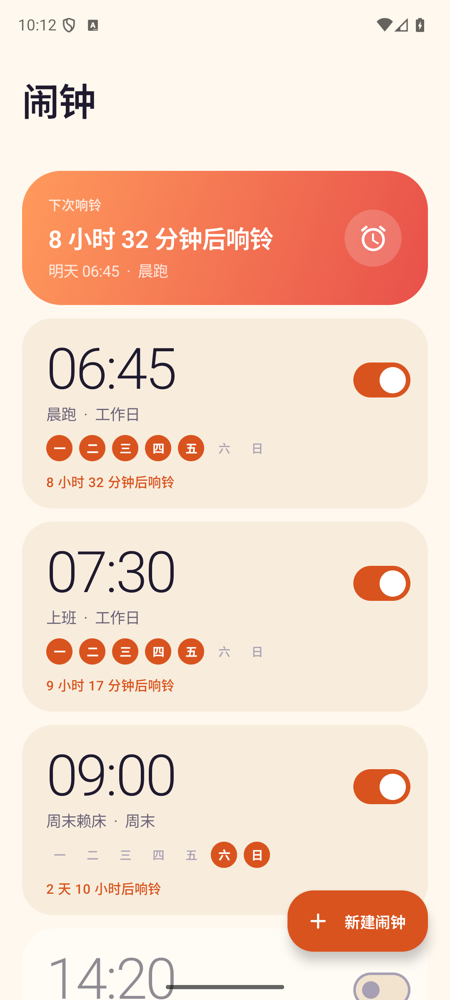
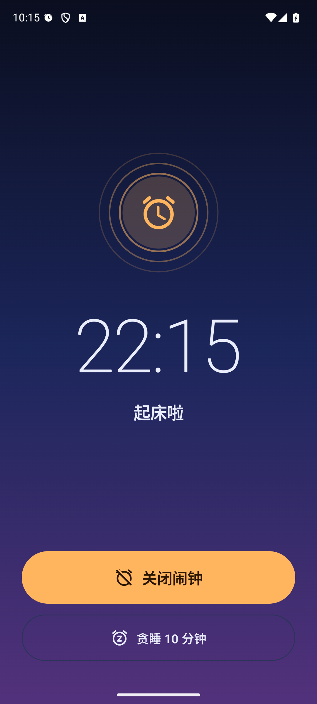
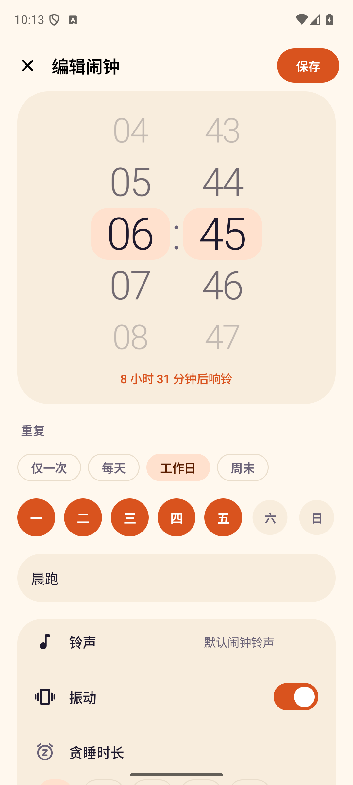
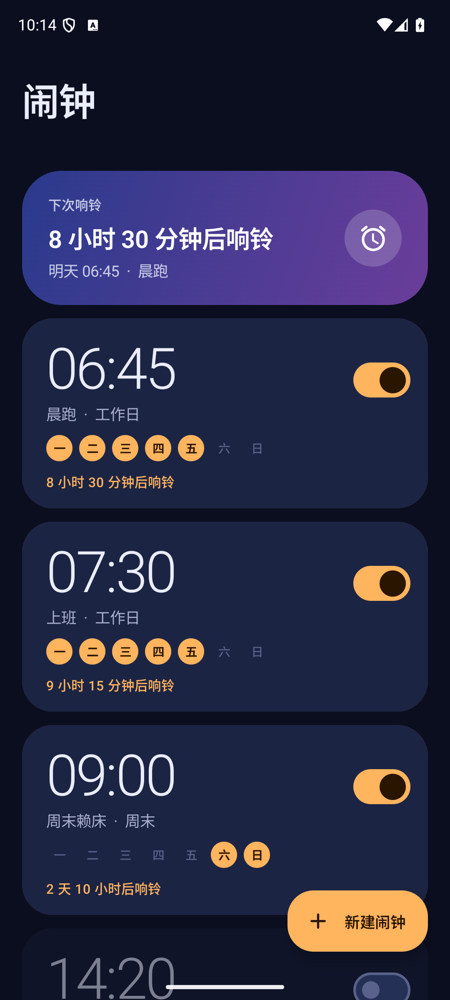
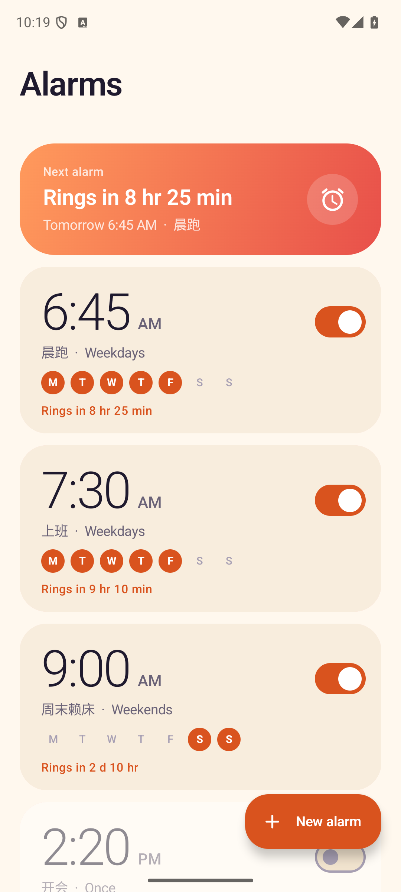
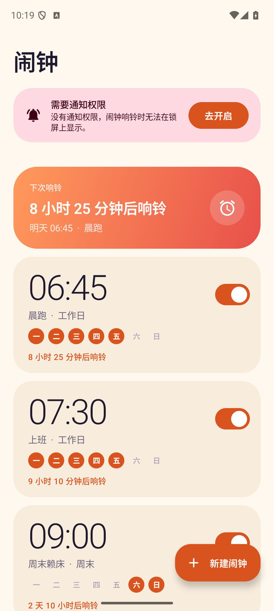
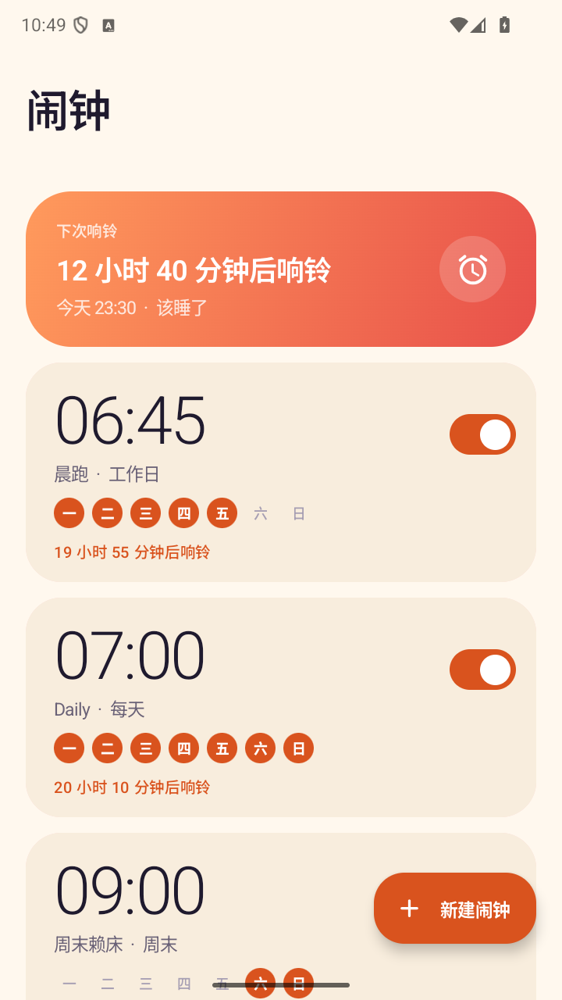

# 闹钟（`org.agentos.sample.alarm`）

AgentOS 的示例 App 之一：一个**真的会响**的闹钟，Compose + Material 3 界面，内嵌 Agent Plugin 并导出 Binder MCP 服务。
装在手机上后，AgentOS 能发现它、列出工具、经 MCP 完整操作闹钟，App 界面实时刷新，MCP 设的闹钟到点照响。契约见 [docs/sample-apps.md](../../../docs/sample-apps.md) 4.1 节。

| | 列表 · MCP 创建后实时出现 | 响铃全屏页（锁屏上） | 编辑 |
|---|---|---|---|
| |  |  |  |

| 空状态 | 暗色（午夜琥珀） | 英文 | 通知权限被拒的提示条 | 小屏（360×640dp） |
|---|---|---|---|---|
|  |  |  |  |  |

## 功能

**界面**
- 闹钟列表：时间大字（跟随系统 12 / 24 小时）、标签、重复日圆点、开关；顶部“下次响铃”渐变卡片（“8 小时 32 分钟后响铃”）；滑动删除带撤销；空状态是 Canvas 画的插画。
- 新建 / 编辑：吸附滚轮选时间（点一下数字也能滚过去）、重复预设（仅一次 / 每天 / 工作日 / 周末）+ 七个星期开关、标签、系统铃声选择器、振动、贪睡时长；实时显示“多久后响铃”。
- 响铃全屏页：夜间配色、脉动光环、“关闭”“贪睡 N 分钟”两个大按钮；锁屏上可见、点亮屏幕。
- 配色“晨曦”（奶油底 + 焦橘）与“午夜琥珀”（深靛蓝 + 琥珀）两套，不用系统动态取色；edge-to-edge；Pixel 8（1080×2400）与小屏都排过；中文默认，`values-en` 英文。
- 通知权限首次进入时运行时申请；被拒绝或没有全屏通知权限时，列表顶部出现提示条，点“去开启”跳系统设置，授权回来自动消失。

**会响（不是摆设）**
- `AlarmManager.setAlarmClock`（`USE_EXACT_ALARM`，闹钟类 App 安装即授予）：精确、Doze 里照响、状态栏有闹钟图标。
- 到点由前台服务（`mediaPlayback`）播放铃声（`USAGE_ALARM`、循环、约 20 秒渐强）+ 振动 + 全屏通知（`USE_FULL_SCREEN_INTENT`）；贪睡；10 分钟没人理会就静音并留一条“错过的闹钟”通知。
- 重复日重排；`BOOT_COMPLETED` / 升级 / 时间或时区变化后重新登记；关机期间错过的闹钟会被识别并通知；用户在设置里“强行停止”后，下次进程启动时补登记。
- 下次响铃时刻按本地 `HH:mm` 计算：跨午夜、重复日、时区变化、夏令时间隙（顺延）和重叠（取先到的）都有单测。

**数据与 MCP 共用同一个仓库**
- 数据在 App 自己的 SQLite（`SQLiteOpenHelper`，无 Room）。界面、响铃服务、MCP 服务共用进程内单例 `AlarmRepository`（`StateFlow` 对外）。
- 因此 AgentOS 经 MCP 创建 / 修改 / 删除 / 开关闹钟时，前台列表立即刷新，**并且同步重排或取消系统闹钟**——通过 MCP 设的闹钟确实会响。

## MCP 工具

插件：`alarm`；MCP 服务器：`alarm`；Service：`org.agentos.sample.alarm.agent.AlarmMcpService`（要求 `org.agentos.permission.BIND_MCP_SERVICE`）。
AgentOS 里的完整工具名是 `mcp__alarm__alarm__<工具名>`。时间一律 ISO-8601 带偏移（`2026-10-08T07:00:00+08:00`），闹钟的“时刻”是本地 `HH:mm`，id 是字符串。

| 工具 | 必填 | 可选 | 注解 | 说明 |
|---|---|---|---|---|
| `alarm_list` | — | `enabled_only` | readOnly | 全部闹钟，按下次响铃时间排序（关闭的排最后） |
| `alarm_get` | `id` | — | readOnly | 单个闹钟，含 `next_fire_at`、是否正在响 |
| `alarm_create` | `time`（"HH:mm"） | `label`、`days`（["mon".."sun"]，空 = 只响一次）、`enabled`、`vibrate`、`snooze_minutes`（1–60） | — | 返回新建的闹钟，含 `next_fire_at` |
| `alarm_update` | `id` | 同 create（只改给出的；`days` 整体替换；`label: ""` 清空） | idempotent | 返回更新后的闹钟 |
| `alarm_set_enabled` | `id`、`enabled` | — | idempotent | 开 = 排下一次，关 = 取消（含贪睡） |
| `alarm_delete` | `id` | — | **destructive** | 删除并取消系统闹钟，返回被删的闹钟 |
| `alarm_next` | — | — | readOnly | 下一个会响的闹钟和时间（`fires_in_minutes`）；没有则返回 JSON `null` |
| `alarm_dismiss` | — | `id` | — | 关闭正在响的闹钟；没有在响返回错误 |
| `alarm_snooze`（额外） | — | `id` | — | 让正在响的闹钟贪睡；没有在响返回错误 |

错误一律 `isError=true` + 一句话原因（缺参数、`"25:00"` 这类非法值、不存在的 id、没有在响的闹钟……），不抛异常。
闹钟对象：`{"id","time","label","days","repeat"("once|daily|weekdays|weekends|custom"),"enabled","vibrate","snooze_minutes","snoozed_until","next_fire_at","ringing"}`。

插件包在 [`src/main/assets/agent-plugin/`](src/main/assets/agent-plugin/)：`plugin.json`（name=alarm）+ `skills/alarm/SKILL.md`（时间格式、`days` 语义、典型流程、坑）。

## 代码结构

```
org.agentos.sample.alarm
├── data/       Alarm、AlarmRepository（单例 + StateFlow）、AlarmStore（SQLite / 内存）、NextFire（下次响铃计算，纯函数）
├── schedule/   AlarmScheduler 接口、SystemAlarmScheduler（AlarmManager.setAlarmClock）
├── ring/       AlarmRingService（前台服务）、RingController、AlarmReceiver / BootReceiver、通知
├── tools/      与 SDK 无关的工具层：ToolDef、AlarmTools（8 + 1 个工具）、RingControl —— 只依赖 kotlinx-serialization-json 和仓库
├── agent/      AlarmMcpService : McpBinderService —— 只负责把 AlarmTools 逐个注册进 SDK
└── ui/         MainActivity、RingActivity、列表 / 编辑 / 响铃页、WheelPicker、空状态插画、主题
```
`src/debug/` 只在 debug 构建里：`DebugToolReceiver`（读状态 / 复位 / 调工具）、`SelfTestReceiver`（MCP 自测）。release 包里没有它们。

## 构建与验证

```bash
export JAVA_HOME=$(/usr/libexec/java_home -v 21) ANDROID_HOME=$HOME/Library/Android/sdk
./gradlew --max-workers=2 :plugins:samples:alarm:testDebugUnitTest :plugins:samples:alarm:assembleDebug \
                          :plugins:samples:alarm:assembleRelease :plugins:samples:alarm:lintDebug
```
- **JVM 单元测试**（70 个，不需要设备）：`NextFireTest`（下次响铃：跨午夜、重复日、时区、夏令时、贪睡）、`AlarmRepositoryTest`（增删改查、调度同步、贪睡、重启重排、错过的闹钟、清空）、`AlarmToolsTest`（每个工具的正常 / 缺参数 / 非法值 / 不存在的 id，契约名与必填参数、注解）。
- **安装**：`adb -s <设备> install -r plugins/samples/alarm/build/outputs/apk/debug/alarm-debug.apk`。首次打开会弹通知权限。
- **R8 下的设备验证**：`:plugins:samples:alarm:assembleReleaseTest`（与 release 相同的混淆规则，调试证书签名，带自测入口，不发布）。
- 平台侧一致性：`./gradlew :core:extensions:test --tests '*SamplePluginsConformanceTest*'` 会读本 App 的插件包、Manifest 和工具层源码。

### 自测：整套 MCP 增删改查

在独立的 `:selftest` 进程里经 `McpBinderClient` 绑自己的 `AlarmMcpService`（真实的跨进程 Binder），走 `initialize`、`tools/list`、全部工具的增删改查和错误路径，共 21 项检查：

```bash
adb -s <设备> shell am broadcast -n org.agentos.sample.alarm/.debug.SelfTestReceiver
# Broadcast completed: result=1, data="{...,"passed":21,"total":21,"ok":true}"   （result=2 表示有失败，data 里有 failed 列表）
```
也可以经 MCP 调单个工具（比如造一个会响的闹钟）：
```bash
adb -s <设备> shell am broadcast -n org.agentos.sample.alarm/.debug.SelfTestReceiver \
    --es tool alarm_create --es args '{"time":"09:30","label":"x"}'      # --es tool tools 只列工具名
```

## 调试：读状态与复位（仅 debug 构建）

联调时用 adb 核对 AgentOS 经 MCP 的操作结果。两个命令都发给 `DebugToolReceiver`（导出，要求 `android.permission.DUMP`，只有 adb shell 和系统持有，其他 App 调不了），
结果放在广播的 **result data**（一个 JSON 字符串，不进 logcat）。

### `dump`：只读

```bash
adb -s <设备> shell am broadcast -n org.agentos.sample.alarm/.debug.DebugToolReceiver --es cmd dump
adb -s <设备> shell am broadcast -n org.agentos.sample.alarm/.debug.DebugToolReceiver --es cmd dump --ei offset 50 --ei limit 50   # 分页
# Broadcast completed: result=1, data="{...}"
```
返回（`limit` 默认 50、最大 200；`offset` 越界会被夹到末尾，不报错）：
```json
{"total":3,"offset":0,"limit":50,"next_offset":null,
 "alarms":[{"id":"11","time":"06:45","label":"晨跑","days":["mon","tue","wed","thu","fri"],"repeat":"weekdays","enabled":true,
            "vibrate":true,"snooze_minutes":5,"snoozed_until":null,"next_fire_at":"2026-10-08T06:45:00+08:00","ringing":false}],
 "scheduled":[{"id":"11","fire_at":"2026-10-08T06:45:00+08:00","registered":true}],
 "system":{"next_alarm_clock":"2026-10-07T23:30:00+08:00","now":"2026-10-07T22:08:04+08:00","time_zone":"Asia/Shanghai"}}
```
- `alarms`：与 MCP 工具返回的闹钟字段完全一致（同一个序列化函数），按一天里的时刻排序，可分页；`next_offset` 为 `null` 表示最后一页。
- `scheduled`：**全部**应当排在系统里的闹钟（有 `fire_at` 的，不受分页影响）。`fire_at` 是仓库记录的已排触发时刻；
  `registered` 是向 AlarmManager 实测的——用 `FLAG_NO_CREATE` 取同一个 `PendingIntent`，取到才是 `true`。所以 `registered: true` 能证明“通过 MCP 设的闹钟确实在系统里排了”。
  已关闭、没有下一次的闹钟不在这里。
- `system.next_alarm_clock`：`AlarmManager.nextAlarmClock`（系统眼里的下一个闹钟，也包含其他 App 的，只当旁证）。
- 只读：不创建、不修改、不取消任何东西；没有任何密钥。未知命令返回 `result=2` 和 `{"error":"..."}`。

想从系统侧再独立核对一次：`adb -s <设备> shell dumpsys alarm | grep -A4 "RTC_WAKEUP.*org.agentos.sample.alarm"` 里每条都有 `origWhen=` 和 `Alarm clock:`。

### `reset`

```bash
adb -s <设备> shell am broadcast -n org.agentos.sample.alarm/.debug.DebugToolReceiver --es cmd reset
# data="{"cleared":4,"remaining_registered":0}"
```
清空全部闹钟数据、取消所有已排的系统闹钟（正在响的会被停掉），并逐个实测 `remaining_registered`（应为 0）。复位后 `dump` 返回 `total: 0`、`scheduled: []`。

### 进程内调工具（结果写 logcat）
```bash
adb -s <设备> shell am broadcast -n org.agentos.sample.alarm/.debug.DebugToolReceiver --es tool alarm_list
# logcat -s AlarmDebug：alarm_list isError=false {"count":…}      --es tool list 只列工具名
```

## 已知限制

- 响铃音量、渐强曲线、10 分钟超时是固定值，没有设置页。
- 铃声选择用系统铃声选择器，只保存 URI；铃声文件被删除后回退到系统默认闹钟铃声。
- 没有“下一次不响（跳过一次）”和“按日期”的闹钟；`days` 只有星期。
- 数据不参与云备份和设备迁移（恢复出来的闹钟没有向系统登记，会看着在、实际不响）。
- R8 构建时会打印“parsing kotlin metadata”警告（Kotlin 2.3 与 AGP 8.10 自带 R8 的版本差），不影响产物，自测在 R8 包上 21/21 通过。
