# 闹钟（`org.agentos.sample.alarm`）

AgentOS 的示例 App 之一：一个**真的会响**的闹钟，Compose + Material 3 界面，内嵌 Agent Plugin 并导出 Binder MCP 服务。
装在手机上后，AgentOS 能发现它、列出工具、经 MCP 完整操作闹钟，App 界面实时刷新，MCP 设的闹钟到点照响。契约见 [docs/sample-apps.md](../../../docs/sample-apps.md) 4.1 节。

**中文**

| 列表 · MCP 创建后实时出现 | 响铃全屏页（锁屏上） | 编辑 |
|---|---|---|
|  |  |  |

| 空状态 | 暗色（午夜琥珀） | 通知权限被拒的提示条 | 小屏（360×640dp） | 12 小时制：“上午 6:45” |
|---|---|---|---|---|
|  |  |  |  | 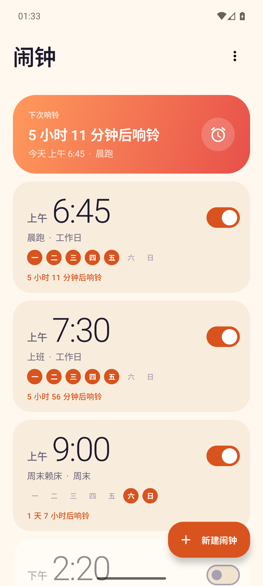 |

| 顶栏“⋮”菜单 | 保证准时响铃 | 同上 · 小米手机的额外指引 | 系统 Intent 设闹钟后的列表 |
|---|---|---|---|
| 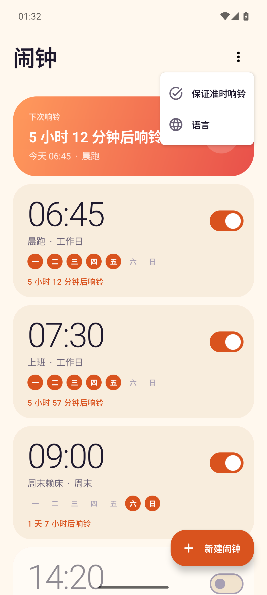 | 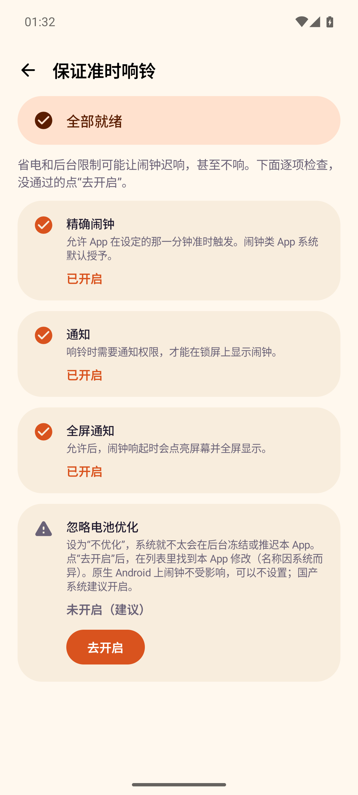 | 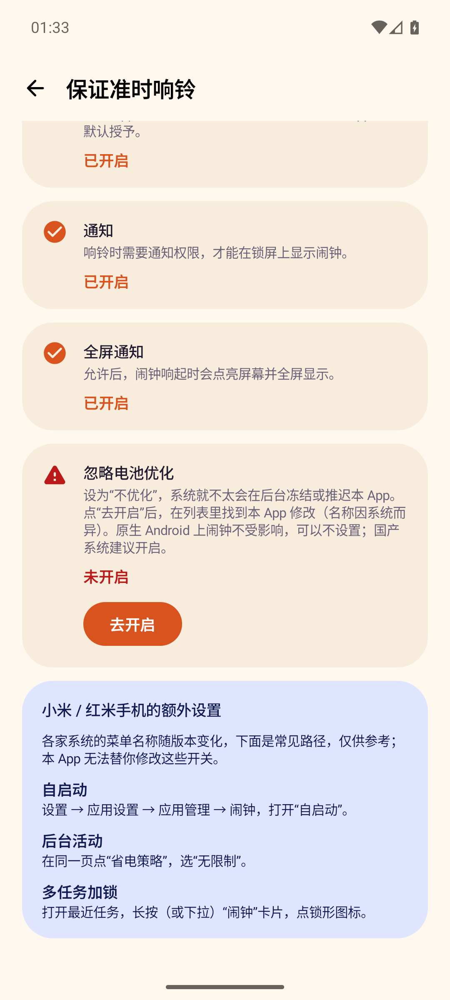 | 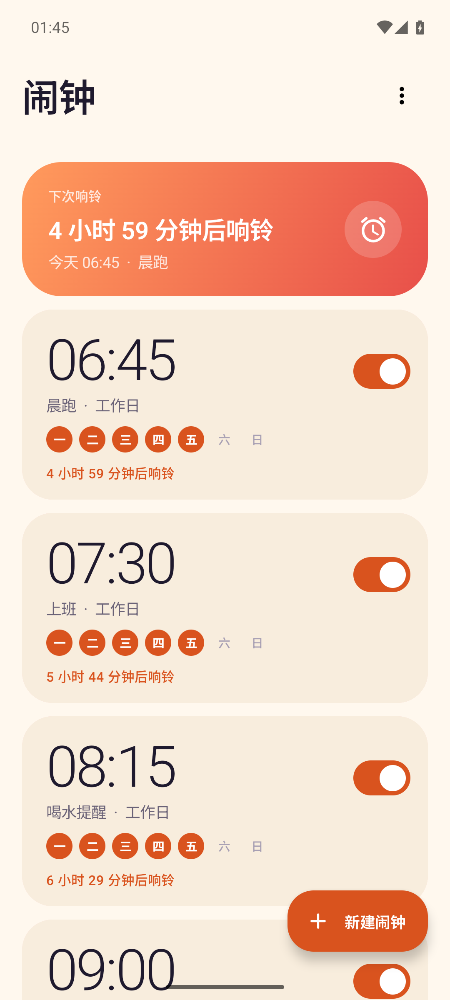 |

**English**（`adb shell cmd locale set-app-locales org.agentos.sample.alarm --locales en`）

| 列表 | 菜单 | 保证准时响铃 | 同上 · 华为手机的额外指引 |
|---|---|---|---|
|  | 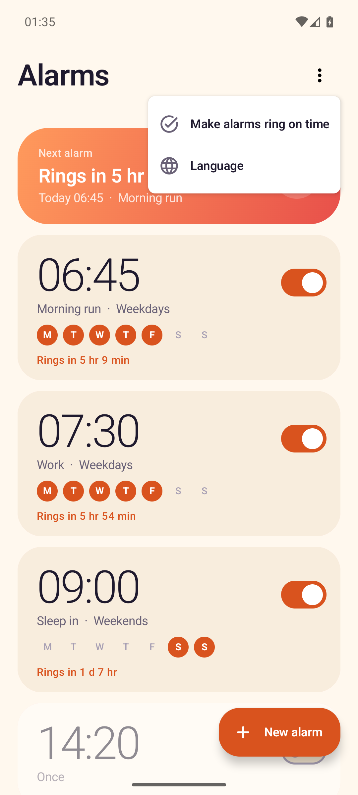 | 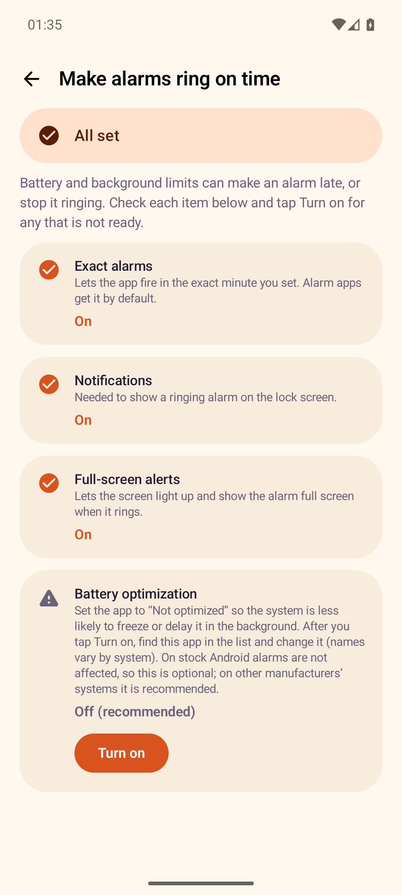 | 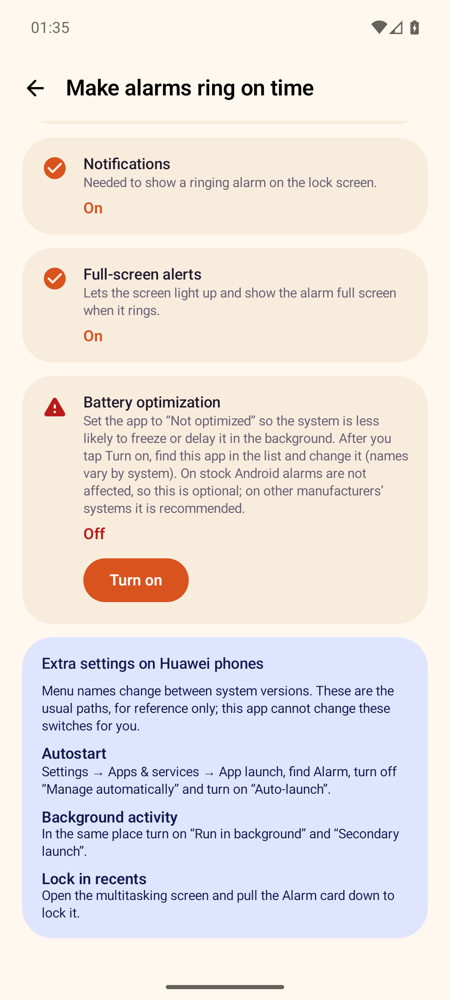 |

| 编辑页 | 1.3 倍字体下的检查页 | `EXTRA_SKIP_UI` 设闹钟：不弹界面，用 Toast 说明 |
|---|---|---|
| 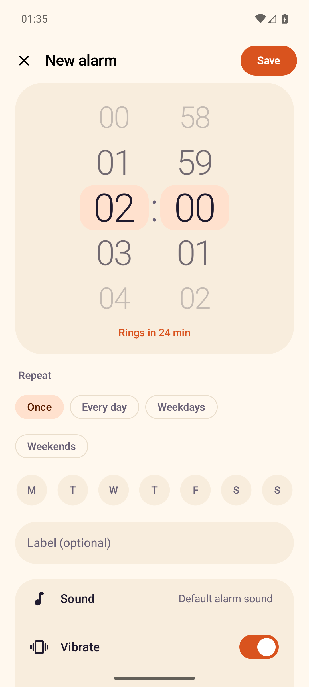 | 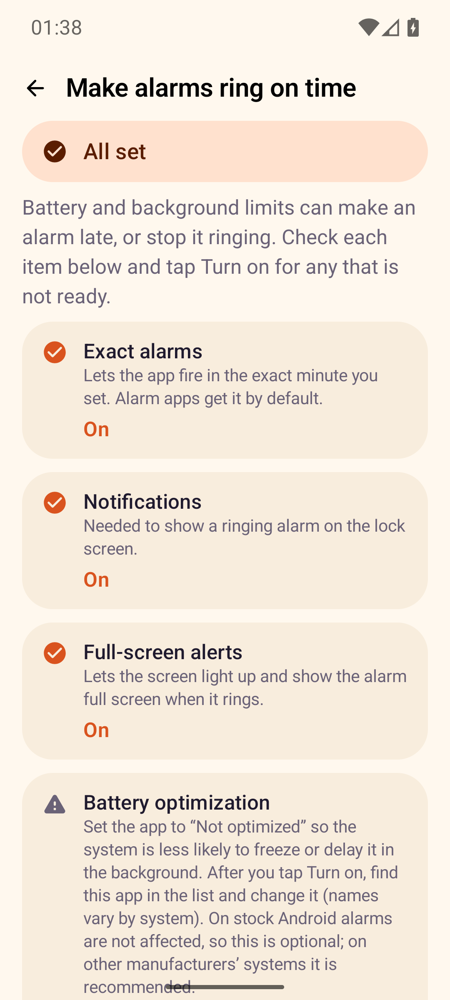 | 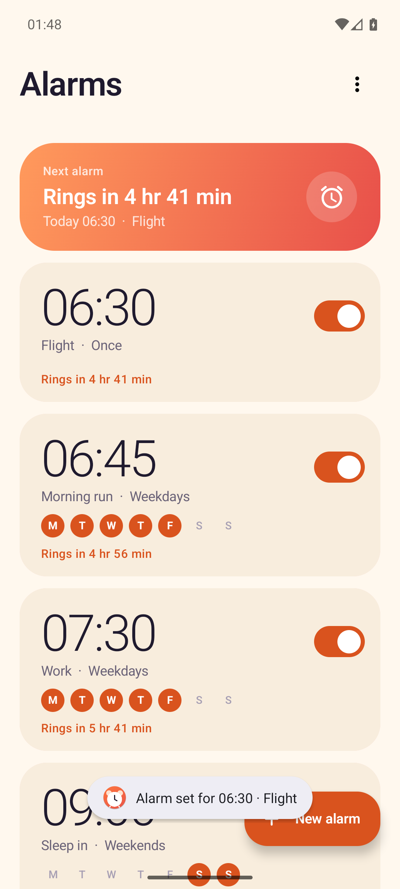 |

## 功能

**界面**
- 闹钟列表：时间大字（跟随系统 12 / 24 小时）、标签、重复日圆点、开关；顶部“下次响铃”渐变卡片（“8 小时 32 分钟后响铃”）；滑动删除带撤销；空状态是 Canvas 画的插画。
- 新建 / 编辑：吸附滚轮选时间（点一下数字也能滚过去）、重复预设（仅一次 / 每天 / 工作日 / 周末）+ 七个星期开关、标签、系统铃声选择器、振动、贪睡时长；实时显示“多久后响铃”。
- 响铃全屏页：夜间配色、脉动光环、“关闭”“贪睡 N 分钟”两个大按钮；锁屏上可见、点亮屏幕。
- 配色“晨曦”（奶油底 + 焦橘）与“午夜琥珀”（深靛蓝 + 琥珀）两套，不用系统动态取色；edge-to-edge；Pixel 8（1080×2400）与小屏都排过；中文默认，`values-en` 英文。
- 通知权限首次进入时运行时申请；被拒绝或没有全屏通知权限时，列表顶部出现提示条，点“去开启”跳系统设置，授权回来自动消失。
- 列表顶栏的“⋮”菜单：**保证准时响铃**（检查页，见下）和**语言**（跳系统的“应用语言”设置；`locales_config.xml` 声明中文、英文，默认跟随系统，别的语言回落到中文）。

**会响（不是摆设）**
- `AlarmManager.setAlarmClock`（`USE_EXACT_ALARM`，闹钟类 App 安装即授予）：精确、Doze 里照响、状态栏有闹钟图标。
- 到点由前台服务（`mediaPlayback`）播放铃声（`USAGE_ALARM`、循环、约 20 秒渐强）+ 振动 + 全屏通知（`USE_FULL_SCREEN_INTENT`）；贪睡；10 分钟没人理会就静音并留一条“错过的闹钟”通知。
- 重复日重排；`BOOT_COMPLETED` / 升级 / 时间或时区变化后重新登记；关机期间错过的闹钟会被识别并通知；用户在设置里“强行停止”后，下次进程启动时补登记。
- 下次响铃时刻按本地 `HH:mm` 计算：跨午夜、重复日、时区变化、夏令时间隙（顺延）和重叠（取先到的）都有单测。

**响应系统的标准闹钟 Intent（`android.provider.AlarmClock`）**

语音助手或其他 App 说“设个闹钟”时可以落到本 App，由用户在系统选择器里选。`AlarmIntentActivity`（无界面，导出，要求调用方持有 `com.android.alarm.permission.SET_ALARM`）处理：
- `ACTION_SET_ALARM`：`EXTRA_HOUR`（0–23）、`EXTRA_MINUTES`（0–59，缺省 0）、`EXTRA_MESSAGE`（标签，≤60 字）、`EXTRA_DAYS`（`ArrayList<Integer>`，`Calendar.SUNDAY..SATURDAY` = 1..7，转成本 App 的星期；`int[]` 也接受）、`EXTRA_VIBRATE`（缺省 true）、`EXTRA_SKIP_UI`（缺省 false）。**时刻 + 标签 + 重复日相同的闹钟不重复建**：已开着就原样返回，已关着就重新打开（官方：该 action 总是启用闹钟）。
- `ACTION_DISMISS_ALARM`：支持 `EXTRA_ALARM_SEARCH_MODE` 的 `android.next` / `android.all` / `android.label` / `android.time`（带 `EXTRA_IS_PM`）；没给模式时先关正在响的，否则只有一个开着的闹钟就关它，多个则打开列表让用户选。多个闹钟匹配同一搜索时也是打开列表，不替用户决定。
- `ACTION_SNOOZE_ALARM`：贪睡正在响的闹钟；`EXTRA_ALARM_SNOOZE_DURATION`（1–60 分钟）只对这一次生效；没有在响则什么都不做，并提示。
- `ACTION_SHOW_ALARMS`：打开列表（`MainActivity` 响应，官方不要求权限）。
- 缺参 / 非法值（小时、分钟越界，星期不在 1–7，类型不对，标签过长）一律明确拒绝，Toast 说明原因，不创建任何东西，不崩。
- **用户可见的反馈**：带 `EXTRA_SKIP_UI` 的创建不弹界面，用 Toast 说“已设置闹钟 …”；不带的直接打开列表。关闭、贪睡、拒绝都有提示。
- 不做计时器（`SET_TIMER` 等）；`EXTRA_RINGTONE` 被忽略（一律用默认闹钟铃声，没有“静音闹钟”）。

**保证准时响铃（检查页）**
- 列表右上角菜单进入。逐项检测并显示状态，没通过的有“去开启”：精确闹钟（`canScheduleExactAlarms`，本 App 的 `USE_EXACT_ALARM` 安装即授予）、通知、全屏通知、忽略电池优化（`PowerManager.isIgnoringBatteryOptimizations`）。回到前台自动重新检查。列表页的权限提示条和检查页共用同一份读取与跳转代码（`SystemSettings`）。
- **电池优化的取舍**：跳系统的“电池优化”**列表页**（`ACTION_IGNORE_BATTERY_OPTIMIZATION_SETTINGS`，不需要权限），由用户在列表里自己找到本 App；**不声明** `REQUEST_IGNORE_BATTERY_OPTIMIZATIONS`。理由：该权限受 Google Play 政策限制（只给核心功能确实受 Doze 影响的 App），而闹钟走 `setAlarmClock`，Doze 里本来就照响，没有正当理由申请。因此这项在原生 Android 上只标“建议”，不计入“需要处理”；在下面列出的国内机型上才算重要。
- **国内机型的文字指引**（按 `Build.MANUFACTURER` 判断：小米 / 红米 / POCO、华为、荣耀、OPPO / realme、vivo / iQOO、一加）：显示该系统“自启动 / 后台活动 / 多任务加锁”的常见路径。**v1 只做文字，不做按品牌的私有深链**；这些路径来自对各系统的一般了解，随系统版本会变，页面里也如此声明，**没有在对应品牌的真机上逐条核对**。

**数据与 MCP 共用同一个仓库**
- 数据在 App 自己的 SQLite（`SQLiteOpenHelper`，无 Room）。界面、响铃服务、MCP 服务共用进程内单例 `AlarmRepository`（`StateFlow` 对外）。
- 因此 AgentOS 经 MCP 创建 / 修改 / 删除 / 开关闹钟时，前台列表立即刷新，**并且同步重排或取消系统闹钟**——通过 MCP 设的闹钟确实会响。

## MCP 工具

插件：`alarm`；MCP 服务器：`alarm`；Service：`org.agentos.sample.alarm.agent.AlarmMcpService`（要求 `org.agentos.permission.BIND_MCP_SERVICE`）。
AgentOS 里的完整工具名是 `mcp__alarm__alarm__<工具名>`。时间一律 ISO-8601 带偏移（`2026-10-08T07:00:00+08:00`），闹钟的“时刻”是本地 `HH:mm`，id 是字符串。

| 工具 | 必填 | 可选 | 注解 | 说明 |
|---|---|---|---|---|
| `alarm_list` | — | `enabled_only` | readOnly | 全部闹钟，按下次响铃时间排序（关闭的排最后） |
| `alarm_get` | `id` | — | readOnly | 单个闹钟，含 `next_fire_at`、是否正在响 |
| `alarm_create` | `time`（"HH:mm"） | `label`、`days`（["mon".."sun"]，空 = 只响一次）、`enabled`、`vibrate`、`snooze_minutes`（1–60） | — | 返回新建的闹钟，含 `next_fire_at` |
| `alarm_update` | `id` | 同 create（只改给出的；`days` 整体替换；`label: ""` 清空） | idempotent | 返回更新后的闹钟 |
| `alarm_set_enabled` | `id`、`enabled` | — | idempotent | 开 = 排下一次，关 = 取消（含贪睡） |
| `alarm_delete` | `id` | — | **destructive** | 删除并取消系统闹钟，返回被删的闹钟 |
| `alarm_next` | — | — | readOnly | 下一个会响的闹钟和时间（`fires_in_minutes`）；没有则返回 JSON `null` |
| `alarm_dismiss` | — | `id` | — | 关闭正在响的闹钟；没有在响返回错误 |
| `alarm_snooze`（额外） | — | `id` | — | 让正在响的闹钟贪睡；没有在响返回错误 |
| `alarm_system_next`（额外） | — | — | readOnly | **系统范围**的下一个闹钟（`AlarmManager.getNextAlarmClock()`，含 Google 时钟等其他 App 设的）：`{"next_fire_at","fires_in_minutes","owned_by_this_app"}`；系统里一个闹钟都没有则返回 JSON `null`（不是错误）。`alarm_next` 仍只看本 App 自己的 |

错误一律 `isError=true` + 一句话原因（缺参数、`"25:00"` 这类非法值、不存在的 id、没有在响的闹钟……），不抛异常。
闹钟对象：`{"id","time","label","days","repeat"("once|daily|weekdays|weekends|custom"),"enabled","vibrate","snooze_minutes","snoozed_until","next_fire_at","ringing"}`。

`owned_by_this_app` 用 `showIntent` 的 `PendingIntent.getCreatorPackage()` 与本 App 包名比较（API 17，minSdk 35 下可用）。别的 App 的 `showIntent` 创建者对本 App 通常**读不到（null，包可见性过滤）**，按“不是本 App 的”处理，所以 `false` 的含义是“不是本 App 设的”，工具不返回别家的包名。

插件包在 [`src/main/assets/agent-plugin/`](src/main/assets/agent-plugin/)：`plugin.json`（name=alarm）+ `skills/alarm/SKILL.md`（时间格式、`days` 语义、典型流程、坑；Agent 只用本 App 设闹钟，问“明天几点起”时同时看 `alarm_next` 和 `alarm_system_next`）。

## 代码结构

```
org.agentos.sample.alarm
├── data/       Alarm、AlarmRepository（单例 + StateFlow）、AlarmStore（SQLite / 内存）、NextFire（下次响铃计算，纯函数）
├── schedule/   AlarmScheduler 接口、SystemAlarmScheduler（AlarmManager.setAlarmClock）、SystemAlarmInfo（getNextAlarmClock 的接口，测试里用假的）
├── ring/       AlarmRingService（前台服务）、RingController、AlarmReceiver / BootReceiver、通知
├── intent/     系统标准闹钟 Intent：AlarmIntentParser（extras → 请求）、AlarmIntentHandler（落到仓库）、IntentFeedback（Toast 文案）、AlarmIntentActivity
├── reliability/ “保证准时响铃”：Reliability（状态判定、厂商判断，纯函数）、SystemSettings（读状态、跳设置页）
├── tools/      与 SDK 无关的工具层：ToolDef、AlarmTools（8 + 2 个工具）、RingControl —— 只依赖 kotlinx-serialization-json 和仓库
├── agent/      AlarmMcpService : McpBinderService —— 只负责把 AlarmTools 逐个注册进 SDK
└── ui/         MainActivity、RingActivity、列表 / 编辑 / 响铃 / 检查页、Format（时间与文案，经 Texts 提供者）、WheelPicker、空状态插画、主题
```
`src/debug/` 只在 debug 构建里：`DebugToolReceiver`（读状态 / 复位 / 调工具）、`SelfTestReceiver`（MCP 自测）。release 包里没有它们。

## 构建与验证

```bash
export JAVA_HOME=$(/usr/libexec/java_home -v 21) ANDROID_HOME=$HOME/Library/Android/sdk
./gradlew --max-workers=2 :plugins:samples:alarm:testDebugUnitTest :plugins:samples:alarm:assembleDebug \
                          :plugins:samples:alarm:assembleRelease :plugins:samples:alarm:lintDebug
```
- **JVM 单元测试**（146 个，不需要设备）：`NextFireTest`（下次响铃：跨午夜、重复日、时区、夏令时、贪睡）、`AlarmRepositoryTest`（增删改查、调度同步、贪睡、重启重排、错过的闹钟、清空、**系统 Intent 的去重**、带时长的贪睡）、`AlarmToolsTest`（每个工具的正常 / 缺参数 / 非法值 / 不存在的 id，契约名与必填参数、注解；`alarm_system_next` 用假的系统闹钟提供者：null、别家的闹钟、本 App 的闹钟、创建者未知、提供者抛异常）、`AlarmIntentParserTest`（Intent 参数 → 请求：`EXTRA_DAYS` 七个 `Calendar` 常量逐个转换、`EXTRA_MESSAGE` / `EXTRA_VIBRATE` / `EXTRA_SKIP_UI`、官方缺省值、缺参、越界、类型错误）、`AlarmIntentHandlerTest`（请求 → 仓库：新建、去重、重新打开、关闭各种搜索模式、重复闹钟不被误关、贪睡）、`IntentFeedbackTest`（Toast 文案，中英文各一份**真实资源**）、`ReliabilityTest`（检查页状态判定与厂商判断）、`FormatTest`（时长 / 重复日 / 12 小时制标记位置，中英文）、`ResourceParityTest`（`values/` 与 `values-en/` 的 key、占位符、复数量词对齐，英文无中文）。
- **安装**：`adb -s <设备> install -r plugins/samples/alarm/build/outputs/apk/debug/alarm-debug.apk`。首次打开会弹通知权限。
- **R8 下的设备验证**：`:plugins:samples:alarm:assembleReleaseTest`（与 release 相同的混淆规则，调试证书签名，带自测入口，不发布）。
- 平台侧一致性：`./gradlew :core:extensions:test --tests '*SamplePluginsConformanceTest*'` 会读本 App 的插件包、Manifest 和工具层源码。

### 自测：整套 MCP 增删改查

在独立的 `:selftest` 进程里经 `McpBinderClient` 绑自己的 `AlarmMcpService`（真实的跨进程 Binder），走 `initialize`、`tools/list`、全部工具的增删改查和错误路径，共 22 项检查（含 `alarm_system_next`）：

```bash
adb -s <设备> shell am broadcast -n org.agentos.sample.alarm/.debug.SelfTestReceiver
# Broadcast completed: result=1, data="{...,"passed":22,"total":22,"ok":true}"   （result=2 表示有失败，data 里有 failed 列表）
```
也可以经 MCP 调单个工具（比如造一个会响的闹钟）：
```bash
adb -s <设备> shell am broadcast -n org.agentos.sample.alarm/.debug.SelfTestReceiver \
    --es tool alarm_create --es args '{"time":"09:30","label":"x"}'      # --es tool tools 只列工具名
```

## 调试：读状态与复位（仅 debug 构建）

联调时用 adb 核对 AgentOS 经 MCP 的操作结果。两个命令都发给 `DebugToolReceiver`（导出，要求 `android.permission.DUMP`，只有 adb shell 和系统持有，其他 App 调不了），
结果放在广播的 **result data**（一个 JSON 字符串，不进 logcat）。

### `dump`：只读

```bash
adb -s <设备> shell am broadcast -n org.agentos.sample.alarm/.debug.DebugToolReceiver --es cmd dump
adb -s <设备> shell am broadcast -n org.agentos.sample.alarm/.debug.DebugToolReceiver --es cmd dump --ei offset 50 --ei limit 50   # 分页
# Broadcast completed: result=1, data="{...}"
```
返回（`limit` 默认 50、最大 200；`offset` 越界会被夹到末尾，不报错）：
```json
{"total":3,"offset":0,"limit":50,"next_offset":null,
 "alarms":[{"id":"11","time":"06:45","label":"晨跑","days":["mon","tue","wed","thu","fri"],"repeat":"weekdays","enabled":true,
            "vibrate":true,"snooze_minutes":5,"snoozed_until":null,"next_fire_at":"2026-10-08T06:45:00+08:00","ringing":false}],
 "scheduled":[{"id":"11","fire_at":"2026-10-08T06:45:00+08:00","registered":true}],
 "system":{"next_alarm_clock":"2026-10-07T23:30:00+08:00","now":"2026-10-07T22:08:04+08:00","time_zone":"Asia/Shanghai"}}
```
- `alarms`：与 MCP 工具返回的闹钟字段完全一致（同一个序列化函数），按一天里的时刻排序，可分页；`next_offset` 为 `null` 表示最后一页。
- `scheduled`：**全部**应当排在系统里的闹钟（有 `fire_at` 的，不受分页影响）。`fire_at` 是仓库记录的已排触发时刻；
  `registered` 是向 AlarmManager 实测的——用 `FLAG_NO_CREATE` 取同一个 `PendingIntent`，取到才是 `true`。所以 `registered: true` 能证明“通过 MCP 设的闹钟确实在系统里排了”。
  已关闭、没有下一次的闹钟不在这里。
- `system.next_alarm_clock`：`AlarmManager.nextAlarmClock`（系统眼里的下一个闹钟，也包含其他 App 的，只当旁证）。
- 只读：不创建、不修改、不取消任何东西；没有任何密钥。未知命令返回 `result=2` 和 `{"error":"..."}`。

想从系统侧再独立核对一次：`adb -s <设备> shell dumpsys alarm | grep -A4 "RTC_WAKEUP.*org.agentos.sample.alarm"` 里每条都有 `origWhen=` 和 `Alarm clock:`。

### `reset`

```bash
adb -s <设备> shell am broadcast -n org.agentos.sample.alarm/.debug.DebugToolReceiver --es cmd reset
# data="{"cleared":4,"remaining_registered":0}"
```
清空全部闹钟数据、取消所有已排的系统闹钟（正在响的会被停掉），并逐个实测 `remaining_registered`（应为 0）。复位后 `dump` 返回 `total: 0`、`scheduled: []`。

### 进程内调工具（结果写 logcat）
```bash
adb -s <设备> shell am broadcast -n org.agentos.sample.alarm/.debug.DebugToolReceiver --es tool alarm_list
# logcat -s AlarmDebug：alarm_list isError=false {"count":…}      --es tool list 只列工具名
```

## 已知行为：系统闹钟 Intent 与系统闹钟（Pixel 8 + Google 时钟 实测，2026-10-09）

- **选择器**：Pixel 8（API 35）和模拟器（API 36）上同时装了 Google 时钟和本 App 时，`am start -a android.intent.action.SET_ALARM …`（不指定包）会弹系统选择器“Complete action using”，列出 **Alarm**（本 App）和 **Clock**（Google 时钟）。`DISMISS_ALARM`、`SNOOZE_ALARM`、`SHOW_ALARMS` 同样两家都响应（`pm query-activities` 各列两项）。
  - 选 **Alarm**：本 App 里建出闹钟（`dump` 的 `scheduled[].registered` 为 `true`），`getNextAlarmClock()` 的归属是本 App。
  - 选 **Clock**：只在 Google 时钟里建，本 App 的列表不变。
  - 两种选法都实测过；选“始终”会把默认记住，这个没试（不想改用户手机的默认应用）。
  - `adb shell am start` 不用额外权限（shell 持有 `com.android.alarm.permission.SET_ALARM`）；没有该权限的调用方会被系统拒绝（由清单里的 `android:permission` 强制；这一点没有找没权限的调用方实测）。
- **`alarm_system_next` 看得到 Google 时钟的闹钟**：真机上 Google 时钟设了 02:20、本 App 设了 02:30，`alarm_system_next` 返回 02:20 且 `owned_by_this_app: false`，`alarm_next` 返回本 App 的 02:30。本 App 自己的闹钟在前时 `owned_by_this_app: true`。
- **创建者读不到时一律当“不是本 App 的”**：别的 App 的 `showIntent.creatorPackage` 在本 App 里读出来是 `null`（Android 11+ 的包可见性过滤；debug 的 `dump` 里 `next_alarm_clock_creator` 为 `null` 就是这个），所以 `owned_by_this_app: false` 只说明“不是本 App 设的”，不能据此知道是谁设的。本 App 自己的闹钟永远读得到自己的包名，不会误判。
- **没有时间参数的 `SET_ALARM`**：按官方文档（“没有时间就应该打开能设闹钟的界面”）打开本 App 的新建页，什么都不创建；只给 `EXTRA_MINUTES` 不给小时则拒绝。
- **`EXTRA_SKIP_UI`**：官方还说“带时间且不重复的闹钟，响过被关闭后实现应该把它删掉”。本 App **没有做这一步**（需要加字段和迁移），这类闹钟响过后留在列表里，状态是关闭，用户可以手动删。
- **`DISMISS_ALARM` 对重复闹钟**：官方语义是“只跳过即将到来的这一次”。本 App 没有“跳过一次”，直接关掉会让它以后都不响，比“该响还响”更危险，所以**没在响的重复闹钟保持开启**，Toast 说明并打开列表让用户自己处理；正在响的、一次性的、贪睡中的照常关闭。
- 不支持：计时器、`EXTRA_RINGTONE`（忽略，用默认铃声）、数据 URI 深链、语音交互模式下回报深链。

## 已知限制

- 响铃音量、渐强曲线、10 分钟超时是固定值，没有设置页。
- 铃声选择用系统铃声选择器，只保存 URI；铃声文件被删除后回退到系统默认闹钟铃声。
- 没有“下一次不响（跳过一次）”和“按日期”的闹钟；`days` 只有星期。
- 数据不参与云备份和设备迁移（恢复出来的闹钟没有向系统登记，会看着在、实际不响）。
- R8 构建时会打印“parsing kotlin metadata”警告（Kotlin 2.3 与 AGP 8.10 自带 R8 的版本差），不影响产物，自测在 R8 包上 22/22 通过。
