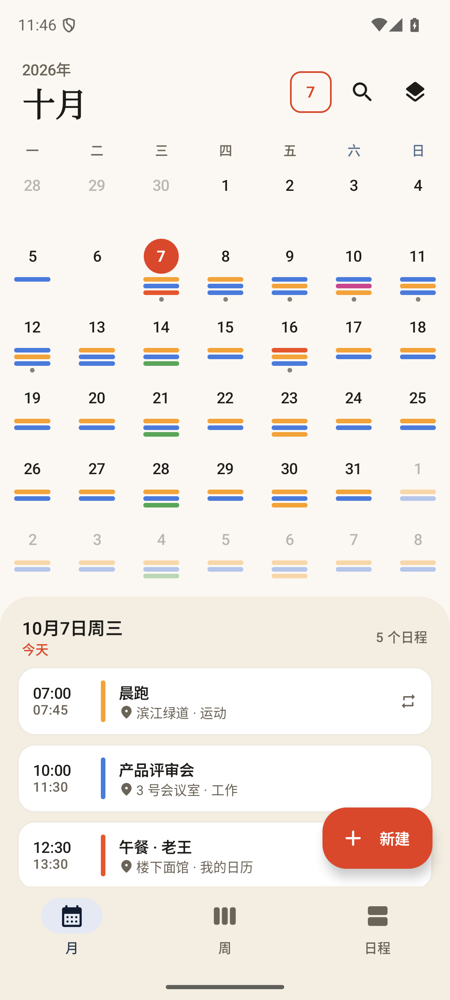
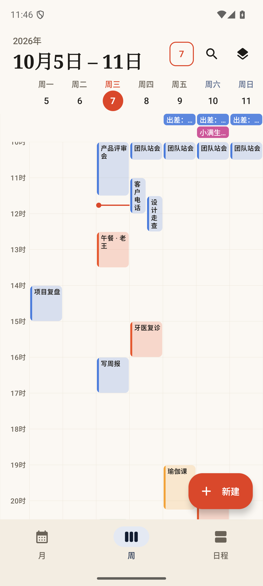
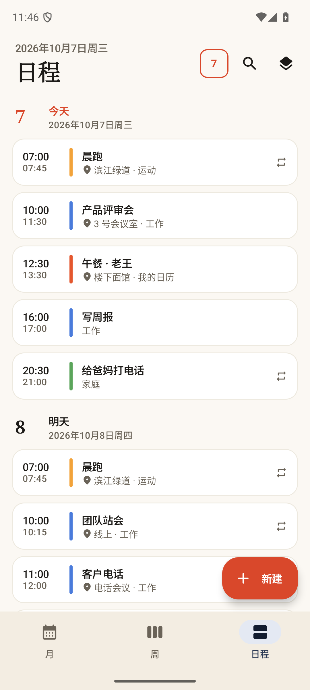
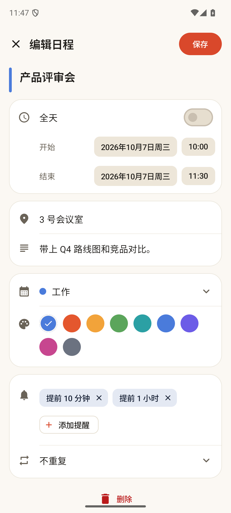
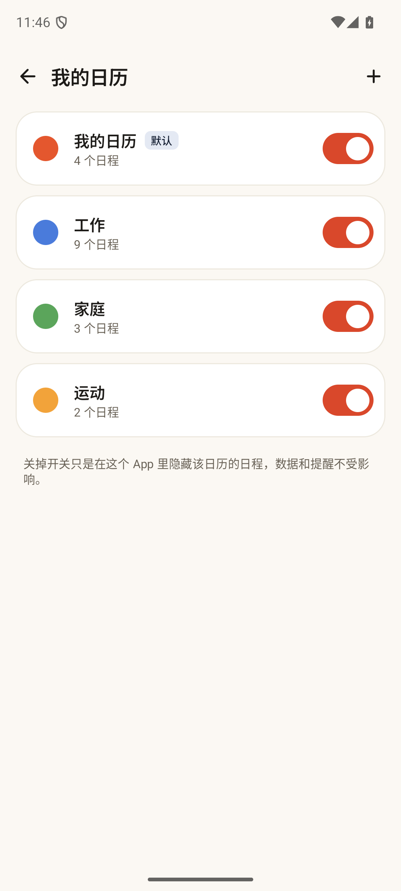
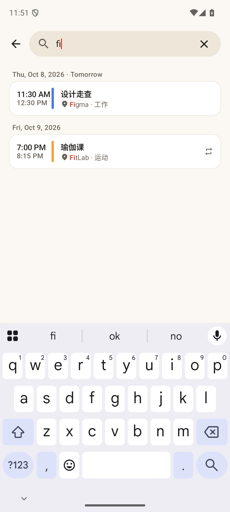
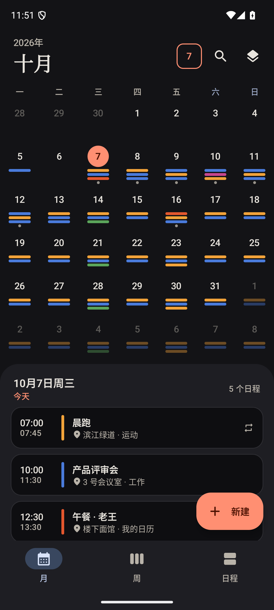
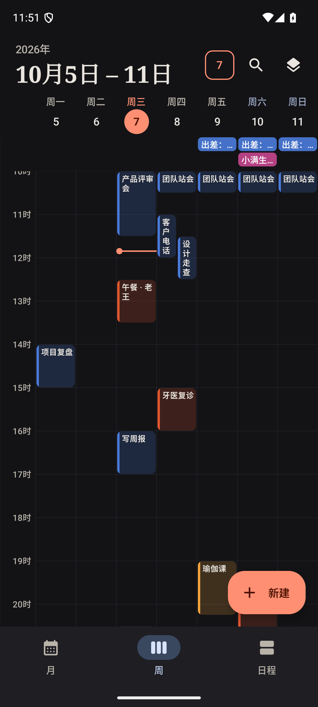
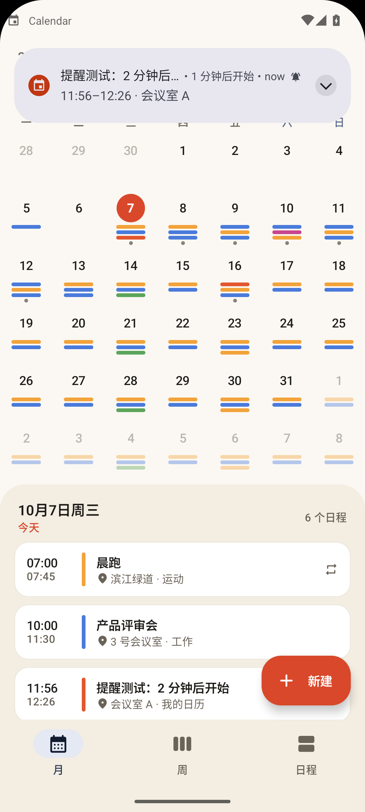
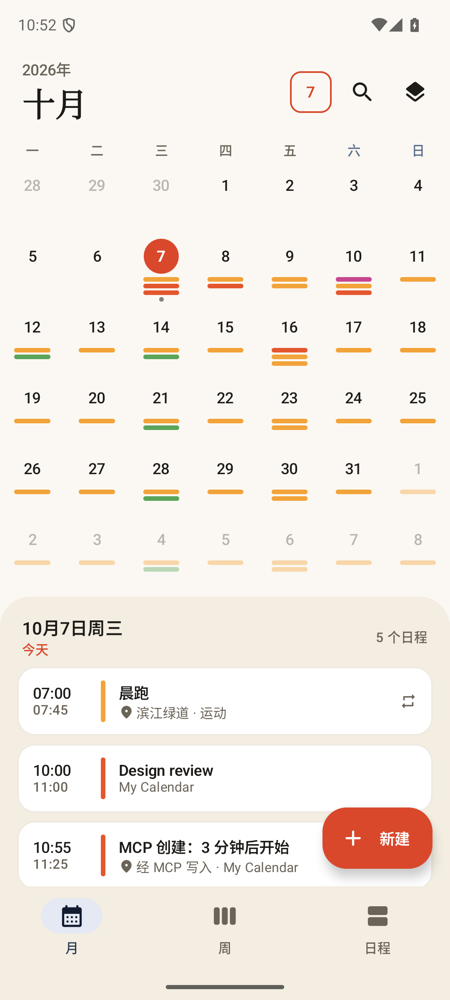

# 日历（示例 App）

`org.agentos.sample.calendar` —— AgentOS 的示例 App 之一（[docs/sample-apps.md](../../../docs/sample-apps.md)）。它是一个界面完整、有真实提醒的独立日历，同时内嵌一个 Agent Plugin 并导出 Binder MCP 服务：装在手机上后，AgentOS 能发现它、列出工具，经 MCP 增删改查日历和日程，App 界面实时刷新。

| 月视图 | 周视图 | 日程（议程） |
|---|---|---|
|  |  |  |

| 日程详情 | 编辑日程 | 日历管理 |
|---|---|---|
|  |  |  |

| 搜索（英文界面） | 暗色 · 月 | 暗色 · 周 |
|---|---|---|
|  |  |  |

| 到点的提醒通知 | AgentOS 经 MCP 创建后界面立即出现 |
|---|---|
|  |  |

## 功能

- **月视图**：左右滑动翻月（标题带上下滚动动画），有日程的日期下面是各日历颜色的色条（超出显示小圆点），点日期在下方面板看当天日程；邻月日期淡显；小屏自动压缩网格，保证当天面板可用。
- **周视图**：七列时间轴，重叠的日程并排显示，全天日程在顶部一行，红色“现在”线；点空白处按半小时取整新建，点日程看详情。
- **议程**：从今天起按日期分组的日程流（日期头吸顶，滚到底自动再加载），带“今天 / 明天”标签。
- **新建 / 编辑**：标题、全天、起止（改开始时结束保持原时长）、地点、备注、所属日历、颜色（默认跟随日历）、多个提醒、重复（不重复 / 每天 / 每周 / 每月 / 每年，可设截止日期）；有未保存修改时返回会确认；删除后底部出现“撤销”。
- **日历管理**：多个日历，开关显示 / 隐藏、改名改色、新建、删除（连同日程一起删，默认日历不能删）。
- **搜索**：标题 / 地点 / 备注的包含匹配，高亮命中，重复日程每个系列一条（最近将发生的那次）。
- **视觉**：暖纸色底 + 墨蓝 + 朱红强调的自定义亮 / 暗配色，月份大标题用衬线体，圆角与间距统一，空状态是画出来的日历插画；edge-to-edge；中文默认，`values-en` 英文；周起始日、时间制式跟随系统区域设置。
- **提醒**：`AlarmManager.setExactAndAllowWhileIdle` + 通知（首次保存带提醒的日程时申请 `POST_NOTIFICATIONS`，被拒时首页有提示条）。始终只挂一个闹钟，指向全部日程里最早的未触发提醒；开机、时区变化、系统时间变化、App 升级后重新排并补发 30 分钟内刚错过的；数据变化（界面或 MCP）后去抖重排。全天日程的提醒相对“第一天 09:00”。

## 数据

自己的 SQLite（`calendar.db`，`SQLiteOpenHelper`），不用系统 `CalendarContract`。

- 定时日程存 UTC 毫秒 + 时区 id；重复日程按**该时区的本地钟点**展开，所以跨夏令时仍是同一钟点，持续时间不变。
- 全天日程存日期（epoch day），不随设备时区漂移。
- 重复（none / daily / weekly / monthly / yearly + until）在查询区间内展开，每个出现带 `series_id`，出现的 id 是 `<series_id>@<key>`；修改 / 删除作用于整个系列。每月重复遇到短月取月末（1 月 31 日 → 2 月 28 日 → 3 月 31 日，不漂移）；2 月 29 日的每年重复在平年落在 2 月 28 日。
- 跨日、跨午夜、跨月的日程在它占据的每一天都出现（月 / 周 / 议程 / `agenda_today` / `free_slots` 一致）。
- **界面、提醒、MCP 共用同一个仓库对象**（`CalendarGraph` 进程内单例，`StateFlow` 对外）。MCP 改了数据，前台界面立即刷新、提醒同步重排。

## MCP 工具

插件名 `calendar`，MCP 服务器名 `calendar`，服务 `org.agentos.sample.calendar.agent.CalendarMcpService`（导出，要求 `org.agentos.permission.BIND_MCP_SERVICE`）。工具定义在 `tools/CalendarTools.kt`（与 SDK 无关），`CalendarMcpService` 只是逐个注册。时间参数都是 ISO-8601 带偏移，缺偏移时按设备时区解释。结果的 `content` 是紧凑 JSON，`structuredContent` 是同一个对象；错误是 `isError` + 一句话。

| 工具 | 必填 | 可选 | 注解 |
|---|---|---|---|
| `calendar_list` | — | — | readOnly |
| `calendar_create` | `name` | `color` | — |
| `calendar_update`（多出） | `id` | `name`, `color`, `visible` | idempotent |
| `calendar_delete` | `id` | — | **destructive**（连同日程一起删，返回 `deleted_events`；默认日历不能删） |
| `event_list` | — | `from`, `to`, `calendar_id`, `query`, `limit`（默认 50，最大 200） | readOnly |
| `event_get` | `id` | — | readOnly |
| `event_create` | `title`, `start` | `end`, `all_day`, `location`, `description`, `calendar_id`, `reminder_minutes`, `recurrence`, `recurrence_until`, `color` | — |
| `event_update` | `id` | 同 create 的各字段（整个系列；`recurrence_until` / `color` 传 null 清除） | idempotent |
| `event_delete` | `id` | — | **destructive**（重复日程整个系列） |
| `event_search` | `query` | `limit` | readOnly |
| `agenda_today` | — | `calendar_id` | readOnly |
| `free_slots` | `date`, `duration_minutes` | `day_start`（09:00）, `day_end`（18:00，可写 24:00）, `calendar_id`, `include_all_day` | readOnly |

`free_slots` 把重复日程和跨午夜的日程算进忙碌时段；窗口按当天真实钟点算（夏令时当天也对）。插件包里的 `skills/calendar/SKILL.md` 告诉模型：相对时间（“明天下午三点”）先自己算成 ISO-8601 再传、创建前先 `event_list` 看冲突、删除日历前先确认。

## 构建与测试

```bash
export JAVA_HOME=$(/usr/libexec/java_home -v 21) ANDROID_HOME=$HOME/Library/Android/sdk
./gradlew --max-workers=2 :plugins:samples:calendar:testDebugUnitTest \
  :plugins:samples:calendar:assembleDebug :plugins:samples:calendar:assembleRelease :plugins:samples:calendar:lintDebug
```

JVM 单元测试（不需要设备）：`OccurrencesTest`（重复展开、夏令时、跨日 / 跨月 / 全天、月网格）、`CalendarRepositoryTest`（增删改查与校验、级联删除、搜索）、`FreeSlotsTest`、`ReminderPlannerTest`、`WeekLayoutTest`、`CalendarToolsTest`（每个工具的正常 / 缺参数 / 非法值 / 不存在的 id，以及工具清单、必填参数、注解的契约检查）。

## 设备上验证

debug 包带两个只给 `adb` 用的入口（要求 `DUMP` 权限，release 里没有）：

```bash
A=org.agentos.sample.calendar
# 灌示例数据 / 清空 / 造“N 分钟后开始、提前 M 分钟提醒”的日程
adb shell am broadcast -n $A/.debug.DebugReceiver -a x --es cmd seed
adb shell am broadcast -n $A/.debug.DebugReceiver -a x --es cmd remind_test --ei start_in 2 --ei lead 1
# MCP 自测：在独立的 :selftest 进程里经 McpBinderClient 绑定本 App 的 CalendarMcpService（真正跨进程的 Binder），
# initialize、tools/list、再把全部工具（含错误路径）走一遍，结果是一行 JSON，写 logcat（tag CalendarMcpSelfTest）
adb shell am broadcast -n $A/.debug.McpSelfTestReceiver
# 只经 MCP 创建一个 3 分钟后开始、提前 1 分钟提醒的日程并保留（看界面实时刷新和到点通知）
adb shell am broadcast -n $A/.debug.McpSelfTestReceiver --es mode create --ei start_in 3 --ei lead 1
```

## 目录

```
src/main/java/org/agentos/sample/calendar/
  data/       Model、Occurrences（重复展开）、CalendarRepository、SqliteCalendarStore、FreeSlots
  tools/      CalendarTools（与 SDK 无关的工具定义）、IsoTime、ToolTypes
  agent/      CalendarMcpService（唯一与 plugin-sdk 有关的类）
  reminder/   ReminderPlanner（纯函数）、ReminderScheduler、通知与广播接收器
  ui/         主题、月 / 周 / 议程 / 详情 / 编辑 / 日历管理 / 搜索
src/main/assets/agent-plugin/   plugin.json + skills/calendar/SKILL.md
src/debug/                      DebugReceiver、McpSelfTestReceiver
```
