# 备忘录（Notes）—— AgentOS 示例 App

一个界面精美、增删改查完整的 Markdown 备忘录，**内嵌 Agent Plugin 并导出 Binder MCP 服务**：装在手机上之后，AgentOS 能发现它、列出工具、经 MCP 完整地读写备忘录，而 App 界面在前台时会**实时刷新**。

它是 [`docs/sample-apps.md`](../../../docs/sample-apps.md) 里三个示例 App 之一（另两个是闹钟、日历），也是第三方 App 接入 AgentOS 的范例：Manifest 怎么写、工具层怎么与 SDK 解耦、MCP 与界面怎么共用同一份数据。

| | |
|---|---|
| applicationId | `org.agentos.sample.notes` |
| 插件名 / MCP 服务器名 | `notes` / `notes`（服务类 `org.agentos.sample.notes.agent.NotesMcpService`） |
| 技术 | Kotlin · Jetpack Compose + Material 3（不加别的界面库）· 平台 `SQLiteOpenHelper`（无 Room / KSP）· `:sdk:plugin-sdk` |
| 权限 | 无（不联网、不申请任何权限） |

<p>
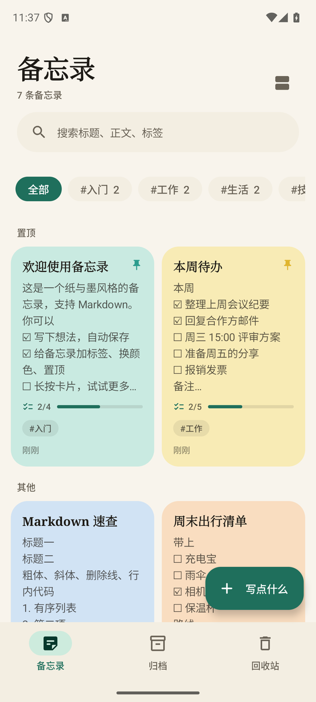
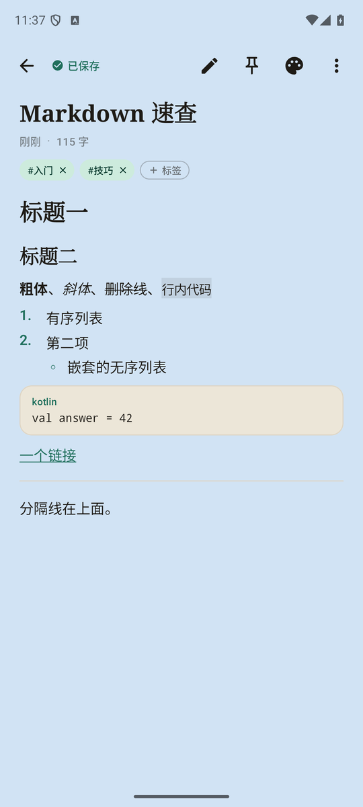
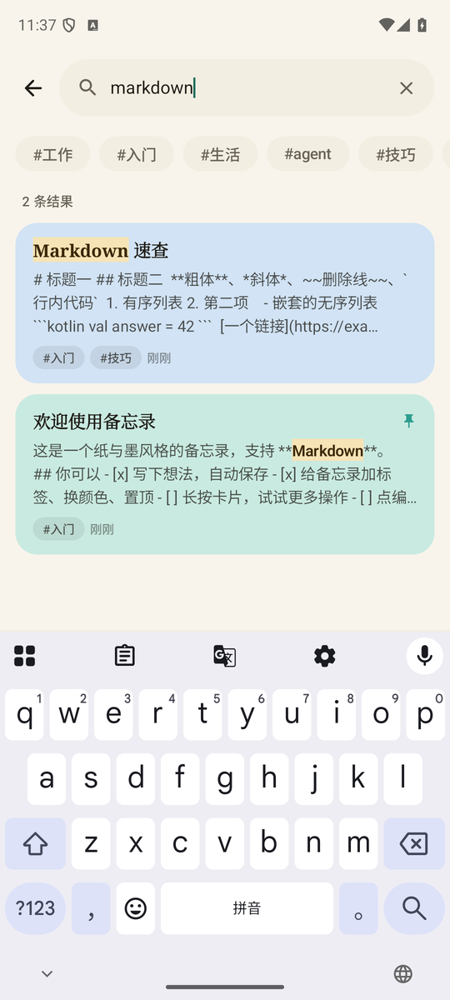
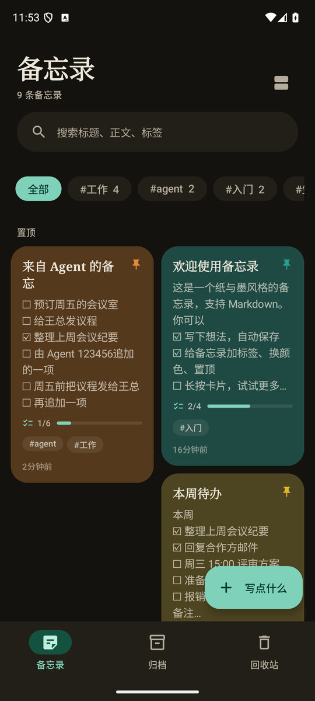
</p>

## 功能

**界面**（中文默认，`values-en` 英文；亮 / 暗两套配色，跟随系统；edge-to-edge；Pixel 8 与 720×1280 小屏都验证过）

- **首页**：瀑布流卡片，可一键切换为列表。卡片有标题（衬线体）、摘要（去掉 Markdown 标记、保留行结构）、任务进度条（`2/5`）、标签、颜色底、置顶图钉、更新时间。置顶的在最上面单独成组。长按卡片出菜单：置顶 / 颜色 / 归档 / 移到回收站。
- **编辑页**：标题 + Markdown 正文，**停手 0.7 秒自动保存**（顶栏显示「已保存 / 编辑中 / 保存中」）。底部格式工具栏：标题、粗体、斜体、删除线、无序 / 有序 / 任务列表、引用、行内代码、代码块、链接、分隔线；列表里按回车自动续项，空项再按回车结束列表。标签（从已有标签里点选或新建）、颜色（9 色，页面底色跟着变）、置顶。
- **Markdown 预览**（自己写的解析器，不加依赖）：标题、粗体 / 斜体 / 删除线、行内代码与代码块、有序 / 无序 / 嵌套列表、**任务列表复选框（预览里可以直接点，会改回正文）**、引用、链接（只放行 http / https / mailto / tel）、分隔线。
- **搜索**：标题 / 正文 / 标签的不分大小写包含匹配，多个词需全部命中；结果按相关度排序，**命中的文字在标题和片段里高亮**；可再按标签过滤。
- **标签筛选**：首页顶部一排标签（带数量），点一下过滤。
- **归档**：不常用但想留着的备忘录；**回收站**：删除先进回收站、可恢复；回收站里再删才是永久删除（单条要确认，「清空」要确认）。
- **空状态**：每个页面都有自己的插画（Canvas 画的，跟随主题色）。
- **动画**：列表项进出 / 重排、页面横向滑动 + 淡入淡出、保存状态切换、编辑页底色渐变、对话框与 Snackbar（带「撤销」）。

**与 MCP 共用同一份数据**

界面和 `NotesMcpService` 用的是**同一个进程内单例仓库**（`NoteRepository`，`StateFlow` 对外）。所以 AgentOS 经 MCP 增删改之后：

- 首页 / 搜索 / 回收站立刻刷新；
- 正在编辑页里打开的那一条：没有未保存修改时**静默同步**并提示一下；有未保存修改时**不会静默覆盖**——自动保存暂停，给出三个选择：载入最新 / 另存为副本 / 保留我的。外部把它移进回收站则转为只读并给「恢复」；外部永久删除则可以「另存为新备忘录」。

<p>
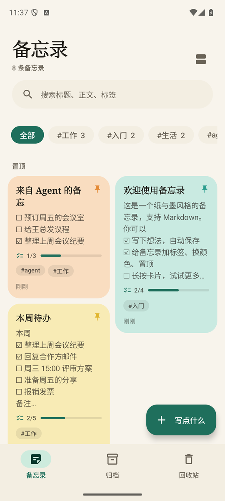
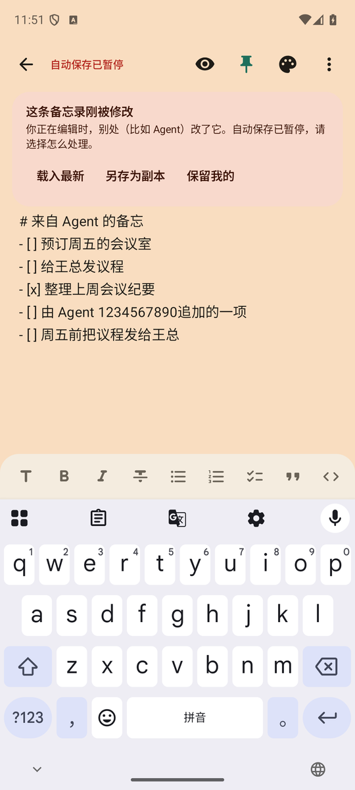
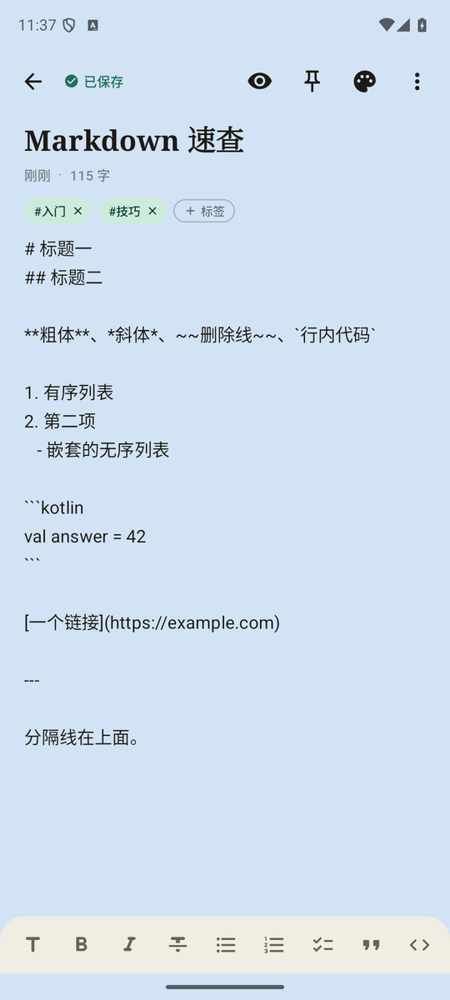
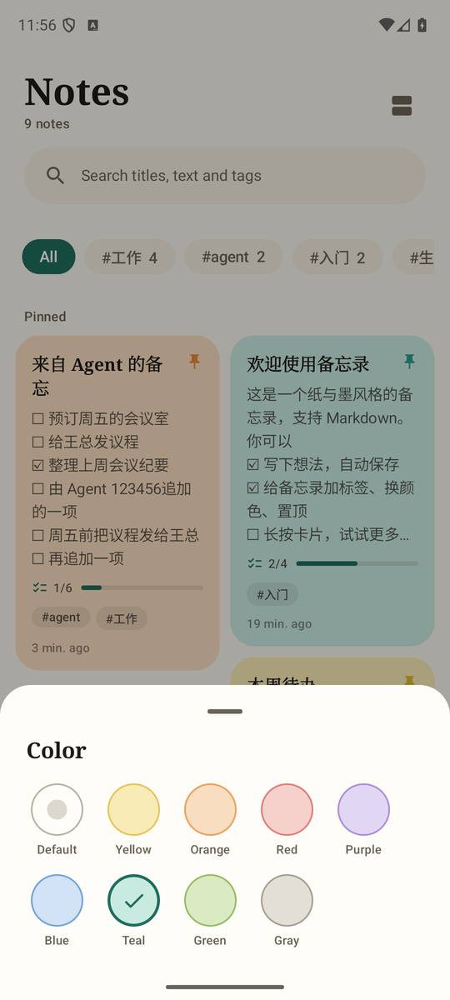
</p>
<p>
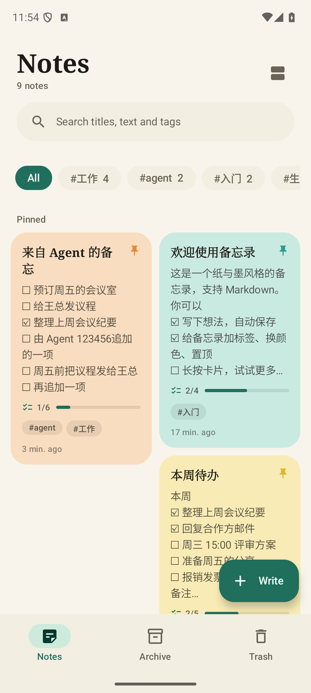
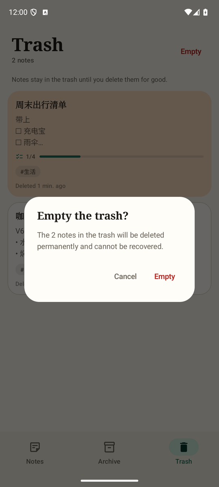
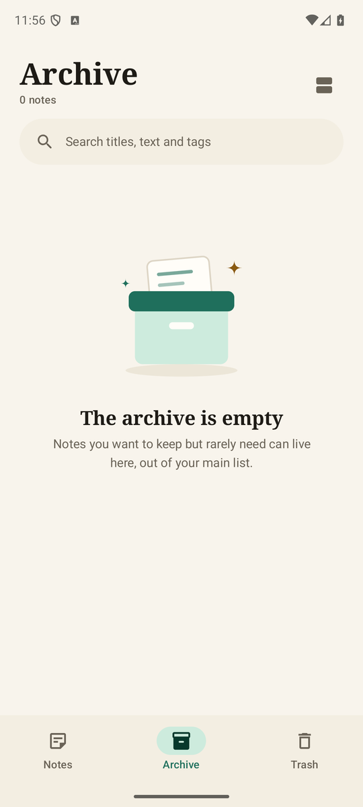
</p>

## MCP 工具

10 个工具（名字和必填参数照 `docs/sample-apps.md` 第 4.3 节）。描述写给模型，用英文；错误一律是 `isError=true` + 一句话原因；时间是带时区偏移的 ISO-8601（`2026-10-08T07:00:00+08:00`）；id 是字符串。

| 工具 | 必填 | 可选 | 注解 | 说明 |
|---|---|---|---|---|
| `note_list` | — | `tag`, `pinned`, `archived`（默认 false）, `trashed`（默认 false）, `limit`（默认 50，最大 200）, `offset` | readOnly | 置顶在前、按更新时间。返回 200 字摘要（不是全文）、`total`、`has_more`、`next_offset` |
| `note_get` | `id` | `offset`, `max_chars` | readOnly | 完整正文；超长时分片，`truncated` 为 true 就用 `next_offset` 接着读 |
| `note_create` | `content`（Markdown） | `title`（缺省取正文首行）, `tags`, `color`, `pinned` | — | 描述里提醒模型先 `note_search` 再决定新建还是追加 |
| `note_update` | `id` | `title`, `content`, `tags`（整体替换）, `color`, `pinned`, `archived` | idempotent | 只改给出的字段；`archived=true` 归档、`false` 取消。回收站里的不能改 |
| `note_append` | `id`, `text` | `separator`（默认 `\n`） | — | 在正文末尾追加；返回 `appended_chars` |
| `note_search` | `query` | `tag`, `limit`, `include_trashed` | readOnly | 标题 / 正文 / 标签包含匹配；返回**命中片段**和 `matched_in`（title / tag / content） |
| `note_trash` | `id` | — | — | 放进回收站（可恢复） |
| `note_restore` | `id` | — | — | 从回收站或归档恢复 |
| `note_delete` | `id` | — | **destructive** | 永久删除；**只允许删回收站里的**，否则返回「先 `note_trash`」 |
| `tag_list` | — | — | readOnly | 全部标签及各自的备忘录数（回收站里的不算） |

**结果大小**：Binder 通道单条消息上限是 65,536 字符，而 `McpToolResult.json(对象)` 会把同一段 JSON 在 `content` 和 `structuredContent` 里各放一份，所以工具层按「2 × 长度 + 转义增量」估算真实线上成本，超了就少返回几条（`has_more` 为 true，`next_offset` 接着取）；`note_get` 对长正文自动缩小切片。转义很重的正文（比如满是引号和换行）也不会超限，有单测覆盖。

**插件包**在 `src/main/assets/agent-plugin/`：`plugin.json`（`name=notes`，`extensions."org.agentos".mcpServers.notes.service` 指向 `NotesMcpService`）和 `skills/notes/SKILL.md`（讲清 Markdown 写法、标签约定、「先 `note_search` 再 `note_append`，不要重复创建」、删除要先进回收站、`note_update` 的 `content` / `tags` 是整体替换等流程）。

## 代码结构

```
src/main/java/org/agentos/sample/notes/
  data/       Note、NoteRepository（进程内单例 + StateFlow + 互斥写 + 状态机）、NoteStore / SqliteNoteStore、NoteSearch（命中片段）、NoteQueries
  markdown/   MarkdownParser（纯 Kotlin）、MarkdownEdit（工具栏的文本变换）——与界面无关，JVM 可测
  tools/      NotesTools —— 与 SDK 无关的工具定义（name / description / inputSchema / 注解 / handler），只依赖 kotlinx-serialization-json 和仓库
  agent/      NotesMcpService —— 与 SDK 有关的**唯一**一个薄层：把上面的工具逐个注册进 McpBinderService
  ui/         Compose 界面：theme、components（空状态插画、Markdown 渲染、公共件）、home、editor（含 EditorSession）、search
  NotesGraph  进程内单例（仓库 + 工具），界面和 MCP 服务拿到的是同一个
src/debug/    只在 debug 包里：DebugCallReceiver（dump / reset / 调工具）、SelfTestReceiver（跨进程 MCP 自测）
```

## 构建与验证

```bash
export JAVA_HOME=$(/usr/libexec/java_home -v 21) ANDROID_HOME=$HOME/Library/Android/sdk
./gradlew --max-workers=2 :plugins:samples:notes:testDebugUnitTest :plugins:samples:notes:assembleDebug \
                          :plugins:samples:notes:assembleRelease :plugins:samples:notes:lintDebug
```

- **JVM 单元测试**（不需要设备）：数据层与回收站 / 归档状态机、搜索与命中片段、Markdown 解析与工具栏变换、`EditorSession`（自动保存、外部修改同步与冲突，虚拟时间）、每个工具的正常 / 缺参数 / 非法值 / 不存在的 id / 结果大小，以及 SDK 注册层。
- **设备**：装 debug 包（`./gradlew :plugins:samples:notes:installDebug`，指定设备用 `ANDROID_SERIAL`）。
- **与契约的一致性**：`./gradlew :core:extensions:test --tests '*SamplePluginsConformanceTest*'`（读本 App 的 `plugin.json`、`AndroidManifest.xml`、`SKILL.md` 和工具源码，检查工具清单「只多不少」；本 App 在 main 里时默认就读它）。
- release 开 R8（`isMinifyEnabled`，`NotesMcpService` 有 keep 规则）；产出是未签名的 `notes-release-unsigned.apk`（设了 `AGENTOS_SIGNING_*` 环境变量则用项目证书签名）。

## 调试（只在 debug 包里）

两个导出的接收器，都要求 `android.permission.DUMP`——只有 `adb shell` 和系统能发。release 包里没有它们，也没有它们引用的代码（`NotesDump`、`clearAll` 在 release 里无人引用，被 R8 去掉）。结果都放在**广播的 result data**（一个 JSON 字符串，**不进 logcat**），`am broadcast` 会打印 `Broadcast completed: result=1, data="{…}"`；result code：`1` 成功，`2` 失败。**不返回任何密钥。**

### `cmd=dump`：读出全部状态（只读）

```bash
adb -s <设备> shell am broadcast -n org.agentos.sample.notes/.debug.DebugCallReceiver --es cmd dump
# 分页（数据多时）：
adb -s <设备> shell am broadcast -n org.agentos.sample.notes/.debug.DebugCallReceiver --es cmd dump --ei offset 0 --ei limit 50
```

返回（字段 snake_case；每条备忘录的字段与 MCP 的 `note_get` 一致，再加 `revision`）：

```json
{
  "notes": [
    {
      "id": "c6902cef-b841-459d-ab40-872bd490804e",
      "title": "来自 Agent 的备忘",
      "content": "# 来自 Agent 的备忘\n- [ ] 预订周五的会议室",
      "tags": ["agent", "工作"],
      "color": "orange",
      "pinned": true,
      "archived": false,
      "trashed": false,
      "created_at": "2026-10-07T10:30:56+08:00",
      "updated_at": "2026-10-07T10:31:40+08:00",
      "content_length": 42,
      "revision": 2
    }
  ],
  "tags": [{ "name": "agent", "count": 1 }],
  "total": 8, "offset": 0, "count": 8, "next_offset": null
}
```

- **包含全部**备忘录：正常、归档（`archived: true`）和回收站（`trashed: true`，另有 `trashed_at`）。`notes` 按创建时间排序，分页稳定。
- `tags` 统计未进回收站的备忘录；`total` 是备忘录总数；`next_offset` 为 `null` 表示没有更多了。
- result data 约 1 MB 上限：每页按 20 万字符预算自动截断（`count` 可能小于 `limit`），用 `next_offset` 接着取；单条正文超过 10 万字符会截断并带 `content_truncated: true`（`content_length` 是真实长度）。
- 只读，不改任何数据（有单测保证）。

### `cmd=reset`：清场

```bash
adb -s <设备> shell am broadcast -n org.agentos.sample.notes/.debug.DebugCallReceiver --es cmd reset
# → data="{"ok":true,"deleted":8}"
```

删除**全部**备忘录（含归档和回收站）。不会重新放示例——示例备忘录只在第一次安装时放一次。之后 `dump` 返回 `total: 0`。

### 直接调工具层

```bash
adb -s <设备> shell "am broadcast -n org.agentos.sample.notes/.debug.DebugCallReceiver --es tool note_search --es args '{\"query\":\"会议\"}'"
# → data="{"tool":"note_search","ok":true,"result":{…}}"   或   {"tool":…,"ok":false,"error":"…"}
```

和 MCP 服务用的是同一个仓库对象，所以前台界面会像被 Agent 操作一样实时刷新。注意 `adb shell` 会在设备端再解析一次引号，参数 JSON 要像上面那样整条包进单引号。

### `SelfTestReceiver`：跨进程的 MCP 自测

```bash
adb -s <设备> shell am broadcast -n org.agentos.sample.notes/.debug.SelfTestReceiver          # 可加 --el pause_ms 3000 让每步停一下方便截图
adb -s <设备> logcat -d -s NotesSelfTest
```

在单独的 `:selftest` 进程里经 `McpBinderClient` 绑定本 App 的 `NotesMcpService`（所以是真正跨进程的 Binder），`initialize` → `tools/list`（核对 10 个工具与注解）→ 走一遍增删改查全部工具和错误路径（缺参数、非法值、不存在的 id、删除不在回收站的），最后清理自己创建的备忘录。结果是一行 JSON 摘要（`passed` / `total` / `failed`），只含工具名与通过 / 失败，不含备忘录内容。

## 已知限制

- 搜索是包含匹配，不做分词和拼音；中文按字符匹配。
- 备忘录里不支持图片、表格和 HTML；链接只放行 `http` / `https` / `mailto` / `tel`。
- 数据只存在本机 SQLite，不同步、不加密、`allowBackup=false`。
- 示例数据（欢迎、Markdown 速查等 7 条）只在第一次安装时放入，之后用 `cmd=reset` 清掉不会再出现。
