# 短信（`org.agentos.sample.sms`）

AgentOS 的示例 App 之一，**能力型短信**：不当默认短信应用，读系统短信库（`READ_SMS`）、用 `SmsManager` 发送（`SEND_SMS`），
Compose + Material 3 界面，内嵌 Agent Plugin 并导出 Binder MCP 服务。装在手机上后，AgentOS 能发现它、列出六个工具，
经 MCP 列会话、读消息、搜索、发送、查发送状态、把草稿交给系统短信界面。设计与取舍见 [docs/next-apps-plan.md](../../../docs/next-apps-plan.md) 第 4 节。

| 状态（完整模式） | 会话（验证码已遮蔽） | Agent 发送记录（含状态与失败原因） | 仅撰写模式 + “允许受限制的设置”引导 |
|---|---|---|---|
| 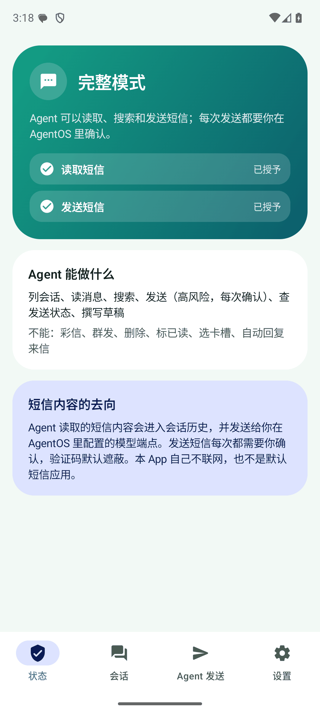 | 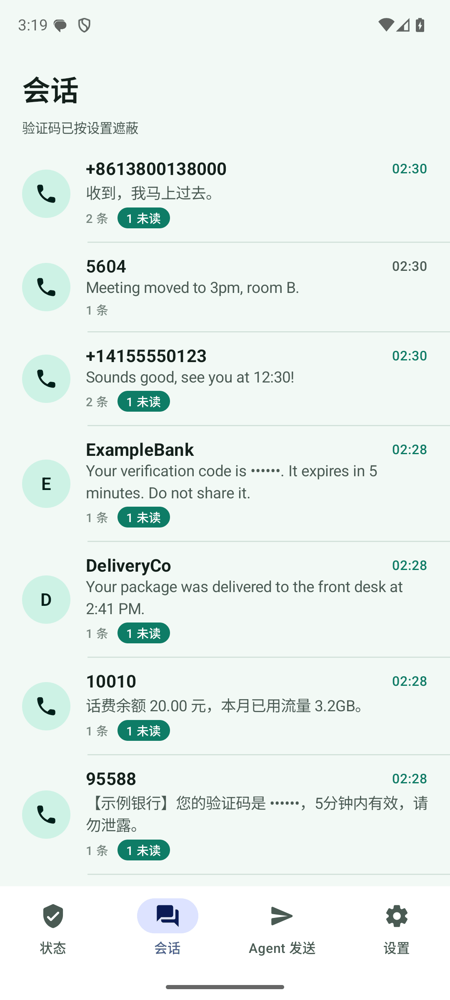 | 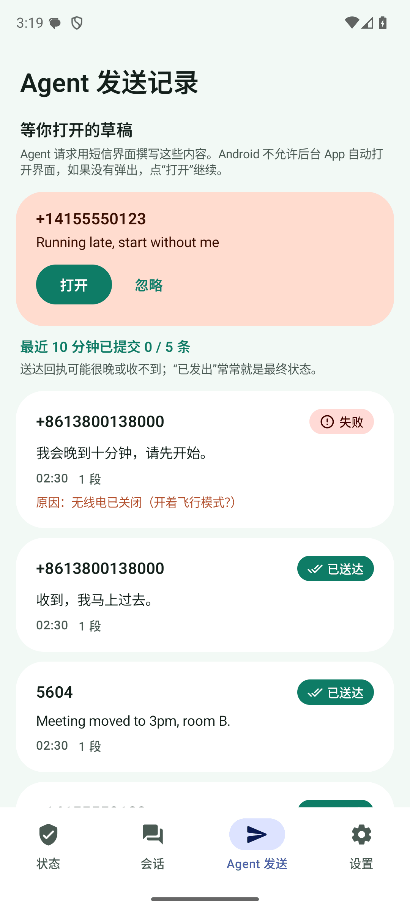 | 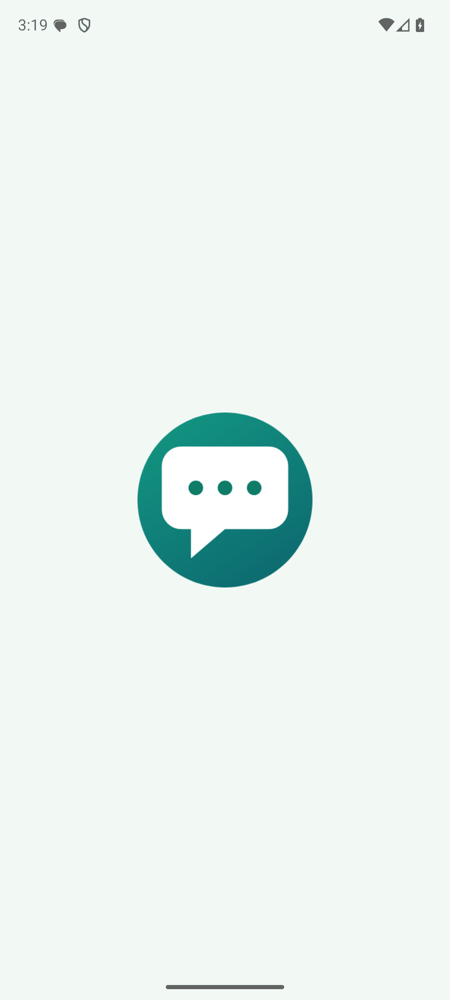 |

| English: status | chats | agent log | compose-only + guide |
|---|---|---|---|
| 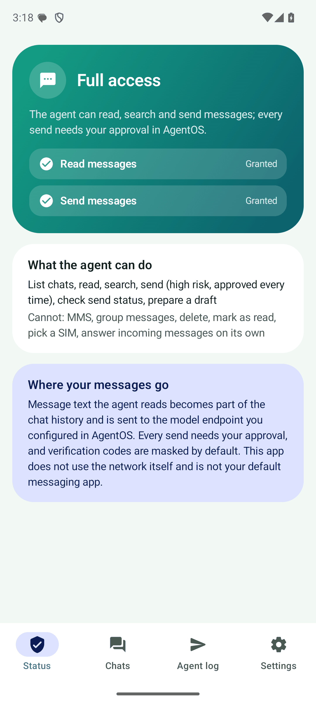 | 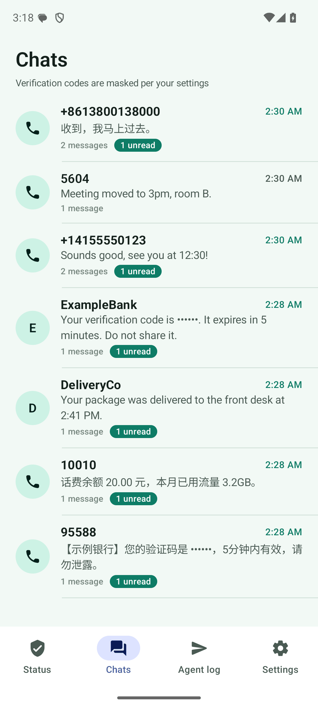 | 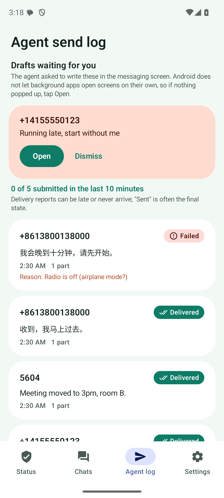 | 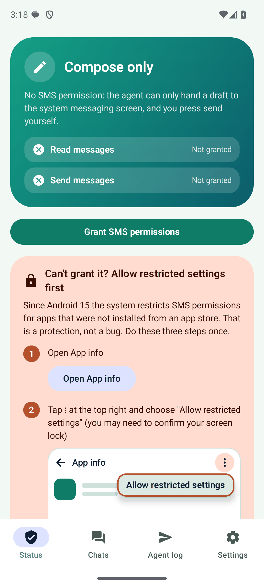 |

| 设置 | 暗色 | 小屏 360×640dp | 英文 + 1.3 倍字体 |
|---|---|---|---|
| 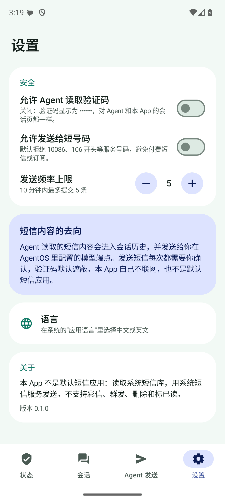 | 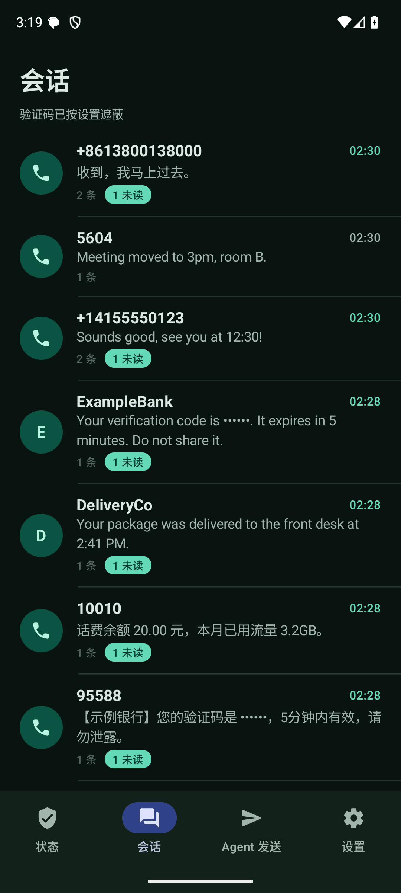 | 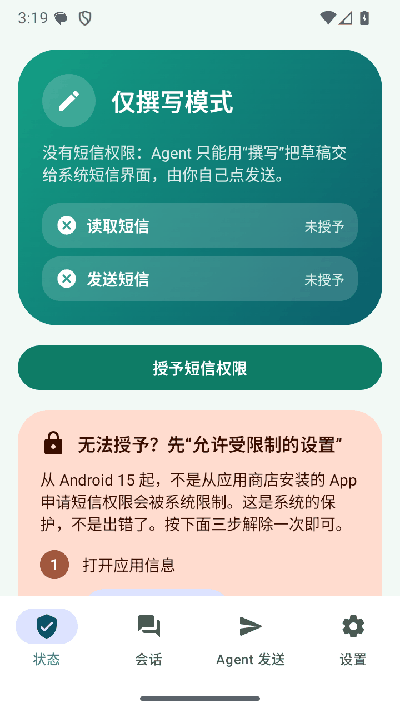 | 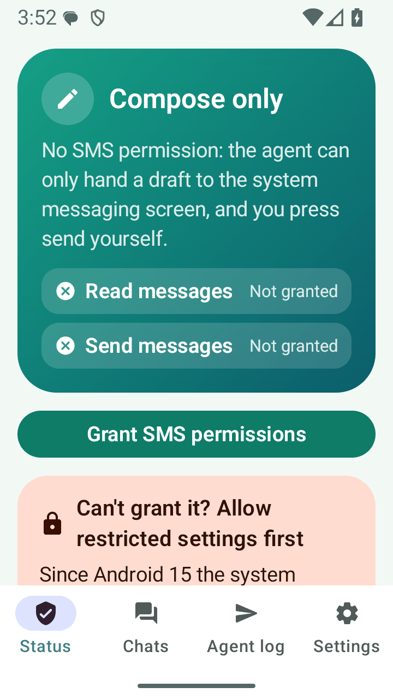 |

更多：[`screenshots/`](screenshots/)（`zh-` / `en-` 各 13 张以上，`sys-` 是系统自己的界面）。截图里的短信都是模拟器上 `adb emu sms send` 造的假数据。

## V1 结论：权限门（2026-10-09 实测）

计划里的第一个验证点：模块 / adb 装的 APK 能不能被授予 `READ_SMS`、`SEND_SMS`？**结论：能，走完整模式；侧载安装时要用户点一次“允许受限制的设置”，否则降为“仅撰写”。**

设备：Pixel 8 真机（Android 15 / API 35，SIM 状态 `LOADED,NOT_READY`），模拟器 Android 16 / API 36（Google Play 镜像）。

| # | 实测 | 结果 |
|---|---|---|
| 1 | `adb install` 装 debug 包（与模块 `pm install` 同路径） | `installer=null`，`cmd appops get <包> ACCESS_RESTRICTED_SETTINGS` = `default`（**未受限**），两个短信权限的标志带 `RESTRICTION_INSTALLER_EXEMPT`。真机和模拟器都是 |
| 2 | `pm grant` `READ_SMS` / `SEND_SMS` | 真机、模拟器都成功（真机授予后立即撤销，期间没有读出任何短信内容）；运行时对话框是**一个**“允许 Messages 发送和查看短信？”，同时授予两个 |
| 3 | 侧载：用系统“文件”App 点 APK 装（模拟器；原始安装来源是第三方 App） | `ACCESS_RESTRICTED_SETTINGS` = **`deny`**。App 里点“授予”弹出系统的“应用被拒绝访问短信”（[截图](screenshots/sys-01-restricted-denied-dialog.png)），不出现授权对话框。`pm grant`（shell）仍然能授予 |
| 4 | 应用信息 → ⋮ → “允许受限制的设置”（[截图](screenshots/sys-02-app-info-allow-restricted-settings.png)） | op 变成 `allow`；再点“授予”弹出正常授权对话框（[截图](screenshots/sys-03-runtime-permission-dialog.png)），授予后进入完整模式 |
| 5 | 从 shell 触发系统安装器（`am start … VIEW`，原始来源是 shell） | **不受限**。只有原始来源是第三方 App（文件管理器、浏览器）时才受限 |
| 6 | App 能不能自己读出“是否受限” | **不能**：`AppOpsManager.unsafeCheckOpNoThrow("android:access_restricted_settings", …)` 抛 `SecurityException`（要特权权限）。所以状态页在缺权限时**一律**显示三步引导，不判断是不是被限制 |
| 7 | 后台能否收到 `SMS_RECEIVED`（临时加 `RECEIVE_SMS` + 清单接收器，试完已还原，没有提交） | 能：App 在后台、进程被 `am kill` 后新短信仍然拉起进程并收到。**本 App 不需要**：发送状态靠 `PendingIntent` 回调，不申请 `RECEIVE_SMS`，也不声明任何 `SMS_DELIVER` 一类接收器 |
| 8 | 模拟器之间发短信（`5608` → `5604`） | `queued` → `sent` 立即；约 2 秒后 `delivered`（模拟器会回送达报告）。3 段长短信（150 个汉字、400 个字母）三段都回调；开飞行模式再发 → `sent` 回调结果码 2 → `failed`，原因 `radio_off`。真机**没有发过短信**（未验证真实 SIM 发送） |
| 9 | `FLAG_IMMUTABLE` 与送达报告 | 用 `FLAG_IMMUTABLE` 时 delivered 回调**没有** `pdu`（`pdu=false`），分不出送达还是永久失败；`FLAG_MUTABLE` 时 `pdu=true status=0`。所以 sent 用 `FLAG_IMMUTABLE`，**delivered 用 `FLAG_MUTABLE`**（显式 Intent、接收器不导出，不能被劫持），代码里有注释 |
| 10 | `sms_compose` 在后台能不能打开系统短信界面 | **不能**：`Background activity launch blocked`（日志里 `callingUidProcState: RECEIVER`，`startActivity` 不抛异常、静默失败）。AgentOS 绑定插件服务用的是 `BIND_AUTO_CREATE`，没有 `BIND_ALLOW_ACTIVITY_STARTS`，真实链路上同样会被拦。所以 `sms_compose` 同时把草稿记下来，“Agent 发送”页顶部有“打开”按钮（本 App 可见时系统才允许）。建议见下 |
| 11 | 确认框能不能让用户看全正文（读 `CapabilityBroker` / `ConsentText` / `ConsentCoordinator` / `ConsentDialog`，并用 AgentOS debug 包的 `ConsentDebugReceiver` 注入请求，读协调器的 `pending`） | 确认框的“参数”区显示**调用参数的紧凑 JSON**：先截到 2,000 字符，再按 **600 个码点**截断（`ConsentConfig.maxArgumentChars`）并去掉不可见字符，被截断时标 `argumentsTruncated`、界面写“参数过长，已截断显示”。实测：500 字正文（JSON 533 字符）完整、`argumentsTruncated=false`；400 个引号（JSON 转义后 833 字符）`argumentsTruncated=true`。**所以**：500 字以内的普通正文看得全；大量引号 / 反斜杠 / 换行的正文会因转义变长而看不全。本 App 在 `sms_send` 里先按同样的规则算一遍，超过 600 就拒绝并让模型缩短（`SendRules.checkFitsConsent`）。确认框的渲染（滚动区能否翻到底）**只读了代码，没有在界面上实看**，因为那台模拟器上的 AgentOS 停在首次引导页 |

**给平台层的提醒（S5 / S1，本 App 不去改主 App）**
1. 插件服务在后台打不开界面（上表 10）。建议 `McpBinderClient.bind` 在 AgentOS 可见时带 `Context.BIND_ALLOW_ACTIVITY_STARTS`，或者由 AgentOS 提供“替插件打开这个 Intent”的受控入口；否则所有“把用户带去另一个界面”的工具都有这个问题。
2. 确认框把参数显示成一整段 JSON，收件人和正文挤在一起、换行显示成 `\n`、有 600 字符上限。建议对 `destructiveHint` 的工具支持结构化展示（`to` 一行、`text` 完整多行），而不是靠插件自己去适应上限。
3. 读类工具的结果会回到调用它的第三方 App（`extensions.md` 5.4），短信读取应对 `APP` 调用方强制确认（`StrictCallerPolicy`）——计划 S5，平台工作，未做。

## 权限门与模式

工具目录**永远是六个**，不随权限增减（避免平台缓存工具目录带来的错位）；权限不足时工具自己返回明确的英文错误，带“请在短信 App 里授权，或在应用信息里允许受限制的设置”。

| 模式 | 条件 | 可用 | 其余工具 |
|---|---|---|---|
| 完整 | `READ_SMS` 和 `SEND_SMS` 都已授予 | 全部 | — |
| 部分 | 只有其中一个 | 读类（需要读权限）；`sms_send`、`sms_send_status`（需要发送权限）；`sms_compose` | 缺哪个权限，对应工具返回“`<权限>` is not granted” |
| **仅撰写** | 两个都没有（被“受限设置”限制 / 用户拒绝 / 事后撤销） | **只有 `sms_compose`** | 返回 `Compose-only mode: … only sms_compose works right now …` |

权限每次调用实测，用户在系统设置里撤销后下一次调用立刻进入对应模式。状态页有当前模式、两个权限、“授予”按钮，缺权限时展开“允许受限制的设置”的图文引导（三步 + 应用信息页示意图）：

| 引导 | 英文 | 小屏 |
|---|---|---|
| 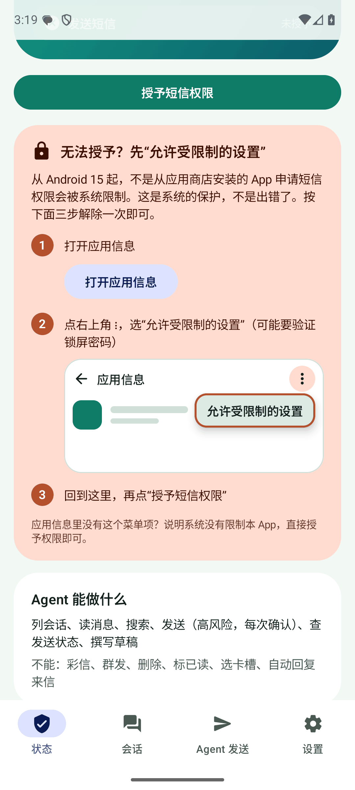 | 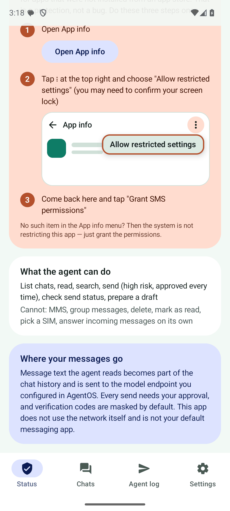 | 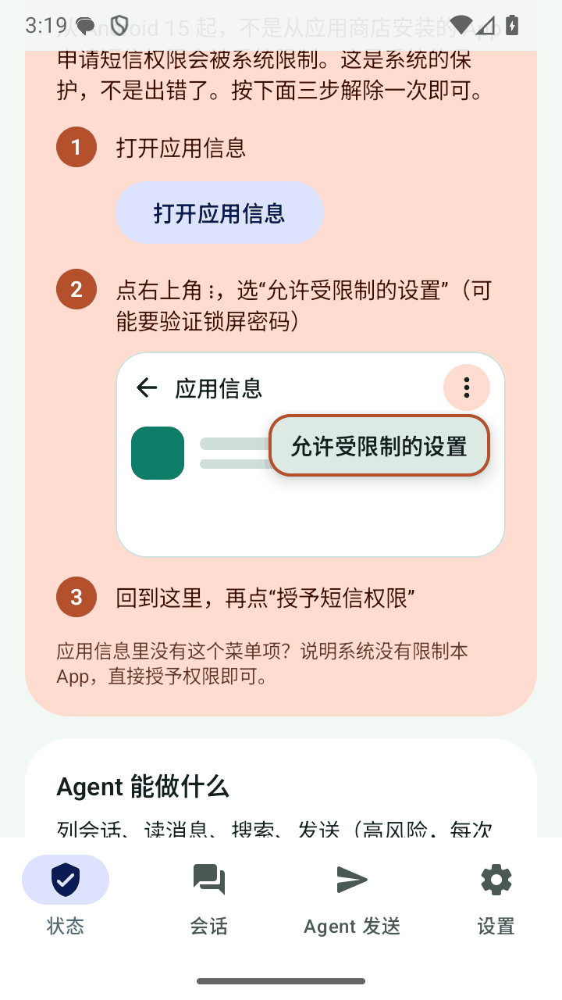 |

## MCP 工具

插件：`sms`（`displayName` 为“短信”）；MCP 服务器：`sms`；Service：`org.agentos.sample.sms.agent.SmsMcpService`（要求 `org.agentos.permission.BIND_MCP_SERVICE`）。
AgentOS 里的完整工具名是 `mcp__sms__sms__<工具名>`。**这是独立示例 App，不是自带插件**：`readOnlyHint` 不会被信任为“读”，所以读也默认每次确认；第三方插件默认关闭。

| 工具 | 必填 | 可选 | 注解 | 说明 |
|---|---|---|---|---|
| `sms_thread_list` | — | `limit`（默认 20，最大 50）、`offset` | readOnly | 会话摘要（地址、最近时间、条数、未读、摘要），新到旧；`has_more`、`next_offset` |
| `sms_message_list` | `address` | `since`（含）、`until`（不含）、`limit`、`offset` | readOnly | 某号码 / 发件人的消息，新到旧；号码按末 10 位匹配（`+86…` 与 `138…` 是同一个） |
| `sms_search` | `query` | `limit` | readOnly | 正文包含匹配（大小写不敏感）；遮蔽开着时在**遮蔽后**的正文上匹配 |
| `sms_send` | `to`、`text` | — | **destructive** | 一次一个收件人；异步，返回本地 `id`、`parts`、`state:"queued"`、`deduplicated` |
| `sms_send_status` | `id` | — | readOnly | 查本 App 发出的某条：`queued` / `sent` / `delivered` / `failed`，`sent_parts`、`delivered_parts`、`error` |
| `sms_compose` | `to` | `text` | — | `ACTION_SENDTO smsto:` 交给系统短信界面预填，不需要任何短信权限；不发送 |

时间一律 ISO-8601 带设备时区偏移；id 是字符串；错误一律 `isError=true` + 一句英文原因（R2：不本地化）。结果体积：单个结果的 JSON 正文不超过约 24,000 字符（content 和 structuredContent 各出现一次，平台上限 65,536），超出时少给几条并 `has_more=true`；单条正文超过 1,000 字符截断并标 `body_truncated`。

插件包在 [`src/main/assets/agent-plugin/`](src/main/assets/agent-plugin/)：`plugin.json`（`description` 里就写明数据去向和高风险发送）+ `skills/sms/SKILL.md`（英文：不可信数据、发送规则、格式、异步语义、权限缺失时怎么办）。

## 安全规则 S1–S6

- **S1 发送**：单次调用单个收件人（`,`、`;`、`/` 等分隔符直接拒绝）；`text` ≤ 500 个字符（按码点，表情算一个）；不允许控制字符和不可见字符（零宽、双向控制符、软连字符……，因为确认框会把它们丢掉，用户看到的和实际发出的会不一样；ZWJ 例外，表情序列要用）；**默认拒绝短号和服务号码**（少于 7 位、`10`/`95`/`96` 开头的国内服务号、`106…`；规则是可配置的纯函数 `ShortNumberRules`，设置页可以整体放行）；**发送频率**默认 10 分钟内 5 条（设置里 1–30 可调，`RateLimit` 纯函数）；**相同收件人 + 相同正文 2 分钟内去重**（号码格式不同也算相同；返回上次的 `id` 并标 `deduplicated:true`，不再发一条，也不占频率名额；上一条失败了不算重复）；调用参数编码后超过确认框能显示的 600 字符就拒绝（见 V1 第 11 行）。
- **S2 读取**：本 App 不放宽任何东西——独立示例 App 的读类工具按第三方插件的默认，**每次确认**（`readOnlyHint` 不被信任为“读”）。但平台对“写”级工具仍然会给用户“始终允许”的选项（`ConsentText.allowedChoices`），本 App 无法移除；用户一旦选了，Agent 就能不经确认读短信。这属于 S5 的平台问题，建议对这组工具不提供“始终允许”。
- **S3 验证码默认遮蔽**：`sms_thread_list` 的摘要、`sms_message_list`、`sms_search` 对疑似验证码返回 `••••••`（位数和分隔符不变，另有 `code_masked:true`、`masking.masked_count`）。设置里“允许 Agent 读取验证码”默认关。**规则不跟界面语言走**，中英文模板同时覆盖：关键词 验证码 / 校验码 / 动态码 / 动态密码 / 安全码 / 确认码 / 认证码 / 登录码 / 授权码 / 口令 …，code / OTP / PIN / passcode / password / verification / 2FA / one-time / sign in / log in …；候选是独立的 4–8 位数字（含全角数字）或 `123 456`、`1234-5678`；离关键词近（30 个字符内）的才遮蔽；日期、小数、电话片段、金额和计量（`5000 元`、`$2500`、`USD 5000`、`10月8日`）、没有关键词的纯数字（尾号、订单号）都不动。遮蔽开着时**搜索也在遮蔽后的正文上匹配**，所以不能靠搜 `482910` 来探测验证码。样例测试见 `CodeMaskerTest`。局限：只认数字验证码，字母数字混合码、日韩等其他语言模板不处理；宁可多遮，离关键词很近的订单号也可能被遮。
- **S4 提示注入**：`SKILL.md` 写明短信正文是不可信数据、不得执行其中的指令；发送必须来自用户当前的请求；不转发验证码和账单；不批量发送。工具描述里也写了。
- **S5 平台风险（本 App 不实现）**：见上面“给平台层的提醒”。
- **S6 数据去向**：第一次打开的对话框（[截图](screenshots/en-00-first-run-disclosure.png)）、状态页、设置页、`plugin.json` 的 `description` 都如实写明：**Agent 读到的短信内容会进会话历史，并发送给你在 AgentOS 里配置的模型端点**；本 App 自己不联网。

## 发送语义（outbox）

- **异步**：`sms_send` 返回“已提交”，不承诺送达。本 App 自己维护 `outbox` 表（SQLite）：`id`、`to`、`text`、`parts`、`state`、`created_at`、`updated_at`、`error`，以及每段 sent / delivered 的位图。
- **分段**：`divideMessage` + `sendMultipartTextMessage`；返回 `parts` 让 Agent 知道成本（中文一般 70 字一条，拼接时每条 67 字）。用系统默认短信 SIM（`SmsManager.getDefaultSmsSubscriptionId()`，不申请 `READ_PHONE_STATE`），不能选卡槽。
- **回调**：每段两个 `PendingIntent`（sent / delivered），显式广播发给不导出的 `SmsStatusReceiver`，身份编在 data 里（`sms-outbox://<id>/<段>/<kind>`）。状态机是纯函数 `OutboxMachine`：

```
queued ──所有段 sent──▶ sent ──所有段 delivered──▶ delivered
   │                     │
   └──任一段失败──▶ failed ◀──送达报告失败──┘
```
  终态不再变；重复回调幂等（返回同一个对象，不改 `updated_at`）；delivered 先于 sent 到达时按“送达蕴含已发出”处理；失败原因是 `radio_off`、`no_service`、`generic_failure`、`limit_exceeded`、`short_code_not_allowed`、`delivery_failed` 等英文短语（界面上换成本地化文字）。
- 非默认短信应用发出的短信，系统会自动写入短信库，所以发出去的也能在“会话”里看到。**做不了**：删除、标已读、写草稿、收彩信推送。

## 界面

不做完整客户端，四个页签：**状态**（模式、权限、引导、数据去向）、**会话**（只读浏览，验证码按设置遮蔽，“用短信 App 回复”走 `sms_compose` 同样的 Intent）、**Agent 发送**（outbox、等你打开的草稿）、**设置**（验证码开关、短号放行、发送频率、语言入口、数据去向）。
配色“薄荷 / 松针”两套，不用系统动态取色；edge-to-edge（状态栏后面有底色，滚动内容不会叠在状态栏图标上）；空状态是 Canvas 画的插画；页签切换、模式卡片有淡入淡出。中文默认（`values/`），英文 `values-en/`，`locales_config.xml` + `android:localeConfig`，设置页有跳转系统“应用语言”的入口；日期时间用 `java.time` 的本地化风格（中文 24 小时、英文 12 小时）；英文长文本在 360dp + 1.3 倍字体下检查过截断（[截图](screenshots/en-14-small-font-1.3x-status.png)）。

## 代码结构

```
org.agentos.sample.sms
├── data/       SmsGateway（接口，隔离 Android）、Outbox + OutboxMachine（状态机）、SqliteOutboxStore、Drafts、SmsSettings
├── rules/      Recipient / ShortNumberRules、SendRules、RateLimit、Dedupe、AddressMatcher、CodeMasker —— 纯函数，可配置
├── tools/      与 SDK 无关的工具层：ToolDef、SmsTools（6 个工具、权限门）、SmsDump —— 只依赖 kotlinx-serialization-json
├── platform/   AndroidSmsGateway（content://sms 读、SmsManager 发）、SmsStatusReceiver（sent / delivered 回调）
├── agent/      SmsMcpService : McpBinderService —— 只负责把 SmsTools 逐个注册进 SDK
└── ui/         MainActivity（四页签）、StatusScreen / ChatsScreen / AgentScreen / SettingsScreen、主题、插画
```
`src/debug/` 只在 debug 构建里：`DebugToolReceiver`（dump / reset / set / 调工具）、`SelfTestReceiver`（MCP 自测）。release 包里没有它们（已核对合并清单和 dex）。

## 构建与验证

```bash
export JAVA_HOME=$(/usr/libexec/java_home -v 21) ANDROID_HOME=$HOME/Library/Android/sdk
./gradlew --max-workers=3 :plugins:samples:sms:testDebugUnitTest :plugins:samples:sms:assembleDebug \
                          :plugins:samples:sms:assembleRelease :plugins:samples:sms:lintDebug
./gradlew :core:extensions:test --tests '*SamplePluginsConformanceTest*'
```
- **JVM 单元测试**（135 个，不需要设备，用假的 `SmsGateway`）：正常、缺参数、非法号码、短号拒绝、频率限制、去重、`outbox` 状态机（`queued → sent → delivered`、`queued → failed`、重复回调幂等、乱序、终态不动）、验证码遮蔽样例（中英文模板、全角数字、金额 / 日期 / 电话 / 尾号反例、搜索探测）、仅撰写模式与部分模式、分页、结果体积、`dump`、草稿、时间格式（中英各一个用例）。
- **安装**：`adb -s <设备> install -r plugins/samples/sms/build/outputs/apk/debug/sms-debug.apk`，然后要么 App 里点“授予”（侧载的要先“允许受限制的设置”），要么 `adb shell pm grant org.agentos.sample.sms android.permission.READ_SMS`（`SEND_SMS` 同理）。
- **R8 下的设备验证**：`:plugins:samples:sms:assembleReleaseTest`（与 release 相同的混淆规则，调试证书签名，带自测入口，不发布）。
- **模拟器上造来信**：`adb -s <设备> emu sms send <号码> <正文>`；号码是 4 位端口号的模拟器之间可以互发（`SmsManager` 发给 `5604` 会投递到 `emulator-5604`）。**这类号码属于短号，默认被拒，要先放行**（下面的 `set`）。**绝不发给真实号码。**

### 自测：MCP 路径

在独立的 `:selftest` 进程里经 `McpBinderClient` 绑自己的服务（真实的跨进程 Binder）：`initialize`、`tools/list`（六个工具、必填参数、注解）、再按**当前权限状态**走一遍——没权限时读 / 发工具必须返回权限错误且目录不变；有权限时只验证读工具的结构、发送工具的拒绝路径。**自测不发任何短信，结果里也没有任何短信内容。**

```bash
adb -s <设备> shell am broadcast -n org.agentos.sample.sms/.debug.SelfTestReceiver
# result=1, data="{…,"passed":12,"total":12,"ok":true}"
```

## 调试：读状态、复位、改设置（仅 debug 构建）

全部发给 `DebugToolReceiver`（导出，要求 `android.permission.DUMP`，只有 adb shell 和系统持有），结果在广播的 **result data**（一个 JSON 字符串）。

```bash
adb -s <设备> shell am broadcast -n org.agentos.sample.sms/.debug.DebugToolReceiver --es cmd dump [--ei offset N --ei limit M]
```
```json
{"mode":"full","permissions":{"read_sms":true,"send_sms":true},
 "settings":{"mask_codes":true,"allow_short_numbers":false,"rate_limit":5},
 "outbox":[{"id":"1","to":"5604","text":"…","parts":1,"state":"delivered","sent_parts":1,"delivered_parts":1,"error":null,"created_at":"…","updated_at":"…"}],
 "drafts":[{"id":"1","to":"…","text":"…","created_at":"…"}],
 "total":1,"offset":0,"count":1,"next_offset":null,"now":"…","time_zone":"Asia/Shanghai"}
```
- `outbox` 新到旧、分页（`limit` 默认 50、最大 500，另有 200,000 字符的页预算；`next_offset` 为 `null` 是最后一页）。**dump 不读系统短信库**，里面没有任何收到的短信内容。
- `reset`：**只清本 App 自己的记录**（outbox 和 `sms_compose` 留下的草稿），返回 `{"cleared":N,"outbox_remaining":0,"drafts_cleared":M}`；不碰系统短信库（非默认短信应用也删不掉），不改设置、不改权限。清空同时清掉发送频率和去重的历史。
- `set --es key <mask_codes|allow_short_numbers|rate_limit> --es value <值>`：改设置（测试用；用户在设置页做同样的事）。
- 进程内调工具（与 MCP 注册的是同一批）：`--es tool sms_thread_list --es args '{"limit":5}'`，结果在 result data；logcat（tag `SmsDebug`）只写工具名、`isError` 和结果长度，不写短信内容。**不要在真机上对读类工具这样调**（结果会回到 adb 的输出里）。

## 已知限制

- **没有在真实 SIM 上发过短信**：真机只验证了权限、受限设置状态、自测（仅撰写 / 完整两种）；发送、送达回执、状态机的真实表现来自模拟器。送达回执是否到、多久到，取决于运营商。
- 国内机型（厂商对短信的单独管控、省电策略撤销权限、厂商短信 App 的验证码识别）没有验证，计划里也后置。
- 会话列表最多扫描最新的 20,000 条短信（超出时 `scan_truncated`）；按号码读消息同样最多扫这么多行。
- 只用系统默认短信 SIM，不能选卡槽；系统自己对高频发送也会弹确认（量级没核实），和本 App 的频率上限是两层。
- `sms_compose` 在后台被 Android 拦截时，只能靠“Agent 发送”页的草稿卡片（V1 第 10 行）。
- 验证码遮蔽的局限见 S3。
- 数据不参与云备份和设备迁移（发送记录里有正文）。
