# 待办（`org.agentos.sample.todo`）

AgentOS 的示例 App 之一：一个日常用的待办清单——有状态、优先级、截止日期、标签和一层子任务；Compose + Material 3 界面，内嵌 Agent Plugin 并导出 Binder MCP 服务。
装在手机上后，AgentOS 能发现它、列出工具、经 MCP 完整操作待办，**App 界面在前台时实时刷新**。契约见 [docs/next-apps-plan.md](../../../docs/next-apps-plan.md) 第 3 节，通用约定见 [docs/sample-apps.md](../../../docs/sample-apps.md)。

| | 列表（分组 + 优先级色条） | 展开子任务 | 详情 / 编辑 | 暗色 |
|---|---|---|---|---|
| 中文 | 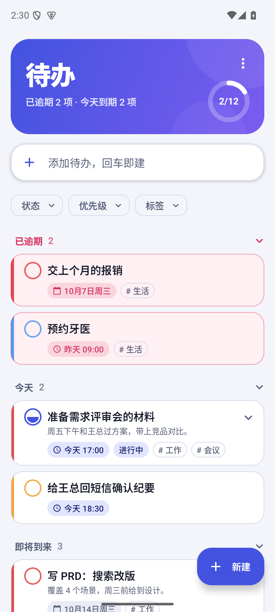 | 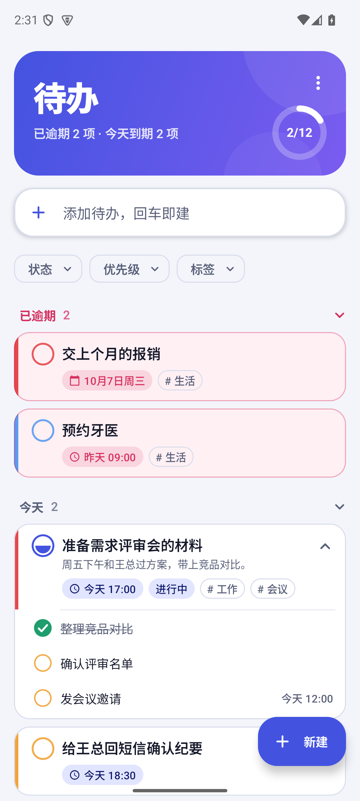 | 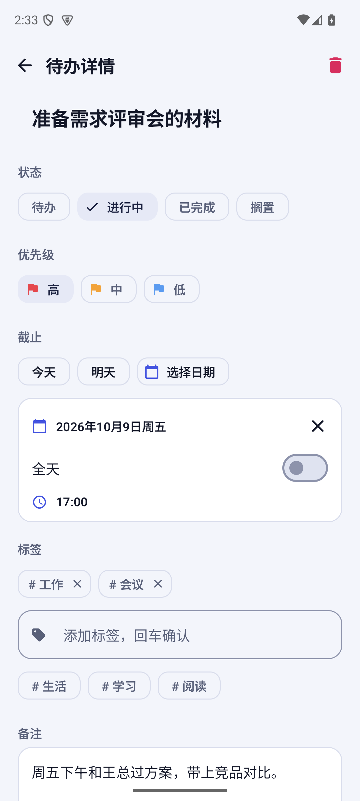 | 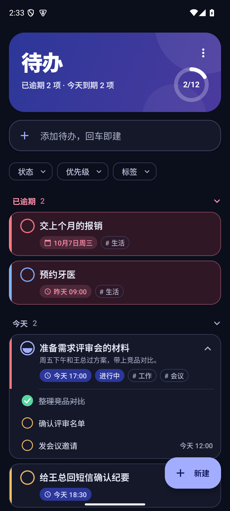 |
| English | 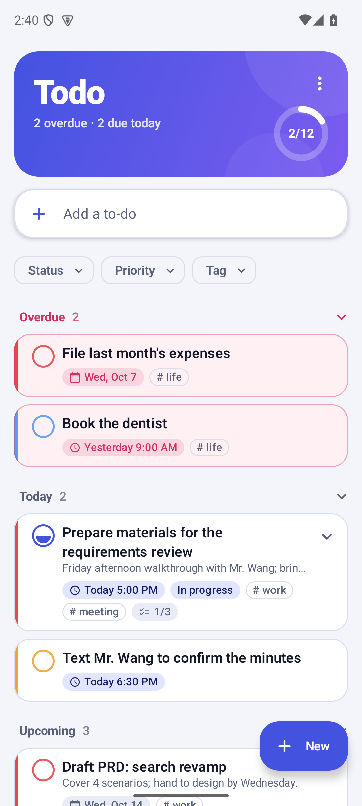 | 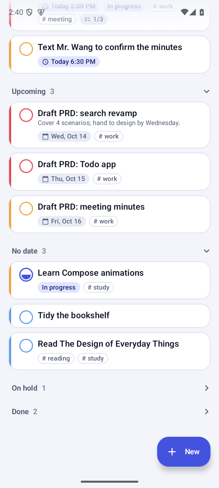 | 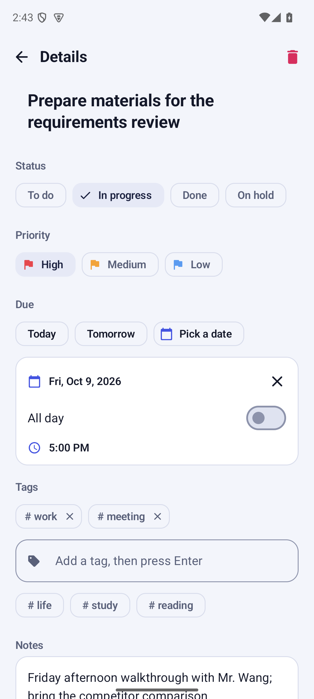 | 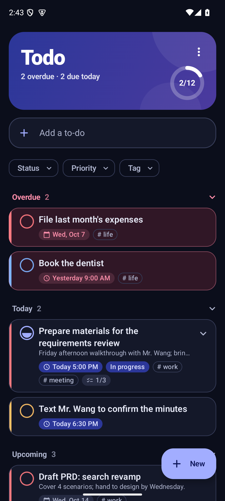 |

| 空状态 | 完成后撤销 | 筛选 chips | 快速添加（English） | 小屏 |
|---|---|---|---|---|
|  | 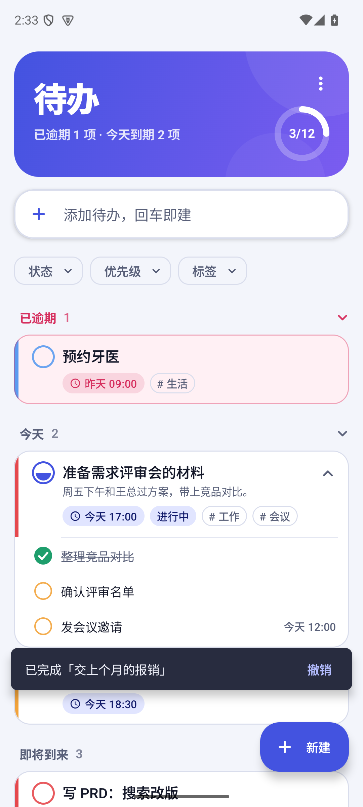 | 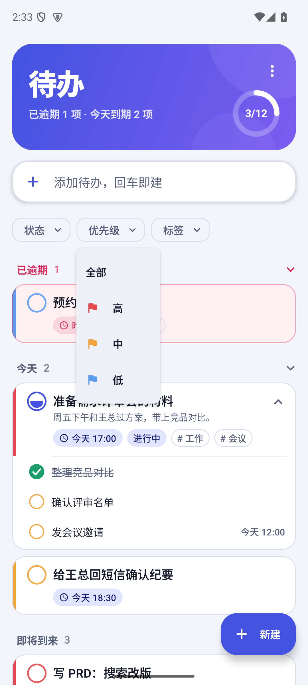 | 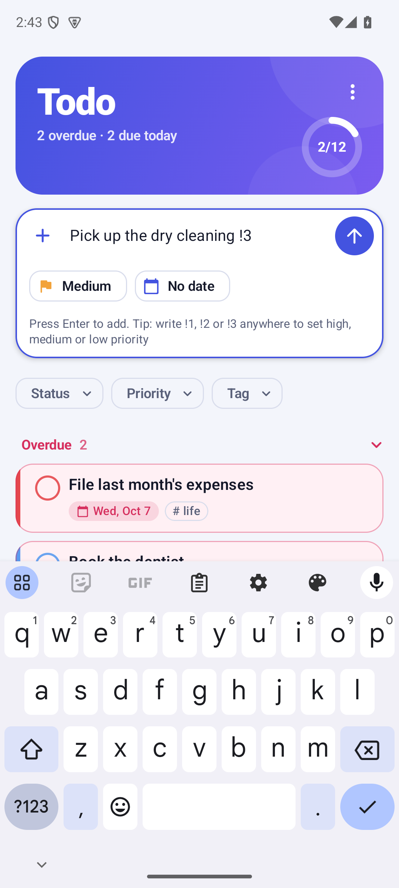 | 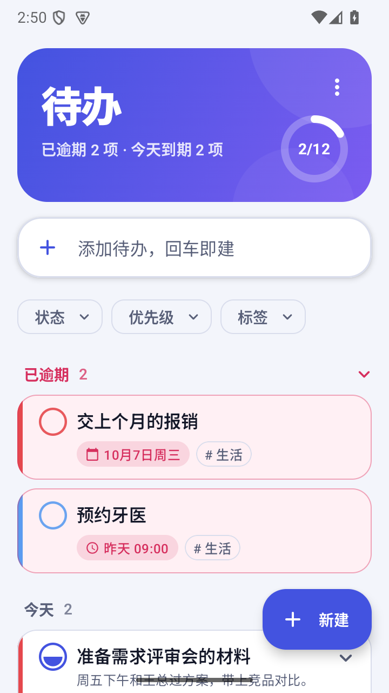 |

更多：[子任务与进度（详情页）](screenshots/zh-06-detail-subtasks.png)、[滚动后的其余分组](screenshots/zh-03-list-more.png)、[全部完成](screenshots/zh-11-all-done.png)、[English 空状态](screenshots/en-01-empty.png)、[English 全部完成](screenshots/en-08-all-done.png)、[English 小屏 + 1.3 倍字体](screenshots/en-07-small-large-font.png)。

| | |
|---|---|
| applicationId | `org.agentos.sample.todo` |
| 插件名 / MCP 服务器名 | `todo` / `todo`（服务类 `org.agentos.sample.todo.agent.TodoMcpService`） |
| 技术 | Kotlin · Jetpack Compose + Material 3（不加别的界面库）· 平台 `SQLiteOpenHelper`（无 Room / KSP）· `:sdk:plugin-sdk`（对外暴露 MCP） |
| 权限 | 无（不联网、不申请任何权限；v1 不自带提醒，所以也不要通知和精确闹钟权限） |

## 功能

**界面**（中文默认，`values-en` 英文；亮 / 暗两套配色“靛蓝与珊瑚”，跟随系统；edge-to-edge；Pixel 8 与 720×1280 小屏、1.3 倍字体都看过）

- **概览卡**：渐变卡片，大标题 + 一句话现状（“已逾期 2 项 · 今天到期 2 项”）+ 完成进度环；右上角菜单里有“语言”，跳系统设置里本 App 的“应用语言”。
- **快速添加**：顶部输入框，**回车即建**。聚焦后出现优先级和截止（无日期 / 今天 / 明天）两个快捷 chip；在标题里写 `!1` / `!2` / `!3`（也认全角 `！`）直接设为高 / 中 / 低并从标题里去掉。
- **分组**：已逾期（红色高亮）、今天、即将到来、无日期、搁置、已完成（搁置和已完成默认折叠，点标题展开 / 收起）。“已逾期”只算待办 / 进行中：带时刻的过了截止时刻，全天的从次日起算。
- **一行待办**：左侧**优先级色条**（珊瑚红 / 琥珀 / 天蓝）、状态圆圈（待办是空心圈，进行中半填充，搁置虚线圈，已完成实心绿圈，点一下切换，对勾是一笔一笔画出来的）、标题、备注首行、截止 / 状态 / 标签 / 子任务进度（`1/3`）小胶囊；有子任务时可展开 / 收起。
- **手势**：**左滑完成**（已完成的左滑是“重新打开”），**右滑删除**；底部提示条带**撤销**（撤销删除会把父任务和它的子任务原样写回，包括创建 / 完成时间）。
- **筛选 chips**：状态、优先级、标签三个下拉；符合条件的子任务会让它的父任务一起留着，不会被藏起来。
- **详情 / 新建**：标题、状态、优先级、截止（今天 / 明天 / 日期选择器；“全天”开关；带时刻时的时间选择器，12 / 24 小时跟随系统）、标签（回车或逗号添加，下面有已有标签建议）、备注、子任务（添加、勾选、删除、进度条）。编辑已有的：**返回即保存，只写改过的字段**；新建的：点“保存”，写了标题又想退出会问一下。
- **空状态**：Canvas 画的夹板插画；没有待办、全部完成、筛选无结果各有文案。
- **动画**：列表项进出 / 换组 / 重排、展开子任务、圆圈对勾、进度环、页面横向转场、底部输入区展开、提示条。

**与 MCP 共用同一份数据**

界面和 `TodoMcpService` 用的是**同一个进程内单例仓库**（`TodoRepository`，`StateFlow` 对外）。AgentOS 经 MCP 增删改之后，列表、概览卡、分组立刻刷新（[MCP 实时刷新](screenshots/zh-12-mcp-live.png)：经 MCP 建的“来自 AgentOS 的待办”在前台列表的“今天”分组里直接出现，概览卡的数字同时更新）。编辑页里打开的那一条被 AgentOS 删掉时自动回到列表；没被改到的字段不会被编辑页的旧值覆盖。

**中英文（docs/next-apps-plan.md 7.2）**：中文放 `values/`，英文放 `values-en/`，key 一一对应（复数中文 `other`、英文 `one` / `other`）；用户可见中文只在资源里，Kotlin 里没有（`ResourcesTest` 检查）；日期用 `DateFormat.getBestDateTimePattern`（“10月12日周一” / “Mon, Oct 12”，12 / 24 小时跟随系统）；没有把任何默认名写进数据库（R3）；`res/xml/locales_config.xml`（`zh`、`en`）+ manifest `android:localeConfig`，系统设置里有“应用语言”。工具名 / 描述 / `SKILL.md` / MCP 错误信息不本地化。术语：待办 / 进行中 / 已完成 / 搁置 = To do / In progress / Done / On hold。

## MCP 工具

插件：`todo`；MCP 服务器：`todo`。AgentOS 里的完整工具名是 `mcp__todo__todo__<工具名>`。id 是 8 位十六进制字符串；时间是带设备本地偏移的 ISO-8601（`2026-10-12T17:00:00+08:00`），全天的截止只有日期（`2026-10-12`）。错误一律 `isError=true` + 一句话原因（缺参数、非法值、不存在的 id、子任务规则……），不抛异常。单个结果不超过 65,536 字符：列表 / 搜索按真实线上成本截断，`has_more` + `next_offset` 接着取。

| 工具 | 必填 | 可选 | 注解 | 说明 |
|---|---|---|---|---|
| `todo_list` | — | `status`、`priority`、`tag`、`due_before`、`due_after`、`overdue_only`、`parent_id`、`include_done`（默认 false）、`limit`（默认 50，最大 200）、`offset` | readOnly | 按优先级（高在前）、截止（早在前、无截止在后）排序；默认不含已完成；给了 `status` 就以它为准。不给 `parent_id` 时顶层待办和子任务混在一起（子任务带 `parent_id`，有子任务的带 `subtask_total` / `subtask_done`）。返回 `total`、`has_more`、`next_offset`。列表项是**紧凑形式**：空字段不写，备注只给前 200 字 |
| `todo_get` | `id` | — | readOnly | 完整字段 + 全文备注 + `subtasks`（紧凑形式，按添加顺序） |
| `todo_create` | `title`（≤200） | `notes`（≤10,000）、`priority`、`due`、`due_all_day`、`tags`、`parent_id`、`status` | — | 建子任务靠 `parent_id`（只支持一层，对子任务再建子任务会被拒绝）。返回完整字段 |
| `todo_update` | `id` | 同 create 的各字段 | idempotent | 只改给出的；`due: ""` 清截止、`notes: ""` 清备注、`tags: []` 清标签、`parent_id: ""` 脱离父任务；单独给 `due_all_day: true` 把当前截止改成全天 |
| `todo_set_status` | `id`、`status` | — | idempotent | `todo` / `doing` / `done` / `shelved`。变成 `done` 写 `completed_at`，从 `done` 改回别的清掉；状态没变什么都不动（完成时间和更新时间都不变） |
| `todo_delete` | `id` | — | **destructive** | 永久删除；有子任务时连带删除，返回 `deleted`（总数）和 `subtasks_deleted` |
| `todo_search` | `query` | `status`、`limit`（默认 20，最大 100） | readOnly | 标题、备注、标签的包含匹配，不分大小写，多个词需全部命中；标题命中的在前，`matched_in` 说明命中位置；含已完成 |
| `todo_summary` | — | — | readOnly | 各状态计数 `counts`、`total`，以及待办 / 进行中里的 `overdue`、`due_today`、`due_this_week`，外加 `today`、`week_start`、`week_end`、`time_zone` |

**口径（测试里逐条写明）**

- **`due` 的格式**：`YYYY-MM-DD`（全天）或带偏移的完整 ISO-8601 时间（`...+08:00`、`...Z`，秒可省）；没有偏移的本地时间、别的写法、不存在的日期、1970–2200 之外的年份一律报错，不猜时区。`due_all_day: true` 把完整时间当成**调用方写的那一天**的全天；`false` 必须带时刻。
- **时区**：全部按设备本地时区。“今天”是本地日历日；带时刻的截止先换算成本地日期；全天的待办按它自己的日期。同一个时刻在 UTC 和 +08:00 里可能落在不同的一天，`todo_summary` 和分组的结果会不同（`TodoQueriesTest` 用跨零点、不同偏移的用例覆盖）。
- **一周**：包含今天的那个日历周，起点是系统 / 区域的一周首日（`WeekFields.of(Locale.getDefault())`，测试里显式传 `ISO`（周一）、`SUNDAY_START`、`Locale.US`、`Locale.FRANCE`）。
- **`overdue` / `due_today` / `due_this_week`**：只算待办和进行中；`overdue` = 已过截止（全天的从次日起算）；`due_today` = 今天到期且没过期；`due_this_week` = 从今天到本周最后一天到期且没过期（**含今天**）。三者不重叠地回答“已经错过 / 今天要做 / 本周要做”。已完成和搁置的只出现在 `counts` 里。
- **`due_before` / `due_after`**：闭区间（“早于等于 / 晚于等于”），值是日期或带偏移的时间；两边都是时刻就比绝对时刻，只要有一边是全天（日期）就按设备本地日期比。没有截止的待办不会命中。
- **`todo_summary` 数子任务**：连子任务一起数（给 Agent 的总览）；界面概览卡只数顶层，和分组里看到的行数一致。

插件包在 [`src/main/assets/agent-plugin/`](src/main/assets/agent-plugin/)：`plugin.json`（name=todo，displayName“待办”）+ `skills/todo/SKILL.md`（能做什么、典型流程、`due` 格式的坑、什么该进待办、v1 不自带提醒）。

## 代码结构

```
org.agentos.sample.todo
├── data/    Todo（模型）、DueTime（解析 / 比较 / 逾期，纯函数）、TodoQueries（排序 / 筛选 / 搜索 / 汇总，纯函数）、
│            TodoRepository（单例 + StateFlow）、TodoStore（SQLite / 内存）
├── tools/   与 SDK 无关的工具层：ToolTypes、TodoTools（8 个工具）、TodoDump —— 只依赖 kotlinx-serialization-json 和仓库
├── agent/   TodoMcpService : McpBinderService —— 只负责把 TodoTools 逐个注册进 SDK
└── ui/      MainActivity、TodoRoot（返回栈 + 提示条）、ListScreen、EditorScreen、TodoViewModel、
             TodoSections（分组，纯函数）、DueFormatter（日期文案，纯函数）、主题、圆圈 / 色条 / 插画
```
`src/debug/` 只在 debug 构建里：`DebugToolReceiver`（`dump` / `reset` / 调工具）、`SelfTestReceiver`（MCP 自测）。release 包里没有它们（合并后的 manifest 和 dex 都查过）。

## 构建与验证

```bash
export JAVA_HOME=$(/usr/libexec/java_home -v 21) ANDROID_HOME=$HOME/Library/Android/sdk
./gradlew --max-workers=3 :plugins:samples:todo:testDebugUnitTest :plugins:samples:todo:assembleDebug \
                          :plugins:samples:todo:assembleRelease :plugins:samples:todo:lintDebug
```
- **JVM 单元测试**（不需要设备）：`DueTimeTest`（解析 / 非法值 / 偏移 / 全天 / 逾期 / 比较）、`TodoRepositoryTest`（创建校验、子任务规则、100 个上限、级联删除、状态流转与 `completed_at`、撤销、清空、加载）、`TodoQueriesTest`（排序、筛选、`due_before/after`、搜索、**`todo_summary` 的时区与一周口径**）、`TodoToolsTest`（8 个工具各自的正常 / 缺参数 / 非法值 / 不存在的 id，契约名 / 必填参数 / 注解，结果体积）、`TodoDumpTest`（`dump` 分页与预算、`reset`）、`TodoMcpBridgeTest`（照 `NotesMcpBridgeTest`）、`DueFormatterTest`（中英文各一套）、`TodoSectionsTest`（分组 + 快速添加解析）、`ResourcesTest`（key 一一对应、占位符、复数、英文无汉字、Kotlin 字面量无汉字）。
- **安装**：`adb -s <设备> install -r plugins/samples/todo/build/outputs/apk/debug/todo-debug.apk`。
- **R8 下的设备验证**：`:plugins:samples:todo:assembleReleaseTest`（与 release 相同的混淆规则，调试证书签名，带自测入口，不发布）。
- 平台侧一致性：`./gradlew :core:extensions:test --tests '*SamplePluginsConformanceTest*'` 会读本 App 的插件包、Manifest 和工具层源码。
- 切换语言截图：`adb -s <设备> shell cmd locale set-app-locales org.agentos.sample.todo --locales en`（或 `zh`），不用改系统语言。

### 自测：整套 MCP 增删改查

在独立的 `:selftest` 进程里经 `McpBinderClient` 绑自己的 `TodoMcpService`（真实的跨进程 Binder），走 `initialize`、`tools/list`（8 个工具、必填参数、注解）、全部工具的增删改查（父任务 + 子任务、级联删除、状态与完成时间、筛选、搜索、汇总）和错误路径，共 32 项检查：

```bash
adb -s <设备> shell am broadcast -n org.agentos.sample.todo/.debug.SelfTestReceiver [--ei pause_ms 800]
# Broadcast completed: result=1, data="{...,"passed":32,"total":32,"ok":true}"   （result=2 表示有失败，data 里有 failed 列表）
```
`--ei pause_ms 800` 在关键步骤之间停一下，方便前台开着列表时看到它们实时出现又消失。也可以经 MCP 调单个工具（比如造一条待办、观察界面实时刷新）：
```bash
adb -s <设备> shell am broadcast -n org.agentos.sample.todo/.debug.SelfTestReceiver \
    --es tool todo_create --es args '{"title":"x","priority":"high"}'      # --es tool tools 只列工具名
```

## 调试：读状态与复位（仅 debug 构建）

联调时用 adb 核对 AgentOS 经 MCP 的操作结果。命令发给 `DebugToolReceiver`（导出，要求 `android.permission.DUMP`，只有 adb shell 和系统持有，其他 App 调不了），结果放在广播的 **result data**（一个 JSON 字符串，不进 logcat）。

### `dump`：只读，分页

```bash
adb -s <设备> shell am broadcast -n org.agentos.sample.todo/.debug.DebugToolReceiver --es cmd dump
adb -s <设备> shell am broadcast -n org.agentos.sample.todo/.debug.DebugToolReceiver --es cmd dump --ei offset 50 --ei limit 50
```
```json
{"todos":[{"id":"e4c689fb","title":"写 PRD：搜索改版","status":"todo","priority":"high","due":"2026-10-14","due_all_day":true,
           "tags":["工作"],"parent_id":null,"completed_at":null,"overdue":false,
           "created_at":"2026-10-09T01:28:17+08:00","updated_at":"2026-10-09T01:28:17+08:00","notes":"…"}],
 "counts":{"todo":7,"doing":2,"done":2,"shelved":1},"total":12,"offset":0,"count":12,"next_offset":null,
 "now":"2026-10-09T01:30:00+08:00","time_zone":"Asia/Shanghai"}
```
- `todos`：全部待办（含子任务、已完成），按创建时间排序；每条的字段与 MCP 的 `todo_get`（不含 `subtasks`）完全一致。`limit` 默认只受字符预算限制，`next_offset` 为 `null` 表示最后一页；`offset` 越界返回空页。
- 只读：不创建、不修改任何东西。未知命令返回 `result=2` 和 `{"ok":false,"error":"…"}`。

### `reset`：清空本 App 全部待办（同步完成）

```bash
adb -s <设备> shell am broadcast -n org.agentos.sample.todo/.debug.DebugToolReceiver --es cmd reset
# data="{"cleared":12,"remaining":0,"remaining_in_db":0}"
```
`remaining_in_db` 是直接数库里的行数，所以返回时库已经空了，不用轮询。只清本 App 的数据，不碰别的。

### 进程内调工具

```bash
adb -s <设备> shell am broadcast -n org.agentos.sample.todo/.debug.DebugToolReceiver --es tool todo_list --es args '{"limit":3}'
# data="{"tool":"todo_list","ok":true,"result":{…}}"      --es tool list 只列工具名
```

## 已知限制

- v1 **不自带提醒**：截止日期只排序和高亮，不会响也不会通知；到期提醒由 Agent 经日历（`reminder_minutes`）或闹钟编排，见 `SKILL.md`。
- 不做：重复待办、清单 / 项目分组、拖拽排序、附件、子任务的子任务（只支持一层）。
- 数据不参与云备份和设备迁移（`allowBackup=false`）。
- 同一个待办在编辑页里被 AgentOS 改了**同一个字段**时，以编辑页最后写入的为准（只发改过的字段，所以改别的字段不会互相覆盖）。
